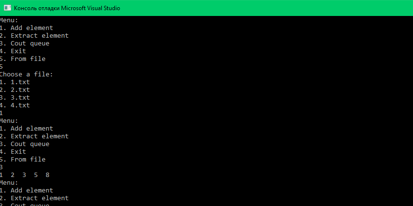

# Лабораторная работа № 1

## Цель

Цель работы - разработать библиотеку для работы с очередью, обеспечивающую эффективные операции добавления элемента в конец очереди и извлечение элемента из начала очереди. 

### Задание

Реализовать код на языке `С++`, который создает и обрабатывает структуру очередь.

### Ключевые понятия

`Очередь` - структура данных, в которой элементы кладутся в конец, а извлекаются из начала (FIFO). Таким образом, первым из очереди будет извлечен тот элемент, который будет добавлен раньше других.
`Head очереди` - голова очереди; элемент, который будет извлечен первым.
`Tail очереди` - хвост очереди; элемент, который был записан последним.

 
## Алгоритм и его реализация

`Реализация структуры очередь` 

```c++
struct queue
{
	int qh, qt;
	int val[];
} ;
```
Где `qh`, `qt` - переменные, которые хранят номера первого и последнего элементов очереди, представленной ввиде одномерного массива.
`val[]` - одномерный массив элементов очереди.


`Реализация функци вставки элемента` 

```c++
void enq(queue * q, int x, int MAXN)
{
  q->val[(q->qt++) % MAXN] = x;
}
```

Необходимо передавать в функцию указатель, т.е. их вызов
должен выглядеть как: enq(&q, x,MAXN);  где x – число,  q – очередь, MAXN - максимальное количество элементов в очереди. 

> [!NOTE]
> Значение вписываем в элемент массива под номером `(q->qt++) % MAXN`, а не `q->qt++`,чтобы "закольцевать" нашу очередь.


 `Реализация функци изъятия элемента` 

```c++
int deq(queue * q,int MAXN)
{
	return q->val[(q->qh++) % MAXN];
}
```


 
## Результаты тестирования
Проверим нашу программу на примере первого теста:

`Тест 1`

Добавить 5 элементов в очередь + вывод очереди + выход

`Исходные данные`

5

1 2 3 5 8

0


 `Результат выполнения программы`
 
 


## Вывод
 
В результате выполнения данной работы были получены следующие практические навыки:
- изучение структуры очередь
- умение работать с header-файлами
- изучение базовых алгоритмов для работы со структурвми типа очередь   
