# Расчётная работа 

### Цель

Формализовать выполнение алгоритма в виде SCg-кода.

### Задание

Реализовать на C++ код, который может найти в неориентированном взвешенном графе минимальный простой разрез.

### Ключевые понятия

`Граф` - математическая абстракция реальной системы любой природы, объекты которой обладают парными связями. 

Графы, в которых все ребра являются звеньями, то есть порядок двух концов ребра графа не существенен, называются `неориентированными`. 
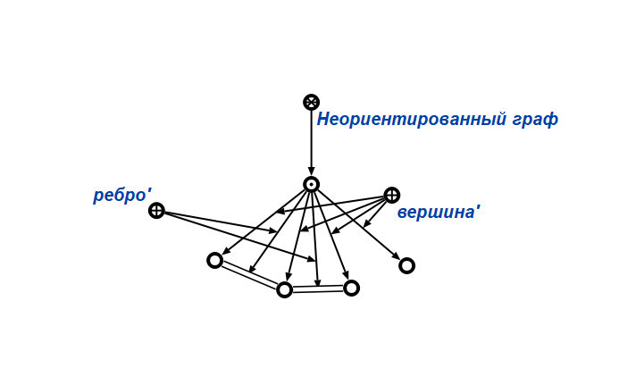

`Минимальный разрез графа` — это разбиение множества V на два подмножества A и B, что: A,B⊂V;   A,B≠∅;  A∩B=∅;  A∪B=V с минимально возможным весом.

### Алгоритм решения 

1. Создаём множество непосещённых вершин.
2. Создаём счетчик минимального разреза minR=inf.
3. Создаём множество вершин А, куда последовательно будут добавляться вершины с большим весом.
4. Создаём счётчик n-1 фаз, где n - количество вершин в графе. 
5. Добавляем произвольную вершину в множество А
6. Из смежных вершин к множеству А, добавляем в множество вершину с большим весом.
   6.1. Повторяем процесс до n-1 фазы (включая предпоследнюю вершину(s))
7. Если вес последней недобавленной вершины(t) меньше записанного минимального разреза в minR, то перезаписываем его в minR.
8. Сливаем две последние вершины в одну.
9. Очищаем множество А
10. Если n = 1 (в графе осталась одна вершина), то выводим результат и завершаем алгоритм.
11. Если n не равно 1, то переходим к пункту 5. 

### Демонстрация алгоритма

##### Переменная `graph` получает в качестве значения sc-узел неориентированного взвешенного графа

***

##### Переменная `not_added_vertexes` получит в качестве значения множество недобавленных в множество вершин

***

##### Создаём счётчик `number_of_vertexes` равный 5
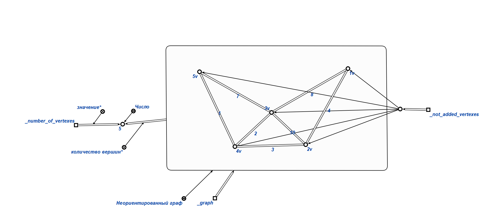
***

##### Добавляем переменную `_min_cut` со значением ∞

***

##### Создание волны, включающей вершину *1v*
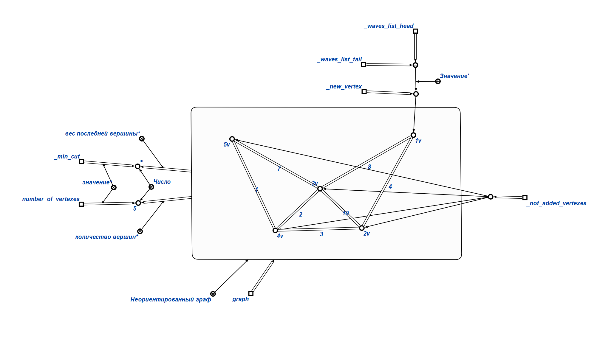
***

##### Создание волны, включающей вершину *3v*

***

##### Создание волны, включающей вершину *2v*

***

##### Создание волны, включающей вершину *5v*

***

##### Создание волны, включающей вершину *4v*
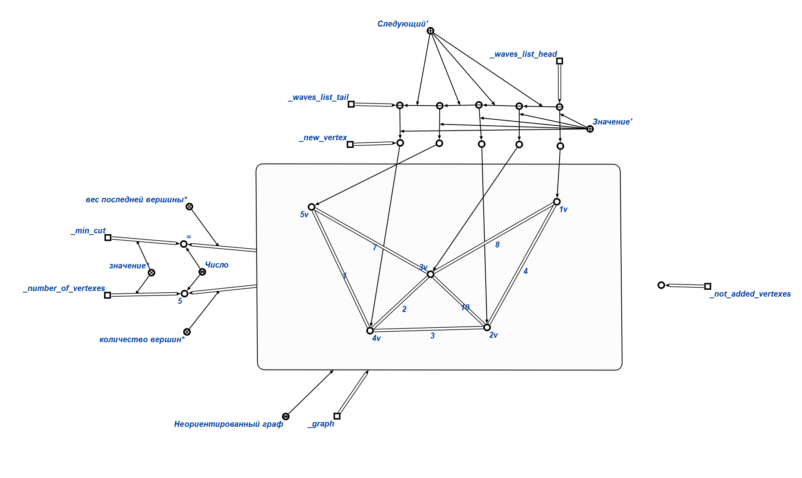
***

##### В счётчик _min_cut записываем вес вершины *4v* = 6, так как он меньше бесконечности
Объединяем вершины *4v* и *5v*
_number_of_vertexes уменьшаем на один 
Удаляем множество посещённых вершин
Создаём волну, включающуюю вершину *1v*
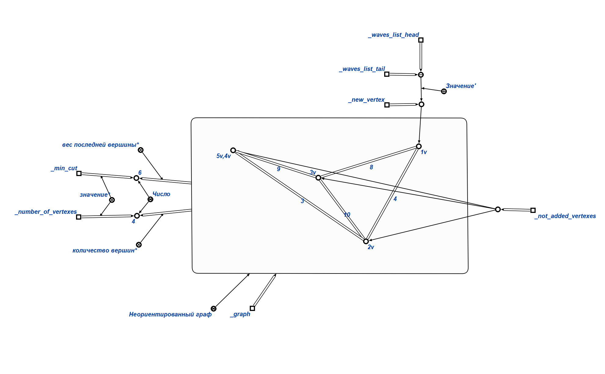
***

##### Создание волны, включающей вершину *3v*

***

##### Создание волны, включающей вершину *2v*
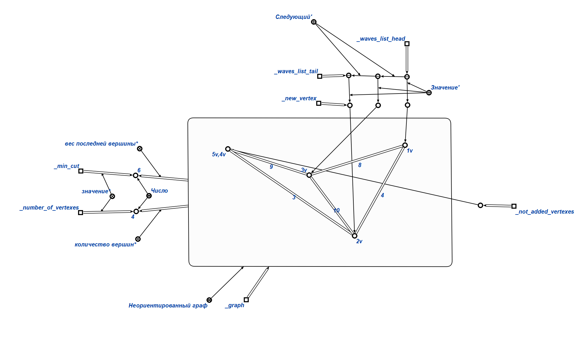
***

##### Создание волны, включающей вершину *5v,4v*
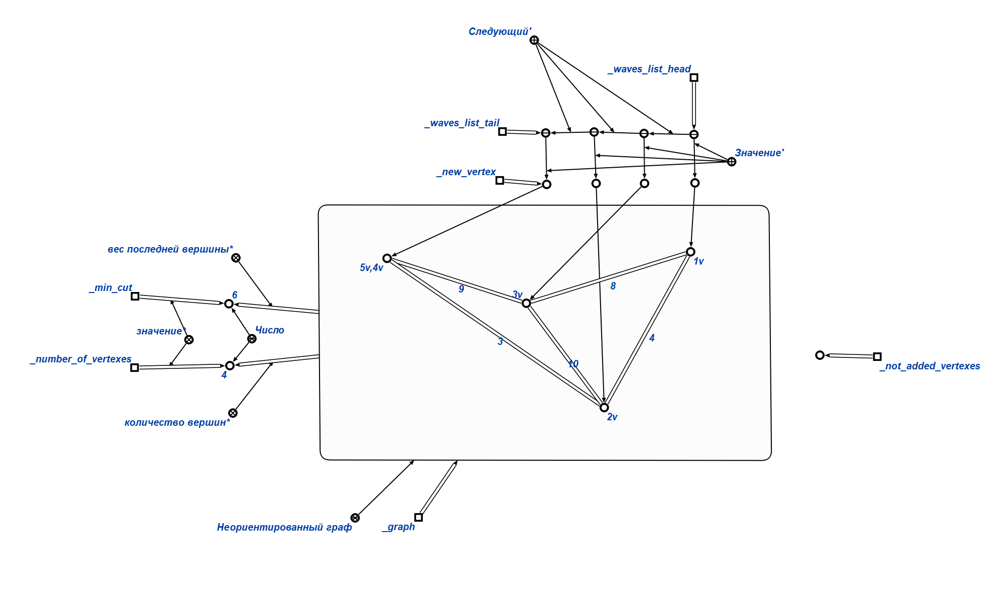
***

##### Объединяем вершины *2v* и *4v,5v*
_number_of_vertexes уменьшаем на один 
Удаляем множество посещённых вершин
Создаём волну, включающуюю вершину *1v*

***

##### Создание волны, включающей вершину *3v*

***

##### Создание волны, включающей вершину *2v*
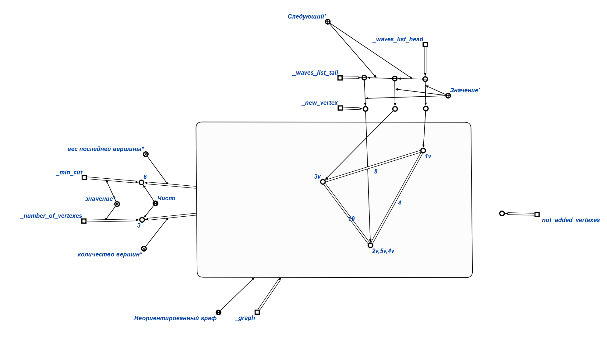
***

##### Объединяем вершины *3v* и *2v,4v,5v*
_number_of_vertexes уменьшаем на один 
Удаляем множество посещённых вершин
Создаём волну, включающуюю вершину *1v*

***

##### Создание волны, включающей вершину *3v,2v,5v,4v*

***

##### Объединяем вершины *1v* и *3v,2v,4v,5v*
_number_of_vertexes уменьшаем на один 
Удаляем множество посещённых вершин

***

##### Результат работы алгоритма:
_min_cut = 6
***

### Тестовые примеры

#### Тест №1

##### Входные данные
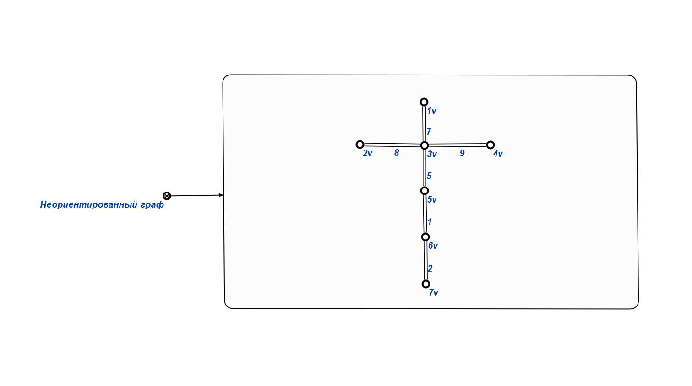

##### Результат работы алгоритма:
_min_cut = 1
***

#### Тест №2

##### Входные данные
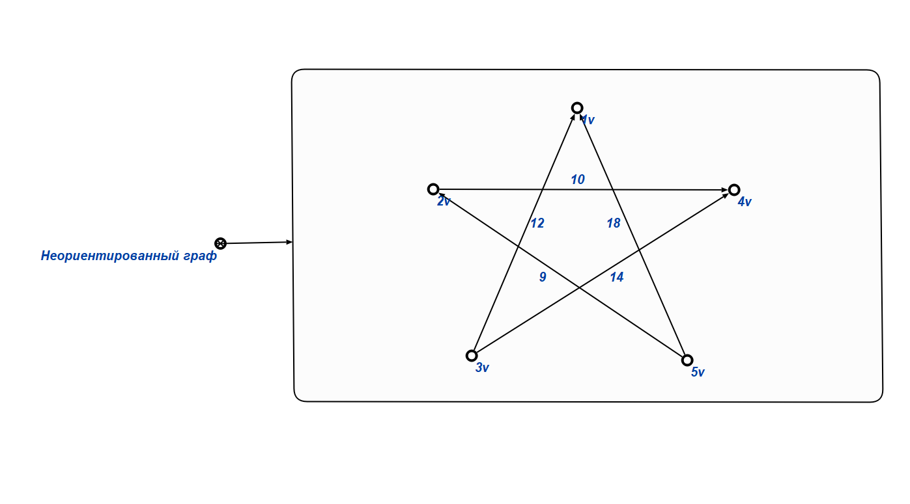

##### Результат работы алгоритма:
_min_cut = 19
***

#### Тест №3

##### Входные данные
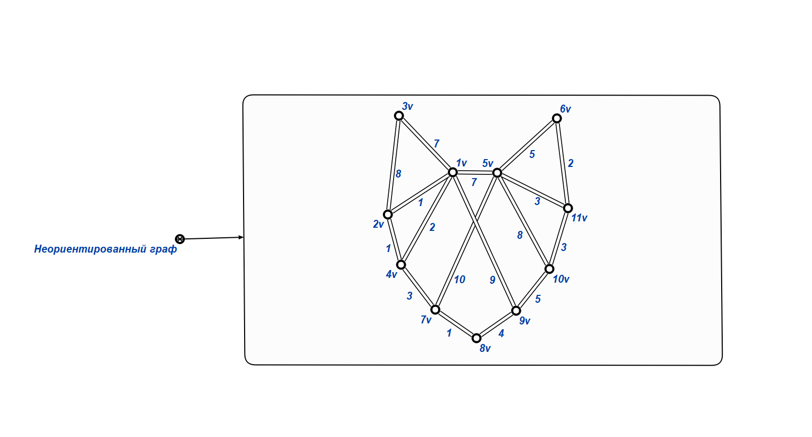

##### Результат работы алгоритма:
_min_cut = 5
***

#### Тест №4

##### Входные данные

##### Результат работы алгоритма:
_min_cut = 0 либо минимального разреза нет
***

#### Тест №5

##### Входные данные

##### Результат работы алгоритма:
_min_cut = 2
***

### Вывод

В результате выполнения данной расчётной работы был формализован алгоритм нахождения минимального разреза графа.

### Источники

- [Руководство к выполнению РР](https://drive.google.com/drive/folders/1RSriLOZWpxyozHjUa1Kz3uZtIr0PixVh)