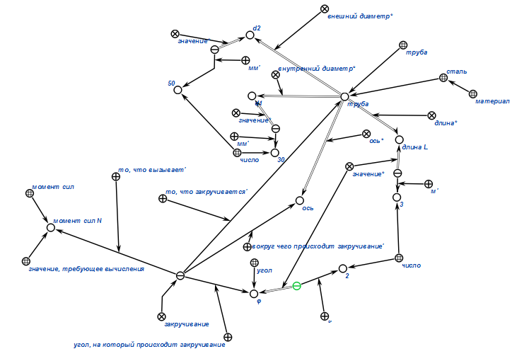
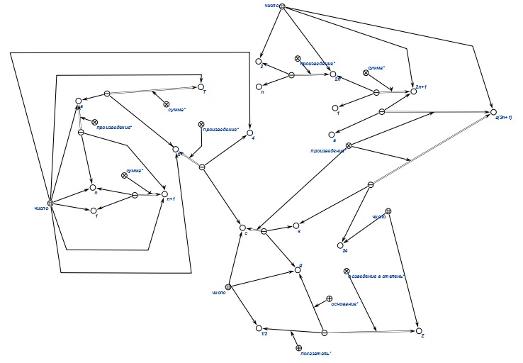
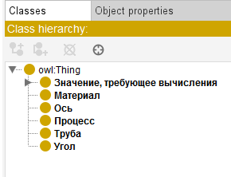
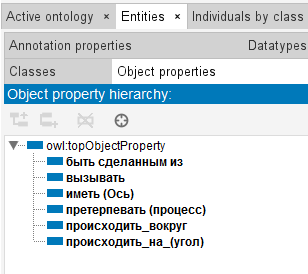
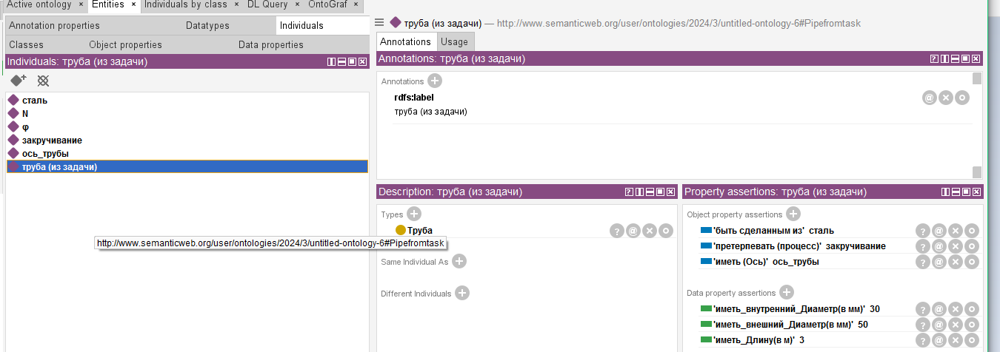

# <p align="center">Практическое задание</p>
### Вариант 7
```txt
7.Вычислить момент сил N, которые вызывают закручивание стальной трубы длины l=3,0 м
на угол  φ=2,0° вокруг ее оси, если внутренний
и внешний диаметры трубы равны d1=30 мм и d2=50 мм.
```
Формализация данного текста в приложении КБЕ




### Вариант 9

Формализация Варианта 7 первой части в приложении protege

Классы




Отношения 



Сущности



# <p align="center">Вывод</p>
Были изучены методы формализации текста и выражений
