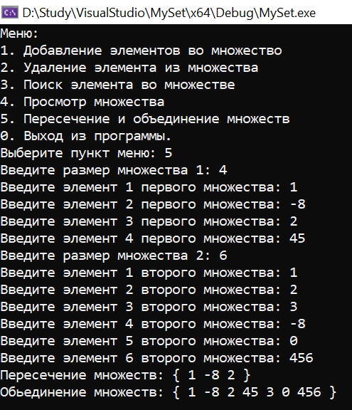

# Лабораторная работа №1 (Вариант 2)

### Цель работы:

Исследовать свойства структур данных и разработать библиотеку алгоритмов обработки структур данных.

### Задача:

Создать множество и реализовать следующий функционал: добавление элемента во множество, удаление элемента из
множества, поиск элемента во множестве, объединение двух
множеств, пересечение двух множеств.

### Список ключевых понятий:

Множество – это структурированный тип данных, представляющий собой набор взаимосвязанных по какому-либо признаку или группе признаков неповторяющихся объектов, которые  можно рассматривать как единое целое.

### Реализация:


##### Объявляем класс MySet и его публичные и приватные члены.
Публичные методы выполняют различные операции над множеством.
Приватные методы resize() и isFull() используются для манипуляции с размером и проверки на полноту множества.
Поле elements представляет собой массив, в котором хранятся элементы множества.
Поле capacity отслеживает текущую емкость массива.
Поле count содержит текущее количество элементов в множестве.

```c++
class MySet {
public:
    MySet();
    ~MySet();

    void insert(int element);
    void remove(int element);
    bool contains(int element) const;
    int contains2(int element) const;

    MySet intersection(const MySet& other) const;
    MySet unionWith(const MySet& other);

    void clear();
    int size();
    void print();

    MySet(const MySet& other);
    MySet& operator=(const MySet& other);
 
private:
    int* elements;
    int capacity;
    int count;

    void resize(int newCapacity);
    bool isFull();
};
```

##### Инициализируем по умолчанию конструктор и деструктор:

```c++
MySet::MySet() : capacity(10), count(0) {
    elements = new int[capacity];
}

MySet::~MySet() {
    delete[] elements;
}
```

##### Методы класса MySet (вставка элемента, увеличение ёмкости множества, удаление элемента, поиск элемента):

```c++
void MySet::insert(int element) {
    if (contains(element)) {
        return;
    }

    if (isFull()) {
        resize(capacity * 2);
    }

    elements[count] = element;
    count++;
}

void MySet::remove(int element) {
    int index = -1;

    for (int i = 0; i < count; i++) {
        if (elements[i] == element) {
            index = i;
            break;
        }
    }

    if (index != -1) {
        for (int i = index; i < count - 1; i++) {
            elements[i] = elements[i + 1];
        }

        count--;
    }
}

bool MySet::contains(int element) const {
    for (int i = 0; i < count; i++) {
        if (elements[i] == element) {
            return true;
        }
    }

    return false;
}

int MySet::contains2(int element) const {
    for (int i = 0; i < count; i++) {
        if (elements[i] == element) {
            return i;
        }
    }
    return 0;
}
```

##### Объединение и пересечение двух множеств

```c++
MySet MySet::intersection(const MySet& other) const {
    MySet result;

    for (int i = 0; i < count; i++) {
        if (other.contains(elements[i])) {
            result.insert(elements[i]);
        }
    }

    return result;
} 

MySet MySet::unionWith(const MySet& other) {
    MySet result = *this;

    for (int i = 0; i < other.count; i++) {
        result.insert(other.elements[i]);
    }

    return result;
}
```

##### Функции очистки, определения размера, вывода и увелечения размера множества

```c++
void MySet::clear() {
    count = 0;
}

int MySet::size() {
    return count;
}

void MySet::print() {
    std::cout << "{ ";
    for (int i = 0; i < count; i++) {
        std::cout << elements[i] << " ";
    } 
    std::cout << "}" << std::endl;
}

void MySet::resize(int newCapacity) {

    int* newElements = new int[newCapacity];

    for (int i = 0; i < count; i++) {
        newElements[i] = elements[i];
    }

    delete[] elements;

    elements = newElements;
    capacity = newCapacity;
}
```

##### 

```c++
```

## Пример работы программы

Программа (main.cpp) работает следующим образом:

*Пользователю предлагаются операции над множеством:

1. Добавление элементов

1.2. Пользователь вводит необходимый элемент

1.2. Новое множество выводится на экран

2. Удаление элемента

2.1. Пользователь вводит элемент, который нужно удалить

2.2. Если элемент есть, он удаляется из множества.

2.3. Если элемент не обнаружен, выводится результат

2.4. Множество выводится на экран

3. Поиск элемента

3.1. Пользователь вводит необходимый элемент

3.2. Если элемент присутствует в множестве, то программа об этом сообщает

3.3. Если элемент отсутсвует, программа сообщает об обратном

4. Множество, полученное посредством предыдущих операций (1-3) выводится на экран

5. Пересечение и обьединение множеств

5.1. Пользователь вводит необходимые ему два множества (как при создании множеств)

5.2. На экран выводится пересечение и обьединение данных множеств


    


## Вывод

В ходе выполнения работы было реализовано множество и интерфейс для работы с ним.


