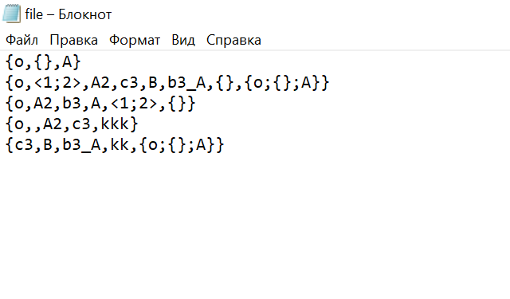
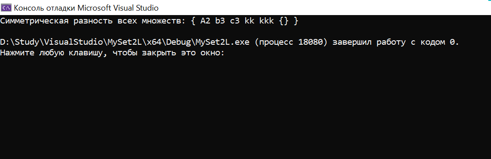

# Лабораторная работа №2 (Вариант 3)

### Цель работы:

Изучить основы теории множеств.

### Задача:

Реализовать программу, формирующую множество равное симметрической разности
произвольного количества исходных множеств (без учёта кратных вхождений элементов).

### Список ключевых понятий:

Множество – это структурированный тип данных, представляющий собой набор взаимосвязанных по какому-либо признаку или группе признаков неповторяющихся объектов, которые  можно рассматривать как единое целое.
Симметрическая разность множеств – это множество, включающее все элементы исходных множеств, не принадлежащие одновременно обоим исходным множествам.

### Реализация:


##### Определяется функция symmetricDifference, которая принимает вектор множеств sets и возвращает симметрическую разность всех множеств в виде set<string>.
Внутри функции symmetricDifference создаются два множества: result для хранения результата и temp для временного хранения элементов, которые уже были добавлены в result.
Во вложенных циклах обрабатываются все множества из вектора sets. Для каждого элемента из каждого множества выполняются следующие действия:
1)Если элемент еще не присутствует в result и temp, он добавляется в result.
2)Если элемент уже присутствует в result, он удаляется из result и добавляется в temp.
После обработки каждого множества, temp очищается.
Функция возвращает result.

```c++
set<string> symmetricDifference(const vector<set<string>>& sets) {
    set<string> result;
    set<string> temp;

    for (const auto& set : sets) {
        for (const auto& element : set) {
            if (result.count(element) == 0 && temp.count(element) == 0) {
                result.insert(element);
            }
            else {
                result.erase(element);
                temp.insert(element);
            }
        }
        temp.clear();
    }

    return result;
}
```

##### Читаем строки из файла.
Для каждой строки выполняются следующие:
Создается пустое множество currentSet.
Находятся позиции символов '{' и '}' в строке.
Если оба символа найдены, извлекается подстрока между ними, в которой содержатся элементы множества.
При помощи разделителя ',' извлекаются отдельные элементы и добавляются в currentSet.
currentSet добавляется в вектор sets.

```c++
string line;
while (getline(inputFile, line)) {
    set<string> currentSet;
    size_t start = line.find('{');
    size_t end = line.rfind('}');

    if (start != string::npos && end != string::npos) {
        string elements = line.substr(start + 1, end - start - 1);
        size_t commaPos = elements.find(',');

        while (commaPos != string::npos) {
            string element = elements.substr(0, commaPos);
            currentSet.insert(element);
            elements = elements.substr(commaPos + 1);
            commaPos = elements.find(',');
        }
        currentSet.insert(elements);
    }

    sets.push_back(currentSet);
}
```

##### Выводим симметрическую разность всех множеств, перебирая элементы symmetricDiff.

```c++
set<string> symmetricDiff = symmetricDifference(sets);
bool firstElement = false;
cout << "Симметрическая разность всех множеств: ";
cout << "{";
for (const auto& element : symmetricDiff) {
    if (firstElement) {
        cout << ",";
    }
    firstElement = true;  
    cout << element;
}
cout << "}";
```


## Пример работы программы

*В файле с исходными множествами множества должны быть представленны в праивльном виде, чтобы программа работала корректно:

-каждое новое множество начинается с новой строки

-множество начинается с '{' и заканчивается '}' 

-все элементы множества разделяются ',' , поэтому если в элементе используется разделение, пользователю стоит использовать ";"

-в множестве не может быть пробелов

    


## Вывод

В ходе выполнения работы было реализованна программа, формирующуя множество равное симметрической разности
произвольного количества исходных множеств.


