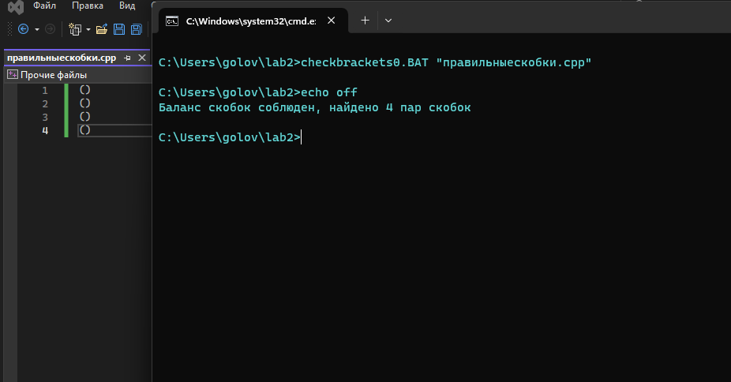
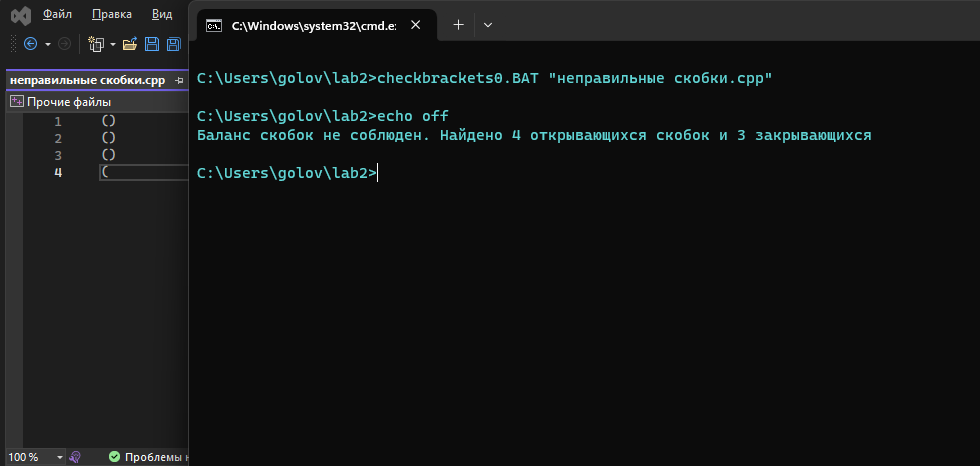
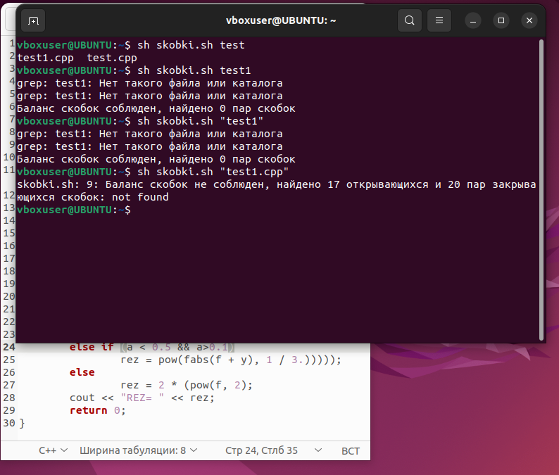

# Лабораторная работа 2

В рамках первой лабораторной работы необходимо было создать исполняемый файл в соответствии с указанным вариантом.

**Вариант 73. Создать файл sh и bat, который выполняет следующее:** 
На вход пакетному файлу приходит абсолютный путь к файлу формата *.cpp с кодом какой-либо программы. Проверить для указанного файла соответствие количества открывающихся и закрывающихся скобок. При соответствии скобок вывести в консоль сообщение “Баланс скобок соблюден, найдено Х пар скобок”, при несоответствии - вывести сообщение “Баланс скобок не соблюден. Найдено Х открывающихся скобок и Y закрывающихся”.

#### [Bat](#bat) 
* [Пример запуска](#batzap)
#### [Bash](#bash) 
* [Пример запуска](#bashzap)
  
<a id ="bat"></a>
### Bat-файл
Текст программы:
```
echo off
set file_path=%~1

for /f %%x in ('find /c "(" ^< "%file_path%"') do set otkriv=%%x
for /f %%y in ('find /c ")" ^< "%file_path%"') do set zakriv=%%y

if %otkriv% equ %zakriv% (
    echo Баланс скобок соблюден, найдено %otkriv% пар скобок
) else (
    echo Баланс скобок не соблюден. Найдено %otkriv% открывающихся скобок и %zakriv% закрывающихся
)
```
`echo off` отключает режим отображения на экране информации о работе команд.
`set file_path=%~1` переменная, содержащая первый параметр (файл, в котором нужно проверить скобки)
`for /f %%x in ('find /c "(" ^< "%file_path%"') do set otkriv=%%x` данный цикл for ищет открывающиеся скобки с помощью команды `find` и присваивает это значение переменной `otkriv`
`for /f %%y in ('find /c ")" ^< "%file_path%"') do set zakriv=%%y` данный цикл for ищет закрывающиеся скобки с помощью команды `find` и присваивает это значение переменной `zakriv`
`if %otkriv% equ %zakriv% (
    echo Баланс скобок соблюден, найдено %otkriv% пар скобок
) else (
    echo Баланс скобок не соблюден. Найдено %otkriv% открывающихся скобок и %zakriv% закрывающихся
)` данный цикл else if отвечает за вывод фразы, основываясь на том, равны ли открывающиеся скобки закрывающимся.

<a id ="batzap"></a>
### Пример запуска на Bat
**Если баланс скобок соблюдён:**


**И, если не соблюдён, соответственно:**


<a id ="bash"></a>
### Bash-файл
Текст программы:
```
file=$1

openingbrackets=$(grep -o '(' "$file" | wc -l)
closingbrackets=$(grep -o ')' "$file" | wc -l)

if [ "$openingbrackets" -eq "$closingbrackets" ]; then
echo "Баланс скобок соблюден, найдено "$openingbrackets" пар скобок"
else
"Баланс скобок не соблюден, найдено $openingbrackets открывающихся и $closingbrackets пар закрывающихся скобок"
fi
```
`file=$1` переменная, содержащая первый параметр (файл, в котором нужно проверить скобки).
`openingbrackets=$(grep -o '(' "$file" | wc -l)` с помощью команды grep записываем количество закрывающихся скобок в переменную `openingbrackets`.
`closingbrackets=$(grep -o ')' "$file" | wc -l)` с помощью команды grep записываем количество открывающихся скобок в переменную `closingbrackets`.
`if [ "$openingbrackets" -eq "$closingbrackets" ]; then
echo "Баланс скобок соблюден, найдено "$openingbrackets" пар скобок"
else` данный цикл else if отвечает за вывод фразы, основываясь на том, равны ли открывающиеся скобки закрывающимся.
`fi` завершает функцию if.

<a id ="bashzap"></a>
### Пример запуска на Bash

