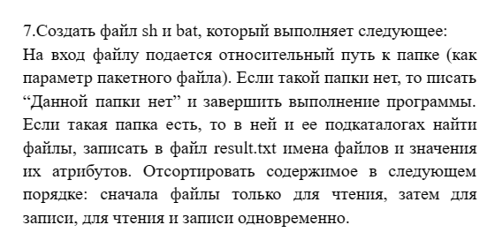

# ЛАБОРАТОРНАЯ РАБОТА №2

# Условие:



## .bat file
```batch

@echo off
if exist "C:\PiOIvIS" (
chcp 1251>nul
echo Atrib=RA: >>result.txt
dir /b/a:r >>result.txt
echo Atrib=HA: >>result.txt
dir /b/a:h >>result.txt
echo Atrib=A: >>result.txt
dir /b/a:-r-h >>result.txt
) else (
echo Dannoi papki net
)
pause
```

##Результат:


##.sh file 

```bash

#!/bin/bash
if [ -d C:/PiOIvIS ]; then 
echo "1)Atribut ra:">> result.txt
ls >> result.txt
echo "2)Atribut ha:" >> result.txt
ls -a | grep "^\." >> result.txt
echo "3)Atribut a:" >> result.txt
ls -a >> result.txt
else 
echo "Dannoi papki net"
fi
```
##Результат:


