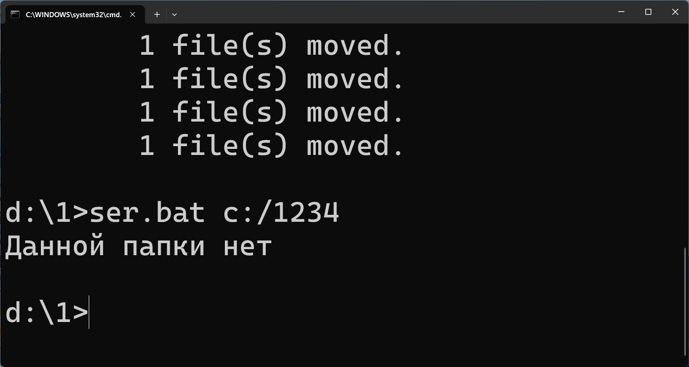
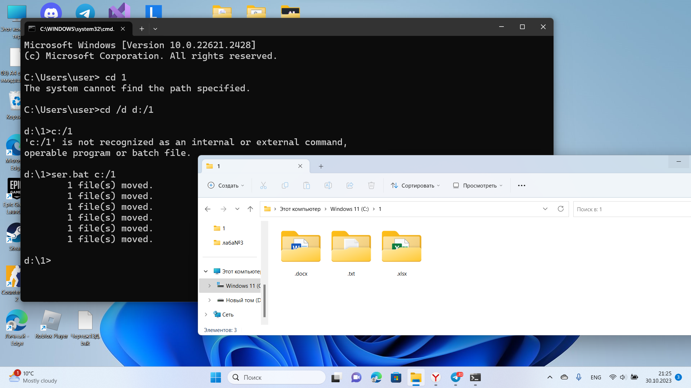
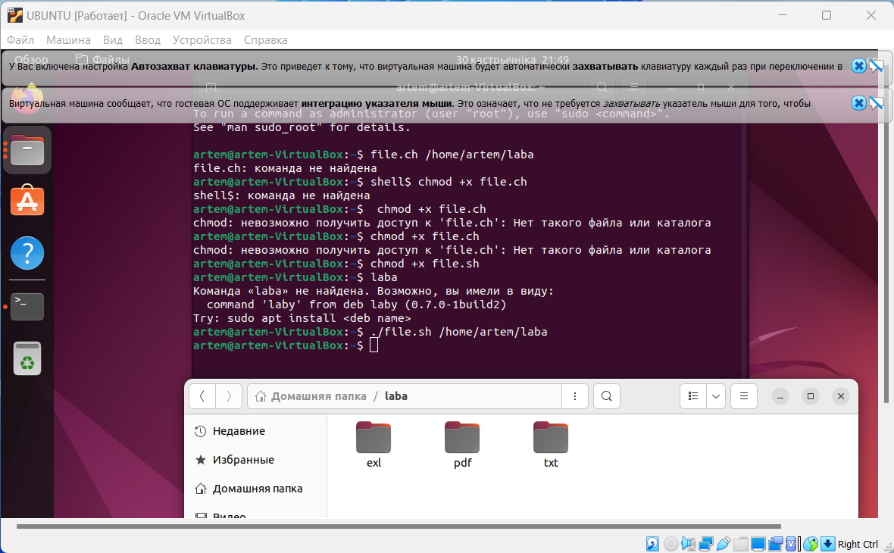

# Лабораторная работа №2

В рамках первой лабораторной работы необходимо было создать исполняемый файл в соответствии с указанным вариантом.

**Вариант 94. Создать файл sh и bat, который выполняет следующее:**   
На вход пакетному файлу приходит относительный путь к папке. Если такой папки нет, то писать “Данной папки нет” и завершить выполнение программы. Если такая папка есть, то в ней и в ее подкаталогах находим все файлы с различными расширениями. Переносим все найденные файлы в папки с названием их расширения (папки должны быть созданы если расширение найдено и должны быть расположены в папке, переданной в качестве параметра пакетному файлу). Например, все файлы с расширением *.txt должны быть перенесены в папку txt, *.exe в exe и т.д. Обратить внимание, что мы не копируем файлы, а переносим.

#### [Bat](#bat)
   - [Пример запуска](#batzap)
#### [Bash](#bash)    
   - [Пример запуска](#bashzap)
  
<a id ="bat"></a>
### Bat-файл
Текст программы:
```
@echo off

set folder=%1

if not exist "%folder%" (
echo Данной папки нет
exit /b
)

for /r "%folder%" %%F in (*) do (
for /f "delims=" %%E in ("%%~xF") do (
if not exist "%folder%\%%E" (
mkdir "%folder%\%%E"
)

move "%%F" "%folder%\%%E"
)
)
```
 ---

- `@echo off` отключает режим отображения на экране информации о работе команд.
- `set folder=%1` переменная, содержащая первый параметр (папка с файлами)
- `if not exist "%folder%" ( echo Данной папки нет exit /b )` данный цикл проверяет существовани папки. Если её нет, завершает цикл
- `for /r "%folder%" %%F in (*) do` цикл, который выполняет определенные команды для каждого файла, найденного в указанной папке `%folder%` и ее подпапках.
- `for /f "delims=" %%E in ("%%~xF") do` данный цикл обрабатывает каждое расширение файла и выполняет команды внутри блока `do` для каждого расширения.
- `if not exist "%folder%\%%E" ( mkdir "%folder%\%%E" )` цикл, который проверяет, существует ли папка с названием расширения. Если нет, создает такую папку
- `move "%%F" "%folder%\%%E"` переносит файл в папку 
---
<a id ="batzap"></a>
### Пример запуска на Bat
**Если папки не существует:**


**Если папка с файлами существует:**


<a id ="bash"></a>
### Bash-файл

Текст программы:
```
#!/bin/bash

if [ -z $1]; then
echo "Данной папки нет"
exit 1
fi

find "$1" - type f | while IFS= read -r file; do
extension="${file##*.}"

mkdir -p "$1/$extention"

mv "$file" "$1/$extention"
done 
```
---
- `if [ -z $1]; then echo "Данной папки нет" exit 1 fi`  данный цикл проверяет существовани папки, которую мы ввели(переменная $1). Если её нет, завершает цикл
- `find "$1" - type f | while IFS= read -r file; do extension="${file##*.}"` данный цикл ищет в папке файлы, присваивает их расширения в переменную "extention" и для каждого значение выполняет следующее:
- `mkdir -p "$1/$extention"` создает папку с названием расширения, если ее нет
- `mv "$file" "$1/$extention"` переносит файл в папку
---
<a id ="bashzap"></a>
### Пример запуска на Bash
**Если папки не существует:**


**Если папка с файлами существует:**

