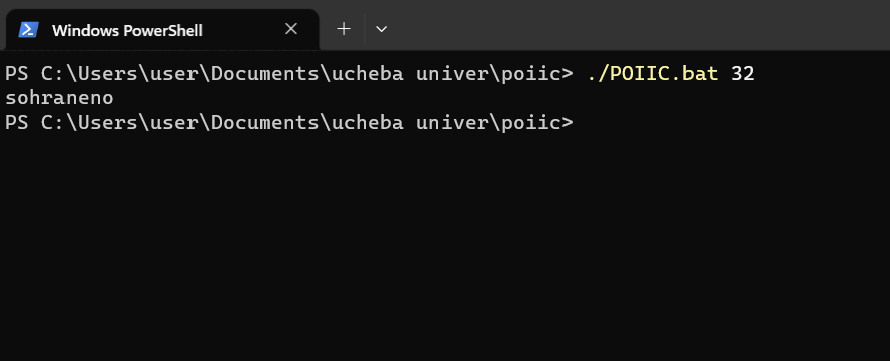
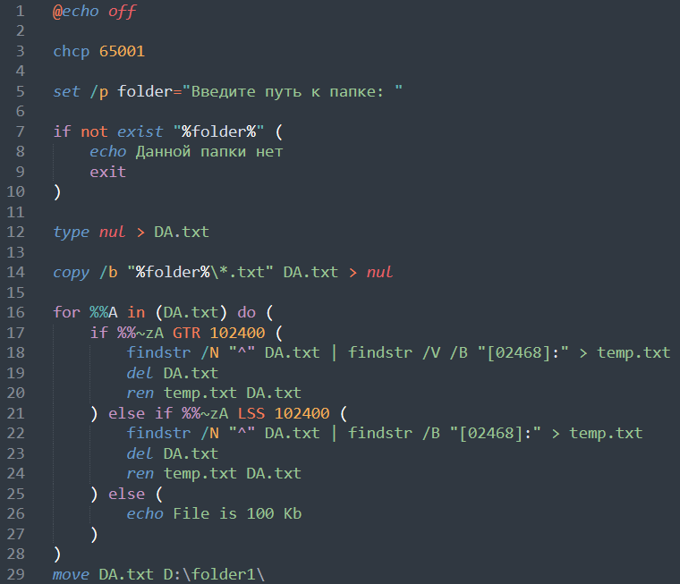
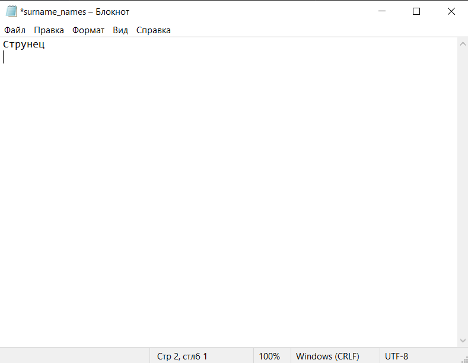
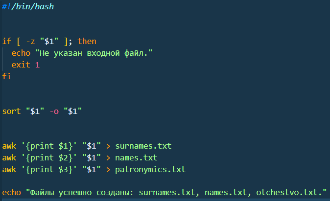
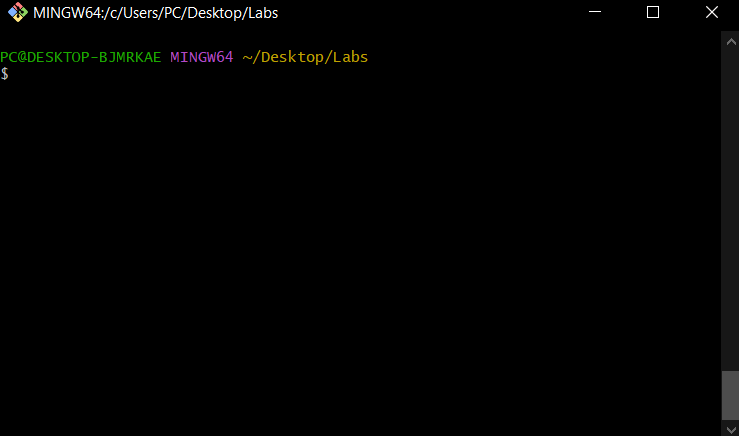
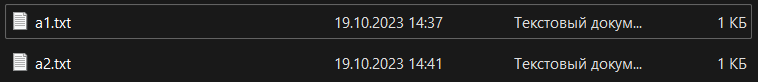
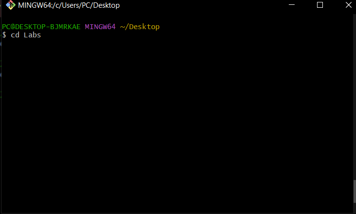
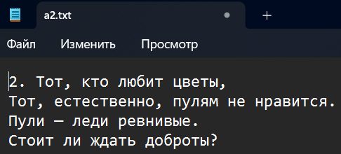
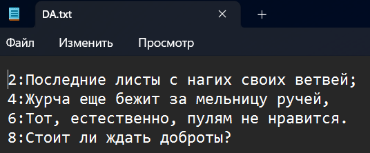
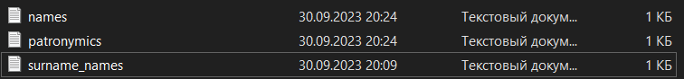

# Цель лабораторной работы №1:

- Ознакомиться с командной строкой операционных систем _Windows_ и _Linux_.
- Создать исполняемые файлы _.bat_ и _.sh_ в соответствии с заданными правилами.

# Условие Лабораторной работы №1. Вариант 26.



# Описание алгоритма и переменных. Пример запуска и выполнения программы.([_.bat_]() файл)



## Алгоритм программы

1. Установить опцию `enabledelayedexpansion`.
2. Определить и инициализировать переменные `inputFile`, `lastNameFile`, `firstNameFile` и `middleNameFile`.
3. Создать пустые файлы `lastNameFile`, `firstNameFile` и `middleNameFile`.
4. Записать строки с ФИО в файл `inputFile`.
5. Отсортировать строки в файле `inputFile`.
6. Для каждой строки в файле `inputFile`, выполнить следующие действия:
   - Разделить строку на три токена: Фамилия, Имя и Отчество.
   - Записать каждый токен в соответствующий файл `lastNameFile`, `firstNameFile` и `middleNameFile`.

### Переменные

- `inputFile`: Содержит имя файла, в который записываются строки с ФИО.
- `lastNameFile`: Содержит имя файла, в который записываются фамилии.
- `firstNameFile`: Содержит имя файла, в который записываются имена.
- `middleNameFile`: Содержит имя файла, в который записываются отчества.

## Методы и команды

```
setlocal enabledelayedexpansion
set "variable=value"
type nul > "filename"
echo text >> "filename"
sort "inputFile" /o "inputFile"

```

- Включение режима отложенного разрешения переменных `setlocal enabledelayedexpansion `.
- Эта команда устанавливает значение переменной `set "variable=value"`.
- Эта команда создает пустой файл. `type nul > "filename"`.
- Эта команда добавляет текст в конец файла`echo text >> "filename"`.

- Эта команда сортирует содержимое файла inputFile в порядке возрастания `sort "inputFile" /o "inputFile"`

```
for /f "delims=" %%a in (%inputFile%) do (
    ...
)
```

- Цикл `for /f "delims="`

В этом цикле каждая строка из файла inputFile считывается и присваивается переменной %%a. Ключевое слово delims= указывает, что необходимо рассматривать всю строку как один элемент (т.е., не использовать разделители). Затем выполняются команды внутри цикла для каждой строки.

```
for /f "tokens=1,2,3" %%b in ("%%a") do (
    ...
)

```

- В этом цикле каждая строка, считанная во внешнем цикле, разделяется на три токена (Фамилия, Имя и Отчество) и присваивается переменным `%%b`, `%%c` и `%%d` соответственно. Ключевое слово `tokens=1,2,3` указывает, что нужно разделить строку на три токена, используя пробелы в качестве разделителей.

- Внутри вложенного цикла выполнены следующие команды:
  - `echo %%b>> "%lastNameFile%"`
  - `echo %%c>> "%firstNameFile%"`
  - `echo %%d>> "%middleNameFile%"`

Каждый токен (Фамилия, Имя, Отчество) записывается в отдельный файл (`lastNameFile`, `firstNameFile` и `middleNameFile`) путем добавления соответствующего токена в конец файла с помощью команды `echo`. Знак `>>` используется для добавления текста в конец файла.

Таким образом, внешний цикл for обрабатывает каждую строку в файле inputFile, а вложенный цикл for разделяет каждую строку на три токена (Фамилия, Имя, Отчество) и записывает их в соответствующие файлы.

## Пример запуска

Запускаем командную строку `(Win + R)`. Для открытия папки с .bat файлом вводим  
`cd путь_к_файлу`.


Чтобы запустить .bat файл используем

`start название_файла.bat`.


Файл запущен.

## Пример работы программы:


Запускаем.


Программа работает. Появились новые файлы : first_names.txt, middle_names.txt, surname_names.txt откроем их.






В результате программы было создано три файла, содержащих имя, фамилию, отчество.

Рассмотрим файл file.sh.

## Описание алгоритма и переменных. Пример запуска и выполнения программы.([_.sh_]() файл)

> Для создания файла с расширением .sh будем использовать ([_Gitbush_](https://git-scm.com/downloads).)



## Последовательность действий алгоритма:

-Проверяет, был ли передан аргумент командной строки (имя входного файла). Если аргумент отсутствует (-z "$1"), выводит сообщение об ошибке и завершает выполнение скрипта (exit 1).

-Сортирует содержимое входного файла ("$1") и перезаписывает его (-o "$1"). Таким образом, входной файл будет отсортирован в алфавитном порядке.

-Используя утилиту awk, скрипт извлекает каждую компоненту ФИО из отсортированного файла и записывает их в отдельные файлы:

-Команда awk '{print $1}' "$1" > surnames.txt извлекает первый столбец (фамилии) и записывает их в файл surnames.txt.
-Команда awk '{print $2}' "$1" > names.txt извлекает второй столбец (имена) и записывает их в файл names.txt.
-Команда awk '{print $3}' "$1" > patronymics.txt извлекает третий столбец (отчества) и записывает их в файл patronymics.txt.
-Выводит сообщение о успешном создании файлов surnames.txt, names.txt и patronymics.txt.

### Переменные:

-$1: Переменная, представляющая первый аргумент командной строки. В данном случае, ожидается, что это будет имя входного файла, передаваемое скрипту при его запуске.

-surnames.txt: Переменная, представляющая имя файла, в который записываются фамилии.

-names.txt: Переменная, представляющая имя файла, в который записываются имена.

-patronymics.txt: Переменная, представляющая имя файла, в который записываются отчества.

### Команды:

-`if [ -z "$1" ]; then ... fi`: Условная конструкция if, которая проверяет, является ли переменная $1 пустой (аргумент командной строки не указан). Если это условие выполняется, то выполняются команды между then и fi, в данном случае выводится сообщение об ошибке и скрипт завершает выполнение.

-`echo "Не указан входной файл."`: Команда echo, которая выводит сообщение на стандартный вывод (в данном случае выводится сообщение об ошибке).

-`exit 1`: Команда exit, которая завершает выполнение скрипта. В данном случае, скрипт завершается с кодом возврата 1, указывающим на ошибку.

-`sort "$1" -o "$1"`: Команда sort, которая сортирует содержимое файла, указанного в переменной $1, и перезаписывает его (-o "$1"). В данном случае, входной файл будет отсортирован в алфавитном порядке.

-`awk '{print $1}' "$1" > surnames.txt`: Команда awk, которая извлекает указанный столбец ($1) из файла, указанного в переменной $1, и записывает его в файл surnames.txt. Аналогичные команды используются для извлечения имён и отчеств из файла.

-`echo "Файлы успешно созданы: surnames.txt, names.txt, otchestvo.txt."`: Команда echo, которая выводит сообщение об успешном создании файлов на стандартный вывод.

## Пример запуска

Для запуска используем ([_Gitbush_](https://git-scm.com/downloads).)

Запускаем.



Открываем директорию `cd путь_к_файлу`.



Открываем директорию `cd путь_к_файлу`.



Чтобы запустить наш .sh файл используем  
 ` ./название_файла.sh`.


Далее передаем агрумент `input.txt`



Файл запущен.

## Пример работы программы:



Запускаем.

Файлы успешно созданы: surnames.txt, names.txt, patronymics.txt.


В результате программы было создано три файла, содержащих имя, фамилию, отчество.

# Итог

В ходе выполнения Лабораторной работы №1 были применил навыки работы с командной строкой в операционных системах Windows и Linux.Также разработал программы, которые реализовывали алгоритмы, соответствующие заданным условиям.
