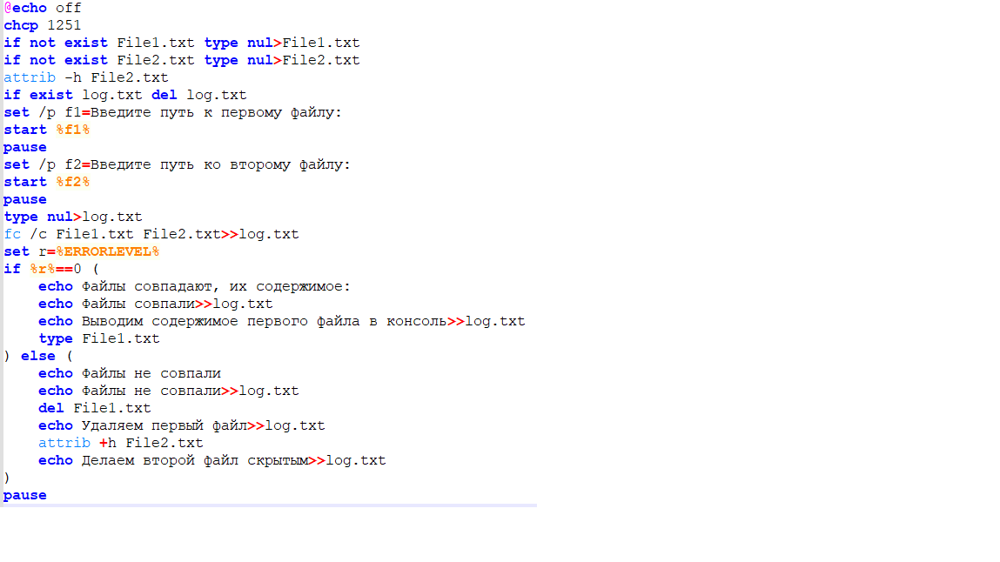
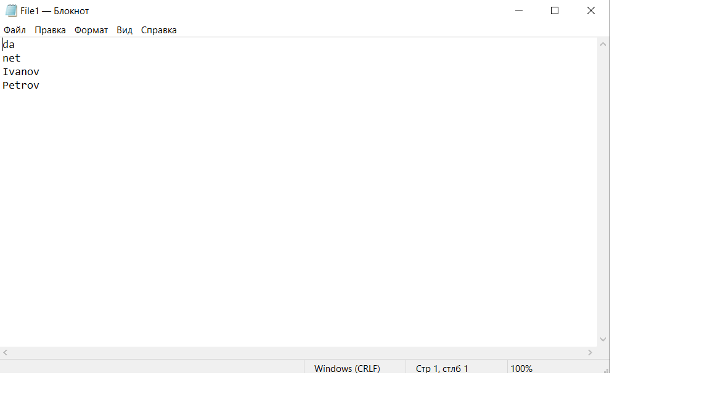
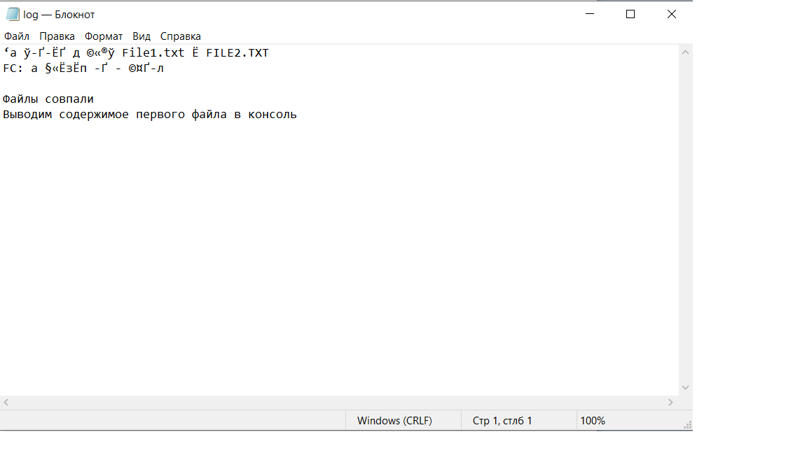

## Условие лабораторной работы №1(27 вариант)

## Код bat-файла

## Алгоритм работы bat-файла
1. Отключаем вывод команд в консоль
2. Добавляем русскую кодировку в консоли
3. Создаем первый файл, если его нет
4. Создаем второй файл, если его нет
5. Снимаем со второго файла аттрибут "скрытый"
6. Удаляем файл log.txt, в который записываются результаты работы(если он есть)
7. Запрашиваем пользователя ввести путь к первому файлу
8. Открываем первый файл
9. Запрашиваем пользователя ввести путь ко второму файлу
10. Открываем второй файл
11. Создаем файл log.txt, в который записываются результаты работы
12. Сравниваем первый и второй файлы, результат сравнения отправляем в файл log.txt
13. Присваиваем переменной r значение кода ошибки в результате сравнения двух файлов(%errorlevel%)
14. Если код ошибки равен нулю, выполняем следующее:  
    14.1. Выводим в консоль сообщение "Файлы совпадают, их содержимое:"  
    14.2. Выводим в файл log.txt сообщение "Файлы совпали"  
    14.3. Выводим в файл log.txt сообщение "Выводим содежримое первого файла в консоль"  
    14.4. Выводим содержимое первого файла в консоль  
15. Если код ошибки не равен нулю, выполняем следующее:  
    15.1. Выводим в консоль сообщение "Файлы не совпали"  
    15.2. Выводим в файл log.txt сообщение "Файлы не совпали"  
    15.3. Удаляем первый файл  
    15.4. Выводим в файл log.txt сообщение "Удаляем первый файл"  
    15.5. Добавляем второму файлу аттрибут "Скрытый"  
    15.6. Выводим в файл log.txt сообщение "Делаем второй файл скрытым"
## Пример работы bat-файла
а) файлы совпадают  
Первый файл:

Второй файл:

Консоль после выполнения работы bat-файлом:

Файл log.txt после выполнения работы bat-файлом:

