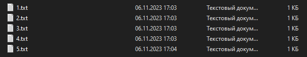
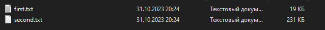

# Лабораторная работа №2
---
## Создать файл sh и bat, который выполняет следующее:
На вход файлу подается относительный или абсолютный путь к папке, атрибут прав доступа к файлу (как параметр пакетного файла). Если такой папки нет, то писать “Данной папки нет” и завершить выполнение программы. Если такая папка есть, то в ней и ее подкаталогах найти все файлы с заданным атрибутом доступа и их имена записать в отдельный файл result.txt.

### .bat файл
```bat
@echo off
chcp 65001

set folder_path=%1
set attributte=%2

REM Проверяем, существует ли указанная папка
if not exist %folder_path% (
    echo This folder not exist
    exit /b
)

REM Поиск файлов с заданным атрибутом доступа и запись их имен в result.txt
dir %1 /a:%2 /s /b > result.txt 

echo The search is complete. The result is written to result.txt
```

---
Ключ /a отвечает за вывод файлов с указанными атрибутами.
Ключ /s отвечает за вывод списка файлов из указанного каталога и его подкаталогов.
Ключ /b отвечает за вывод только имён файлов.

### .sh файл

```sh
folder=$1
permission=$2

# Проверяем существование папки
if [ ! -d "$folder" ]; then
  echo "Данной папки нет"
  exit 1


# Поиск файлов с заданным атрибутом доступа
find "$folder" -type f -perm "$permission" > result.txt

echo "Файлы с заданным атрибутом доступа найдены и записаны в файл result.txt"
```
## Что было(2.txt и 4.txt только для чтения):



## Что записалось в result.txt:


# Вывод

В ходе выполнения Лабораторной работы №1 были применены навыки работы с командной строкой в операционных системах Windows и Linux. Также были разработаны программы, которые реализовывали алгоритмы, соответствующие заданным условиям.
        
