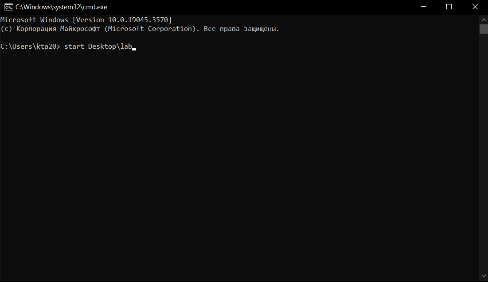
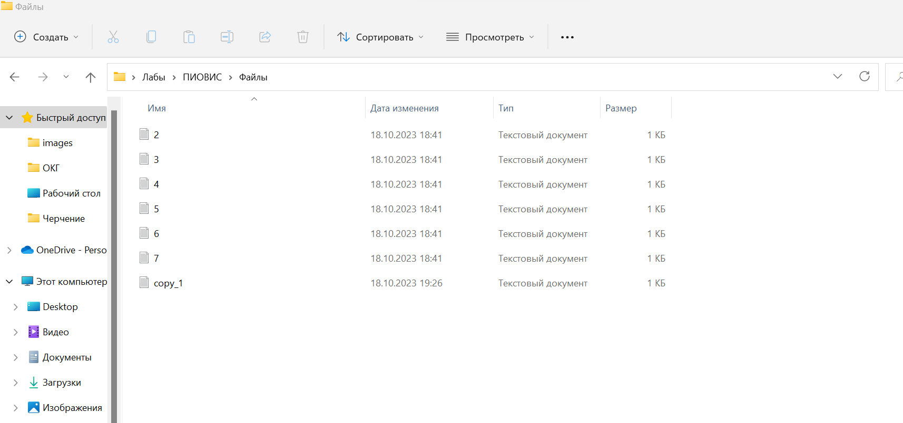

# Условие Лабараторной работы №1 (30 Вариант)
30.Создать файл sh и bat, который выполняет следующее: 
На вход пакетному файлу приходит абсолютный путь к папке (как параметр пакетного файла). В указанной папке найти самый маленький txt-файл, вывести его содержимое в файл copy_[название_файла].txt и удалить. Вместо [название_файла] подставить название удаленного файла.

# Описание алгоритма, пример запуска и выполнение программа ([_.bat_](https://github.com/iis-32170x/RPIIS/blob/%D0%A8%D0%B0%D1%80%D0%BE%D0%B2_%D0%A4/lab30.bat)) 

#### Переменные
- *folder* - В этой переменной сожеожится абсолюный путь к папке с текстовыми файлами.
- *smallestSize* - содержит размер самого маленького файла.
- *smallestFile* -полный путь к самому маленькому файлу.
- *filename* - только название самого маленького файла.
#### Последовательность действий:
1. На вход(как параметр пакетного файла) подается название папки в которой надо найти самый маленький текстовый файл.
2. Дальше в цикле перебираются все текстовые файлы и программа находит минимальный из них.
3. Записывает размер самого маленького файла в переменную *smallestSize* и путь к файлу в переменную *smallestFile*.
4. Дальше в следующем цикле в переменную *filename* из переменной *smallestSize* выдергивается только название файла.
5. После этого в папке копируется содержимое самого маленького файла в файл с пррепиской copy_ и дальше название самого маленького файла (copy_*filename*).
6. После самый маленький файл удаляется.
7. В конце работы программы на экран выводится название самого маленького файла и его размер.
#### Пример выполнение программы
Создадим папку с текстовыми файлами.

Откроем cmd.

Запустим скрипт через cmd подав на вход название папки.
После запуска в командной строке выводится минимальный текстовый файл и его размер.

После в папке которую мы передали как параметр, удалился самый маленький файл, а его содержимое скопировалось в copy_название самого маленького файла.

# Описание алгоритма, пример запуска и выполнение программа ([_.sh_](https://github.com/iis-32170x/RPIIS/blob/%D0%A8%D0%B0%D1%80%D0%BE%D0%B2_%D0%A4/lab30.bat)) 

#### Переменные
- *folder* - В этой переменной сожеожится абсолюный путь к папке с текстовыми файлами.
- *smallestSize* - содержит размер самого маленького файла.
- *smallestFile* -полный путь к самому маленькому файлу.
- *filename* - только название самого маленького файла.
#### Последовательность действий:
1. На вход(как параметр пакетного файла) подается название папки в которой надо найти самый маленький текстовый файл.
2. Дальше в цикле перебираются все текстовые файлы и программа находит минимальный из них.
3. Записывает размер самого маленького файла в переменную *smallestSize* и путь к файлу в переменную *smallestFile*.
4. Дальше в следующем цикле в переменную *filename* из переменной *smallestSize* выдергивается только название файла.
5. После этого в папке копируется содержимое самого маленького файла в файл с пррепиской copy_ и дальше название самого маленького файла (copy_*filename*).
6. После самый маленький файл удаляется.
7. В конце работы программы на экран выводится название самого маленького файла и его размер.
#### Пример выполнение программы
Создадим папку с текстовыми файлами.

Откроем Git Bash.

Запустим скрипт через консоль и введем название папки.
После запуска в консоль выводится минимальный текстовый файл и его размер.

После в папке которую мы передали как параметр, удалился самый маленький файл, а его содержимое скопировалось в copy_название самого маленького файла.

# Итог
