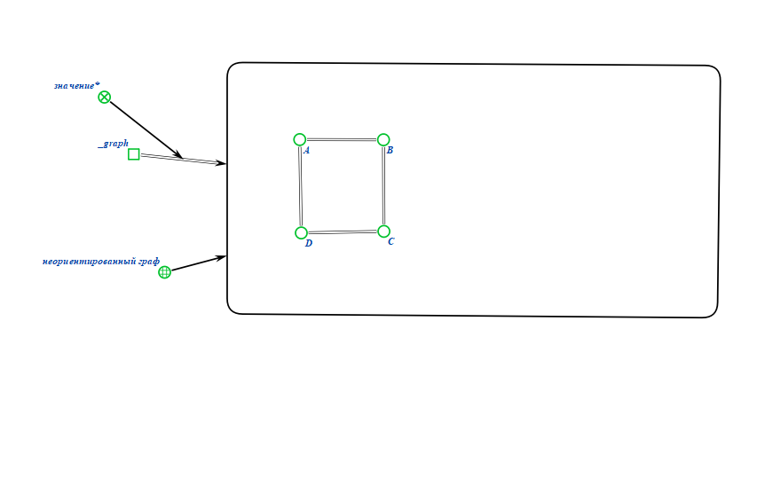
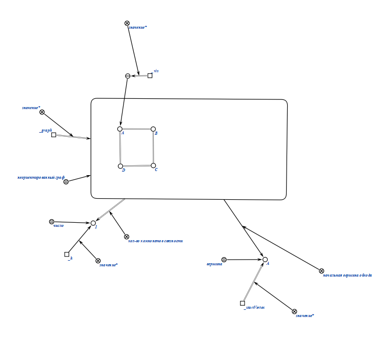
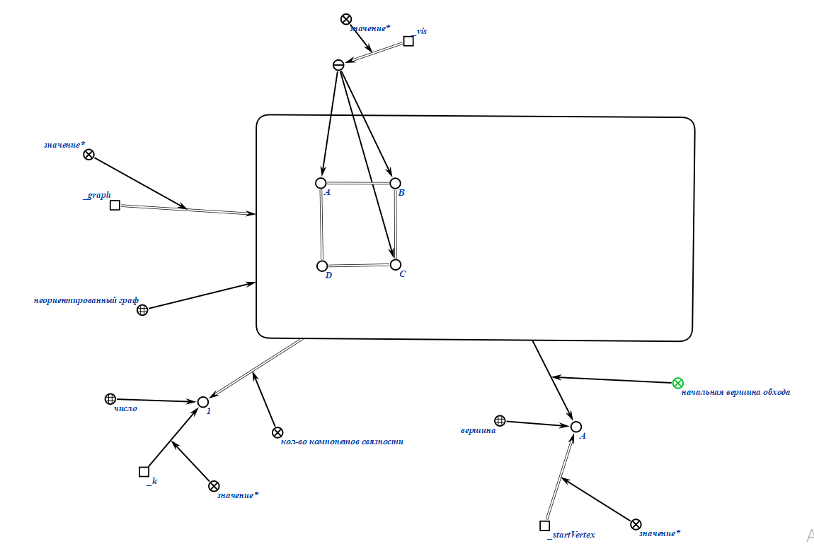
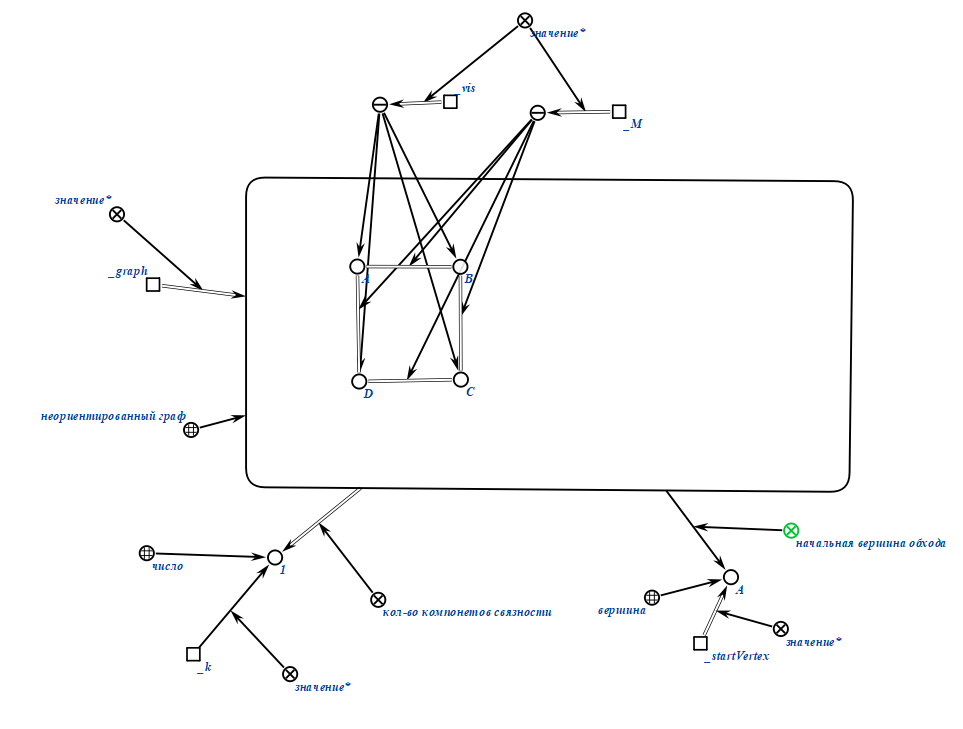
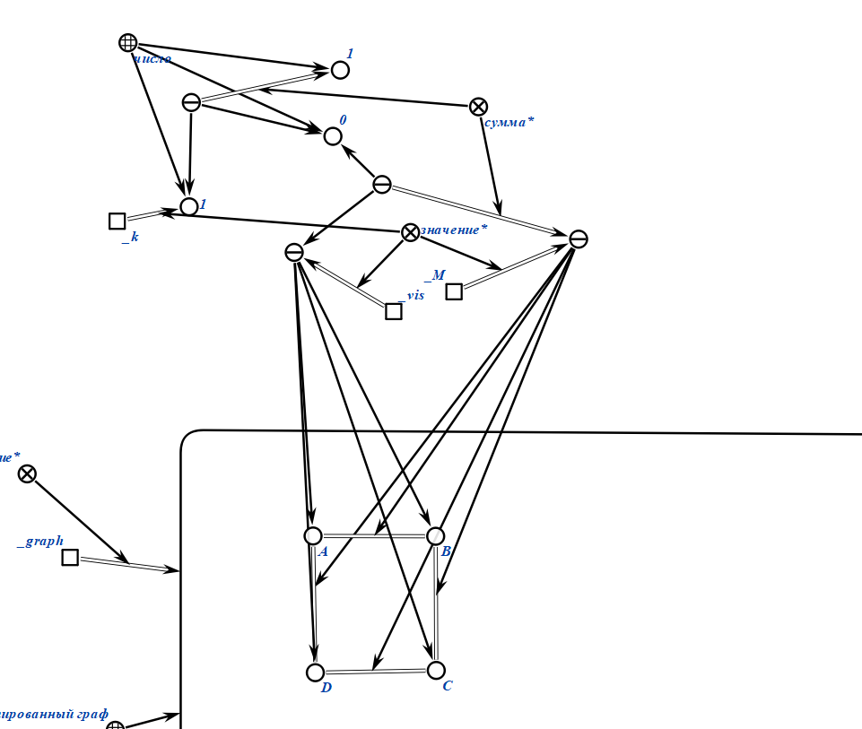

# Формализация алгоритма расчетной работы (РР)

### Задание РР 
6.1 Найти минимальное кол-во ребер для удаление, которое требуется для превращение графа в дерево

Реализовать на C++ код, который может найти эйлеров цикл в неориентированном графе.

Граф представляется в виде матрицы смежности.

### Формализация используемых понятий

### Алгоритм РР

1. Пользователь задает неориентированный граф.
2. Пользователь выбирает вершину для начала обхода.
3. При помощи DFS находится количество связный компонтентов(k)
4. Результатов является значение формулы N-M+K, где N - кол-во ребер, M - вершин, k-связный компонентов

### Результат формализации алгоритма РР

1. Пользователь задает неориентированный граф.
   

2. Создается переменная подсчитывающая кол-во связных компонентов
   

3. Пользователь выбирает вершину для начала обхода (предположим, A).
   

4. Начинаем обхов с вершины А и записываем ее в список vis. Переменная K увеливается на 1

5. Переходим в вершину B, и записываем ее в vis.
    

6. Повторяем это, пока не доходим до вершины, из коротой "выхода" нет: A.

   

7. Как только мы обошли все вершины, начинаем подсчитывать все ребра графа и заносить их число в переменную M.

8. Обойдя все ребра, подсчитывает количество, которое нужно удалить по формуле M - vis + k.

### Результат погружения в метасистему OSTIS

1. В метасистему были погружены примеры алгоритма, а также тесты (вход/выход).

Формализация понятия "количество компонент связности":

Формализацяи понятия "неориентированный граф":

