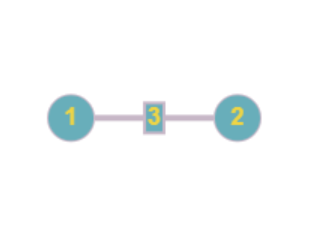

# Расчетная работа 

## Введение

### Цель

Изучить основы теории графов, способы представления графов, базовые алгоритмы для работы с графами,

### Задание

Реализовать на C++ код, который может найти в графе минимальный простой разрез.
Граф представляется в виде матрицы смежности.

### Ключевые понятия

`Граф` - математическая абстракция реальной системы любой природы, объекты которой обладают парными связями. 

Графы, в которых все ребра являются звеньями, то есть порядок двух концов ребра графа не существенен, называются `неориентированными`. 

`G` - неориентированный взвешенный граф с n вершинами и m рёбрами.

`Матрица смежности` - это вид представления графа в виде матрицы, когда пересечение столбцов и строк задаёт дуги. Используя матрицу смежности, можно задать вес дуг и ориентацию. Каждая строка и столбец матрицы соответствуют вершинам, номер строки соответствует вершине, из которой выходит дуга, а номер столбца - в какую входит дуга.

`Весом разреза` называется сумма весов рёбер, проходящих через разрез, т.е. таких рёбер, один конец которых принадлежит A, а второй конец - B.

`Взвешенный граф` — граф, каждому ребру которого поставлено в соответствие некое значение (вес ребра)

`Разрезом` называется такое разбиение множества V на два подмножества A и B, что: A,B⊂V;   A,B≠∅;  A∩B=∅;  A∪B=V.

`Наименьший (минимальный) разрез графа` — это разрез с минимально возможным весом.

## Идея решения

Воспользуемся алгоритмом Штор-Вагнера нахождения минимального разреза.

В общем случае допускаются петли и кратные рёбра. Веса рёбер разреза будем суммировать, а петли игнорировать, так как они не влияют на решение. 

Общая идея алгоритма состоит в последовательном добавлении вершин в множество A и обновлении весов вершин, пока не будет достигнут минимальный разрез. Алгоритм продолжает работу до тех пор, пока не будет выполнено n - 1 фаз, где n - количество вершин в графе. На каждой фазе выбирается вершина с наибольшим весом, которая ещё не входит в множество A, и она добавляется в него. Веса вершин обновляются путём прибавления весов ребер, инцидентных выбранной вершине. Когда это возможно, множество A объединяется с множеством B, и веса ребер между множествами обновляются.

## Тесты

№1

<table>
<tr>
  <td>
    
  </td>
  <td>

## Ответ 

Найменьший разрез равен 1 
 
 </td>
</tr>

## Вывод

 В результате выполнения данной работы были получены следующие практические навыки:
- изучены основы теории графов
- изучены способы представления графов
- изучены базовые алгоритмы для работы с графами