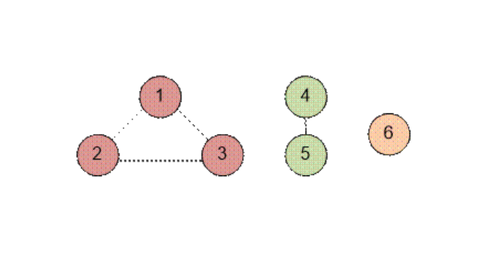

# Расчетная работа 


## Цель

Цель работы - изучить основы теории графов, способы представления графов, базовые алгоритмы для работы с разными видами графов.

### Задание

Реализовать код на языке `С++`, который используя в качестве способа выражения графа матрицу смежности, будет находить количество компонент неориентированного графа.

### Ключевые понятия

`Граф` - математическая абстракция реальной системы любой природы, объекты которой обладают парными связями. Граф как математический объект есть совокупность двух множеств — множества самих объектов, называемого множеством вершин, и множества их парных связей, называемого множеством рёбер.

`Компонента связностии` - набор вершин графа, между любой парой которых существует путь.

 
 
Граф на иллюстрации содержит три компоненты связности, закрашенные разными цветами. Можно заметить, что даже одна вершина, изолированная от остального графа, составляет компоненту связности.

`Неориентированныйграф` -граф, в котором все ребра являются звеньями, то есть порядок двух концов ребра графа не существенен.

`Матрица смежности` - это способ представления графа в виде матрицы. В этой матрице каждая строка и столбец соответствуют одной вершине графа. Элемент матрицы на пересечении строки i и столбца j >= 1, если вершины i и j соединены ребром, и =0, если они не соединены.

## Идея решения
Используя систему непересекающихся множеств, ищем количество компонент связности в графе.

Изначально расположим каждую вершину в отдельном множестве. Каждая вершина является представителем своего множества.

Далее для каждого ребра (u, v) объединим множества, содержащие u и v. После обработки всех ребер количество компонент связности равно числу множеств в системе непересекающихся множеств.

## Пример

Приведем пример графа:
 


Изначально расположим каждую вершину в отдельном множестве. Каждая вершина является представителем своего множества.
 

Далее для каждого ребра (u, v) объединим множества, содержащие u и v. После обработки всех ребер две вершины будут находиться в одной компоненте связности если у них одинаковый представитель.
 
 
Количество компонент связности равно числу множеств в системе непересекающихся множеств. Количество множеств равно числу представителей, а именно количеству таких v, для которых parent[v] = v.
В примере имеется три представителя: 3, 5 и 6. То есть в графе имеется три компоненты связности.

 
## Алгоритм и его реализация

В `comp[]` содержится количество несвязных множеств (компонент). В `comp[i]` содержится номер вершины, на которую указывает вершина i.

> [!NOTE]
> Изначально количество компонент связности равно количеству вершин графа.

```c++
int comp[100];
for (i = 1; i <= n; i++) comp[i] = i;

```

Функция `set` возвращает номер вершины – представителя множества, содержащего вершину k. Двигаемся по указателю на следующий элемент, пока не встретим представителя множества (его указатель указывает на него самого).

 
```c++
int set(int k)
{
	while (k != comp[k]) 
		k = comp[k];
	return k;
}
```
 

Функция `join` объединяет два множества, которые содержат вершины i и j. Ищем представителей множеств, содержащих i и j. Записываем этих представителей в i и j. Если i=j, то вершины i и j содержатся в одном множестве, и в таком случае ничего делать не надо. Иначе указатель представителя i перенаправляем на j.

 
 
```c++
void join(int i, int j)

{
	i = set(i);
	j = set(j);
	if (i != j) comp[i] = j;
}
```
 


Основная часть программы. Изначально каждая вершина указывает сама на себя (comp[i] = i).

 ```c++
int comp[100];
for (i = 1; i <= n; i++) comp[i] = i;

```
 

Читаем матрицу смежности. Для каждого ребра (i, j), где i < j, совершаем объединение множеств, содержащих вершины i и j.

```c++
 cout << "Введите матрицу смежности графа\n";

	for (i = 1; i <= n; i++)
		for (j = 1; j <= n; j++)
			{
				cin >> k;
				if ((i < j)&&(k)) join(i, j);
			}
```
 

Подсчитываем количество компонент связности в переменной count. Оно равно количеству вершин – представителей множеств (которые указывают сами на себя).


```c++
count = 0;
	for (i = 1; i <= n; i++)
		if (comp[i] == i) count++;
```
 

Выводим ответ.
```c++

	cout << "Количество компонент связанности\n";
	cout<<  count;

```
 
 


## Вывод
 
В результате выполнения данной работы были получены следующие практические навыки:
- изучены основы теории графов
- изучены способы представления графов
- изучены базовые алгоритмы для работы с графами 
