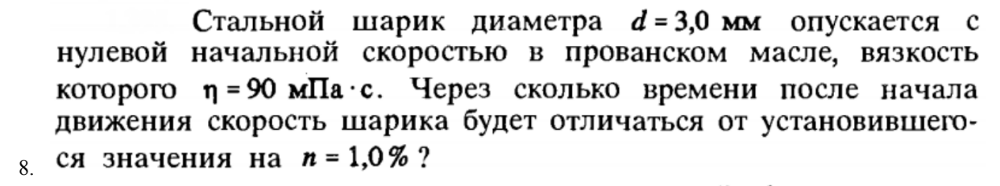
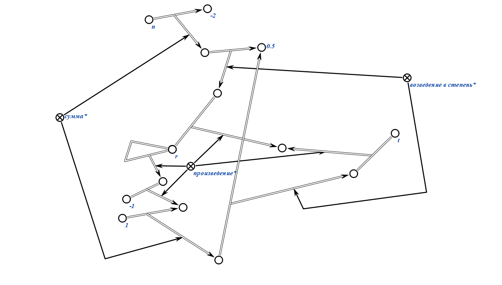
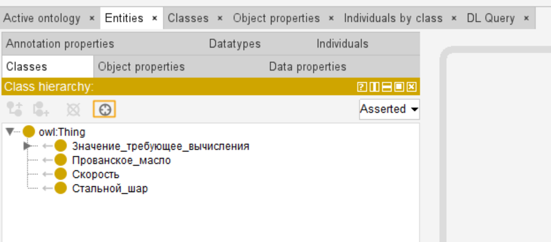
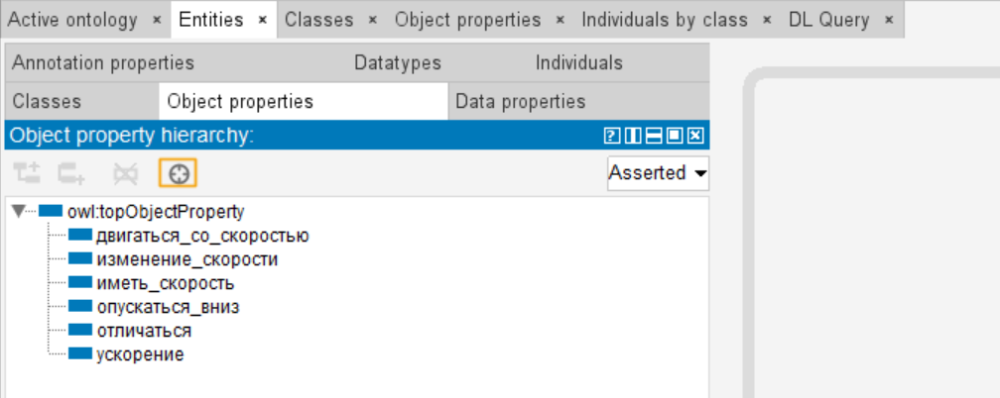
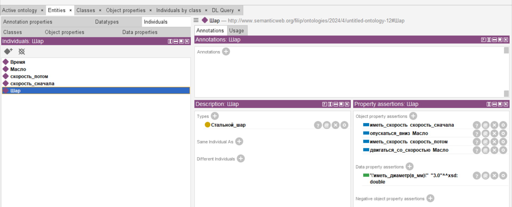
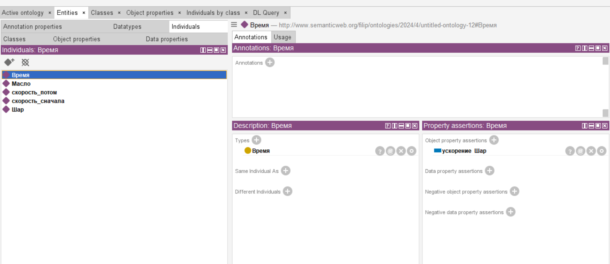

# Самостоятельная работа
## Условие задания для KBE
### Вариант 29

Задание 1. 
 

Результат:

Задание 2.

 

Результат:

## Условие задания для Protege

Результат:

Classes:

Data properties:

Object properties:

Individuals:

Шар:

Масло:

Скорость потом:

Скорость сначала:

Время:
