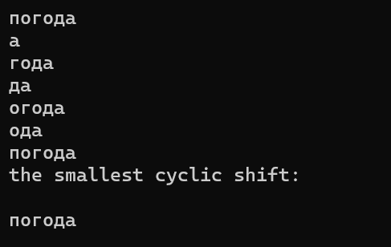
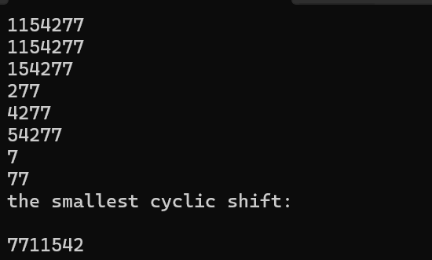
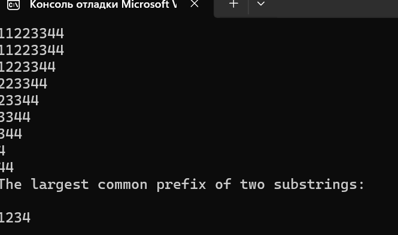

# Лабораторная работа №1

## Цель работы
Исследовать свойства структур данных и разработать библиотеку алгоритмов обработки структур данных.

## Задача
Разработать библиотеку для работы со структурой данных и систему тестов, которые продемонстрировали бы работоспособность реализованной библиотеки.

---

#### Вариант индивидуального задания №7
Суффиксный массив. Построение суффиксного массива из строки. Нахождение наименьшего циклического сдвига строки. Наибольший общий префикс двух подстрок.

---
---

## Определения
**Суффиксный массив** - это лексикографически отсортированный массив всех суффиксов строки

**Циклический сдвиг строки** - это алгоритм позволяет сдвигать элементы строки влево или вправо, сохраняя порядок элементов и обеспечивая цикличность.

**Наибольший общий префикс двух подстрок** - это последовательность символов, которая является общей для двух или более строк и начинается с начала каждой из них. 

---

### Тест функции по поиску наименьшего циклического сдвига.
Пользователь вводит символы 

#### Тест1

#### Тест2

#### Тест3

###Тест функции по поиску наибольший общий префикс двух подстрок.
Пользователь вводит символы 

#### Тест1

#### Тест2

#### Тест3

