# Расчетная работа 
## Цель:
Изучить основы формализации алгоритмов теории графов.

## Задача(5.21):

Формализовать алгоритм выполнения задачи. Найти простой путь заданной длины в графе.

## Формализация алгоритма:

1 Задаем ориентированный граф(в нем мы будем искать путь длиной 3 начиная с вершины 0)

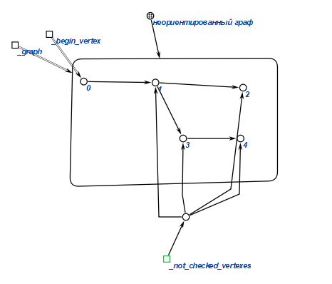

# 
!!! ВАЖНАЯ ПОМЕТКА !!!

### ДАЛЕЕ В ЭТОМ ГРАФЕ РЕБРА НАРИСОВАНЫ НЕПРАВИЛЬНЫМИ ДУГАМИ, ПРАВИЛЬНЫЙ ВАРИАНТ ПРЕДСТАВЛЕН В ФИНАЛЬНОМ ГРАФЕ (последнее изображение перед началом тестов)
# 
Продолжение

2 Берем за начальную вершину 0 и в ней же задаем первую волну, создаем переменную, которая определяет непосещенные вершины из начальной вершины

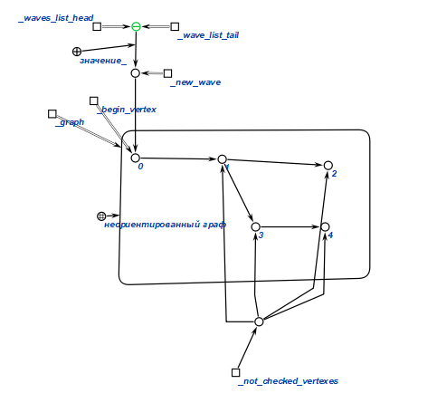

3 Проходим волнами по всему графу 

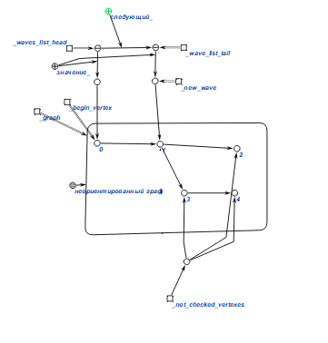

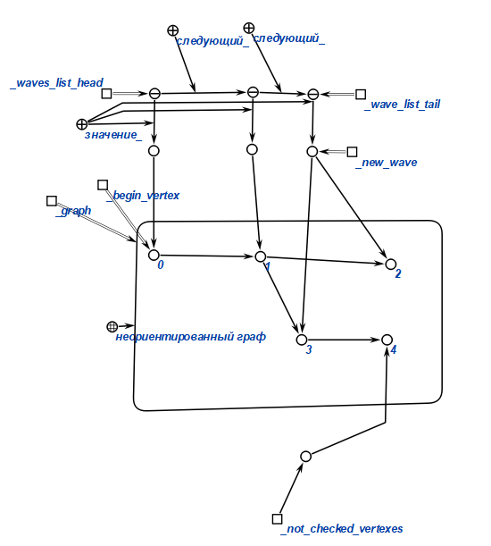

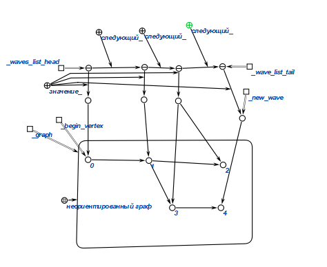

4 После посещения каждой вершины мы проверяем условие 

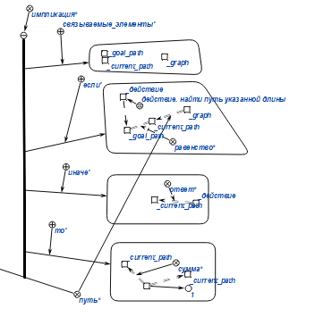

5 Далее начинаем построение оринтированного графа, для построения пути заданной длины по графу. 

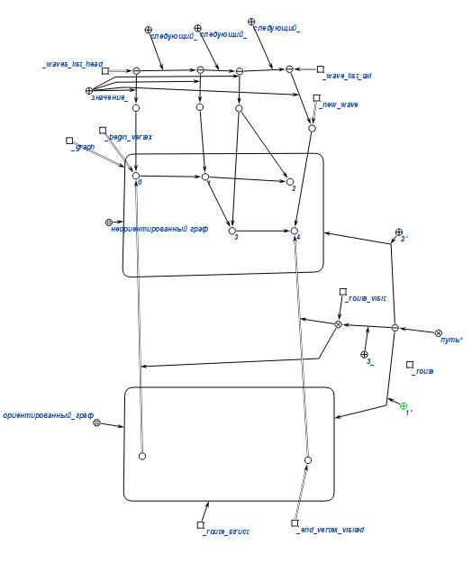

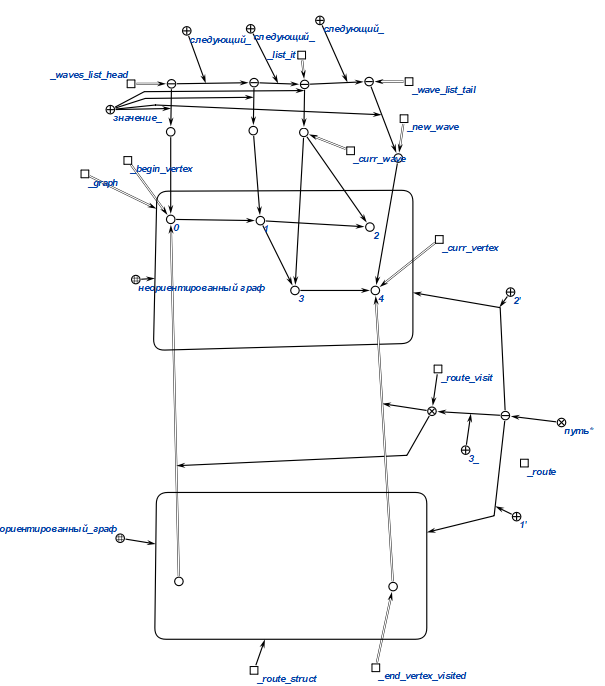

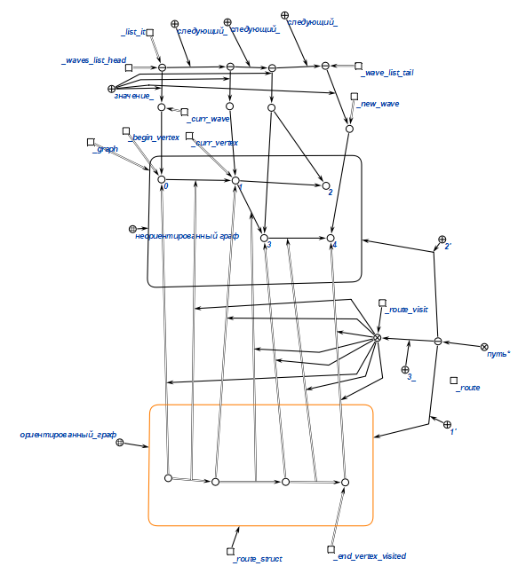

Удалим несущественные части для читаемости

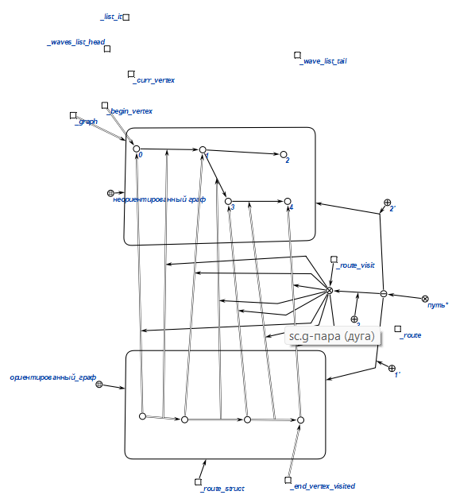

В результате получаем следующий граф

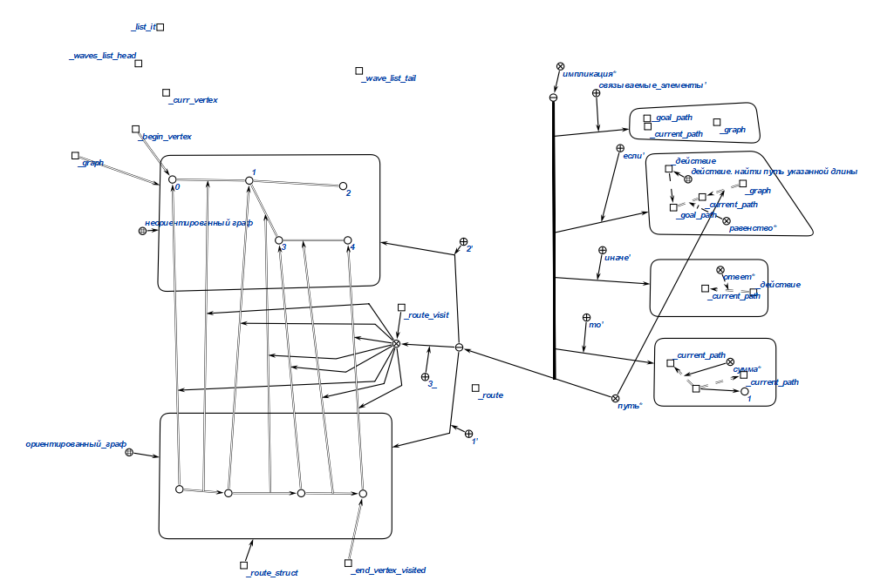

## Тесты
### №2
Входной граф (начало с 0 путь длиной 3)

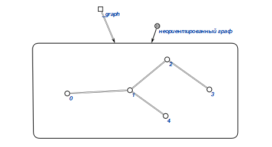

Выход

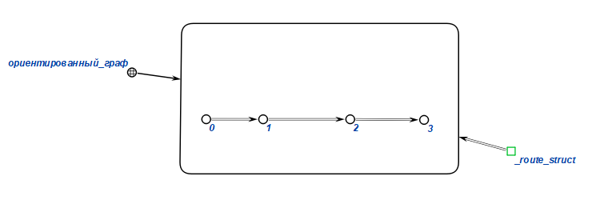

### №3

Входной граф (начало с 3 путь длиной 2)

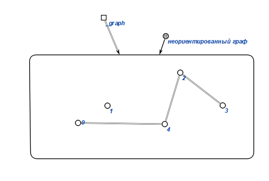

Выход

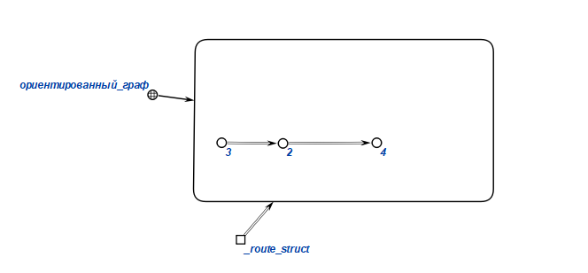

### №4

Входной граф (начало с 1 путь длиной 3)

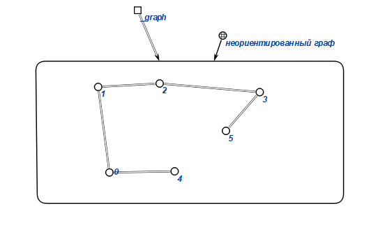

Выход

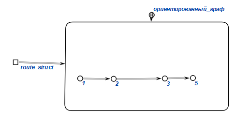

### №5

Входной граф (начало с 0 путь длиной 3)

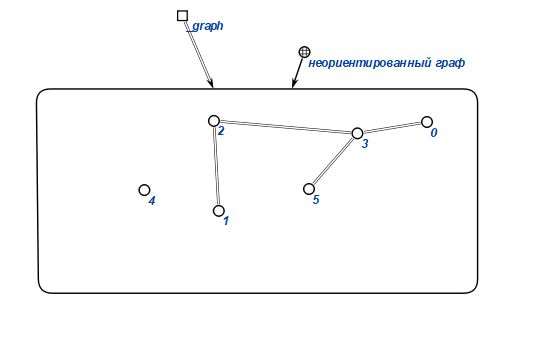

Выход

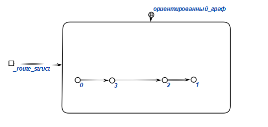

## 
Формализованные понятие в КБЕ

    Граф
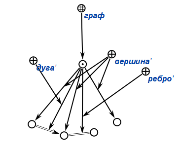

    Неориентированный граф
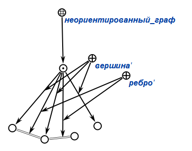

    Путь
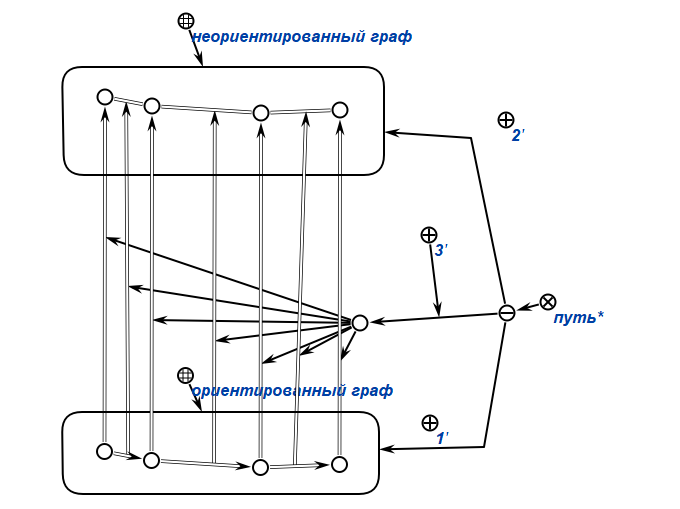

## Вывод 

Научились формализовать алгоритмы работы с графами с использованием редактора КБЕ.