# Расчетная работа 
## Цель:
Изучить основы формализации алгоритмов теории графов.

## Задача(5.21):

Формализовать алгоритм выполнения задачи. Найти простой путь заданной длины в графе.

## Формализация алгоритма:

1 Задаем ориентированный граф(в нем мы будем искать путь длиной 3 начиная с вершины 0)

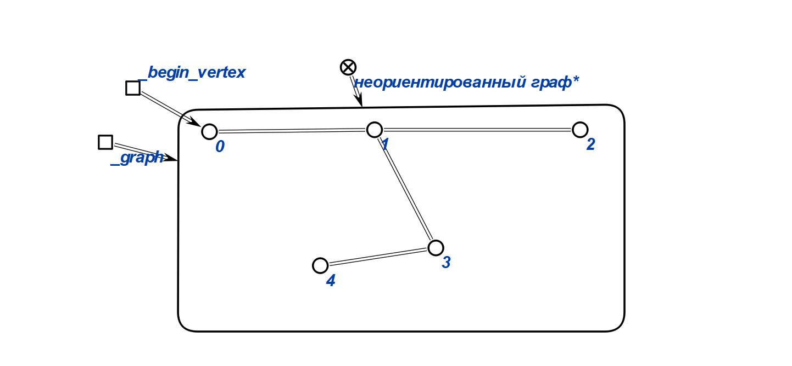

2 Берем за начальную вершину 0 и в ней же задаем первую волну, создаем переменную, которая определяет непосещенные вершины из начальной вершины

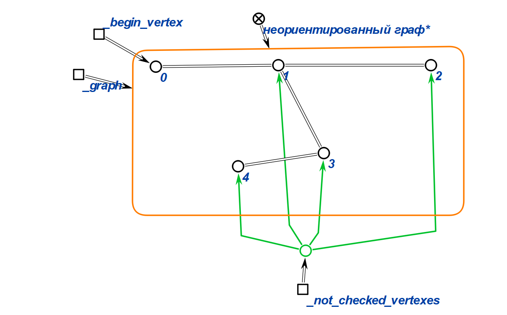

3 Проходим волнами по всему графу 

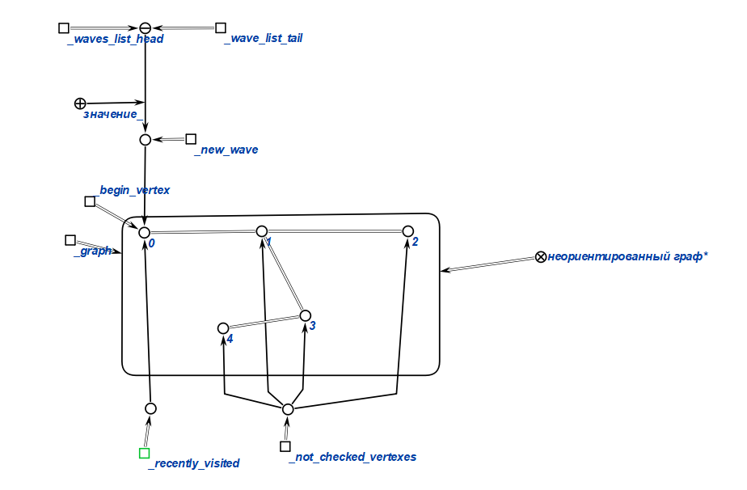

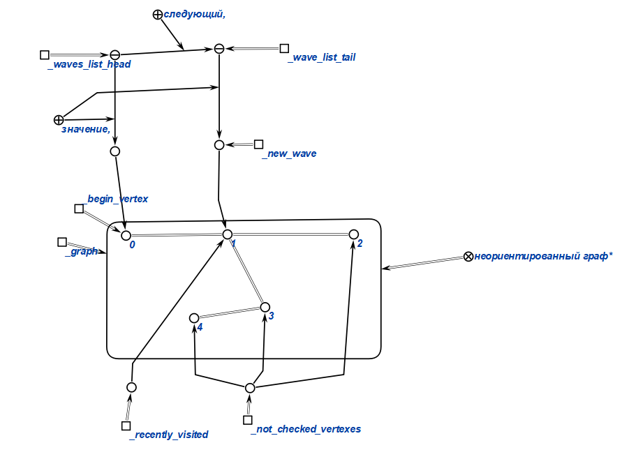

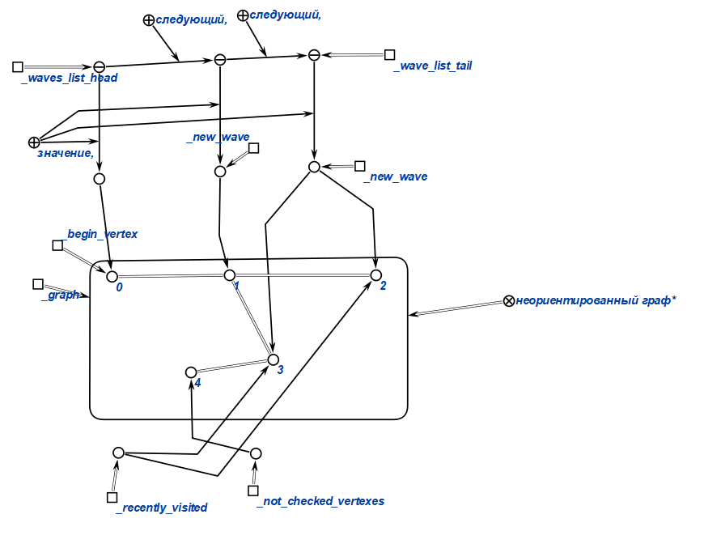

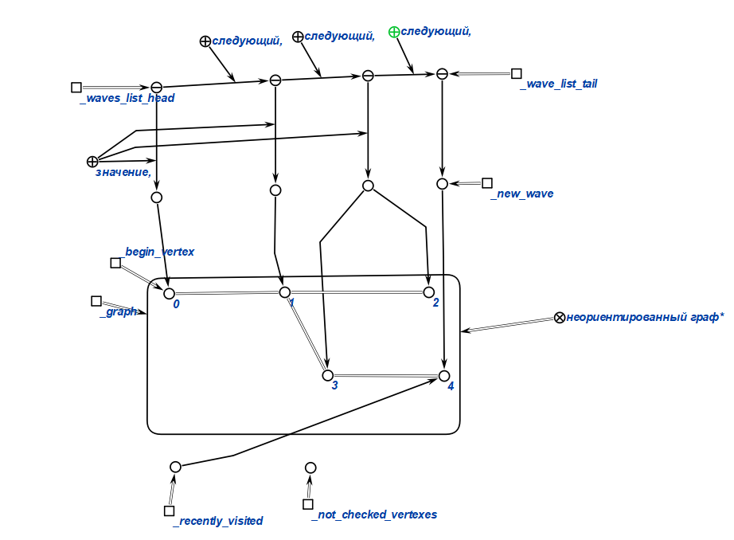

4 После посещения каждой вершины мы проверяем условие 

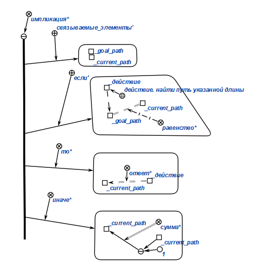

5 Далее, если условие выполняется, начинаем построение оринтированного графа, для построения пути заданной длины по графу. 

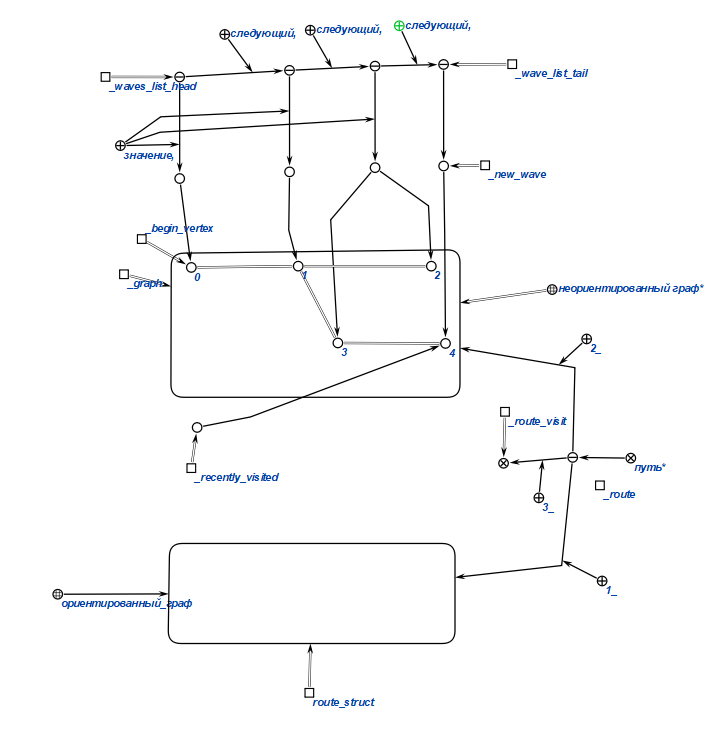

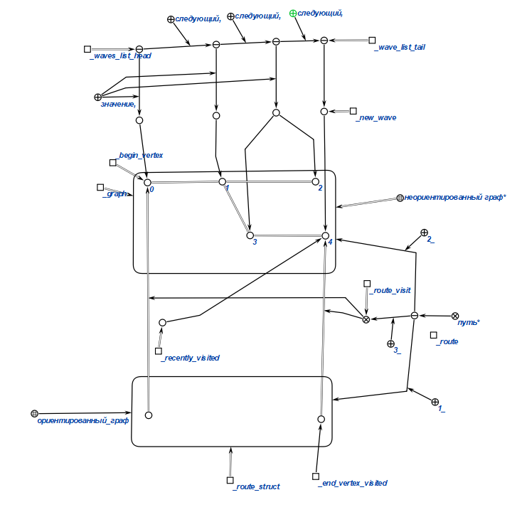

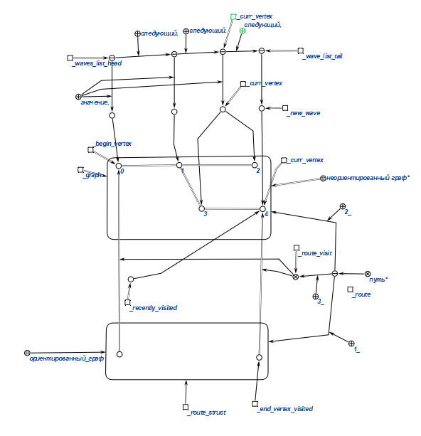

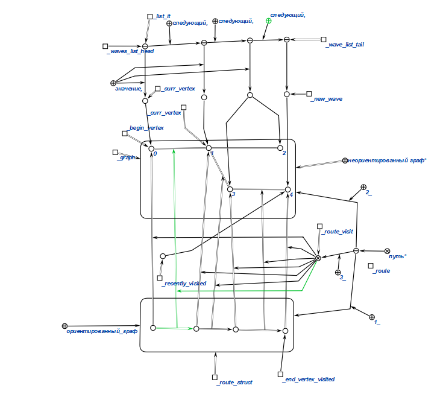

Удалим несущественные части для читаемости

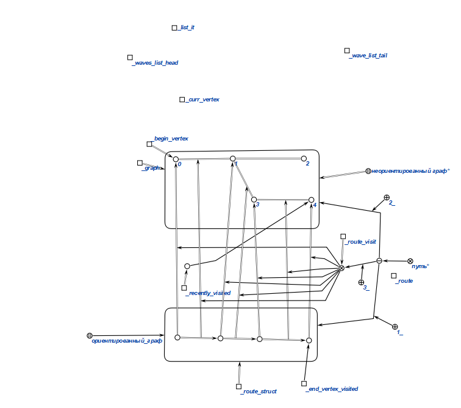

В результате получаем следующий граф

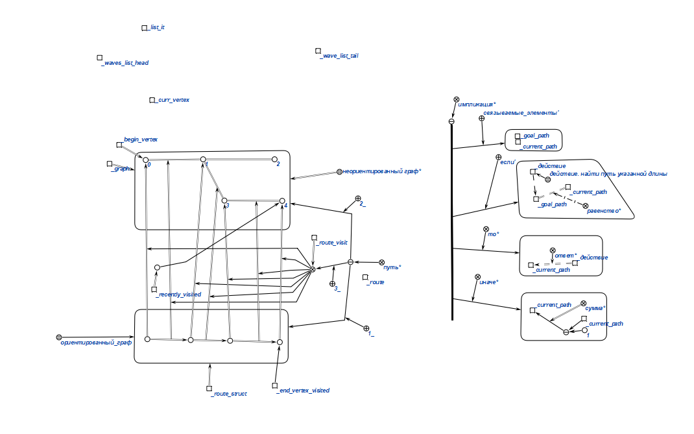

## Вывод 

Научились формализовать алгоритмы работы с графами с использованием редактора КБЕ.