# Формализация алгоритма расчетной работы (РР)

### Задание РР 
4.2 Найти декартову сумму графов 

### Формализации алгоритма РР

1. Пользователь задает 2 неориентированный граф.
   

2. Начало обхода предположим начинается с вершины А.
   
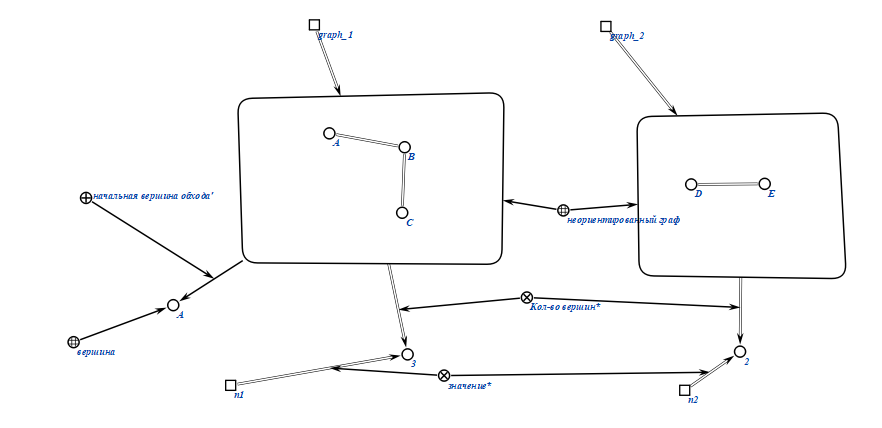

3. Создаем переменную visited где будут хранится посещенные вершины, и переменную not_visited где будут хранится верщины не посещенные.Тем самым берем вершину А и делаем операцию произведения с вершинами переменными not_visited.После берем следующую вершину и повторяем пока не посетим все вершины 1ого графа.

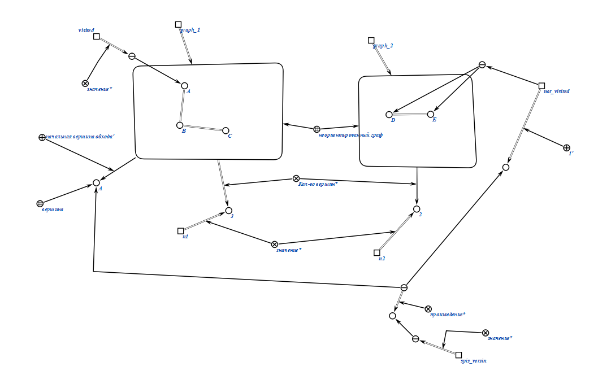

4. Создаем новый граф с вершинами из списка spis_versin

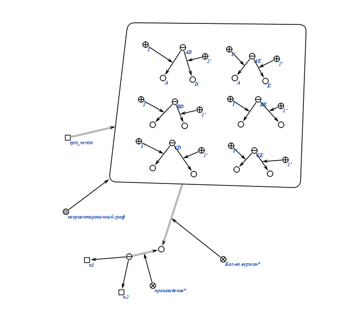
 
5. Создаем переменную где будут хранится посещенные вершины `visited` и `not_visited` где будем хранить вершины с которыми мы должны сравнить вершину из `visited`

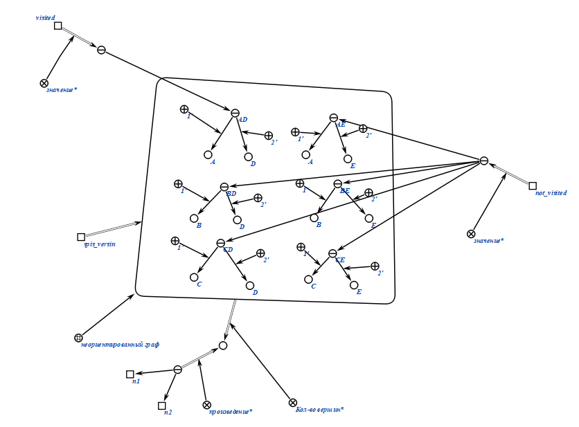

6.После чего при  сравнении вершины из `visited` с вершинами из `not_visited` проверяем условие

Целое условие:

Более детально:
Сначала проверяется если первая компонента `v_1` разная из двух вершин `s_1` и `s_2`, то проверяем если вторая компонента `v_2` из двух вершин `s_1` и `s_2` одинаковая тогда соединяем вершины `s_1` и `s_2`
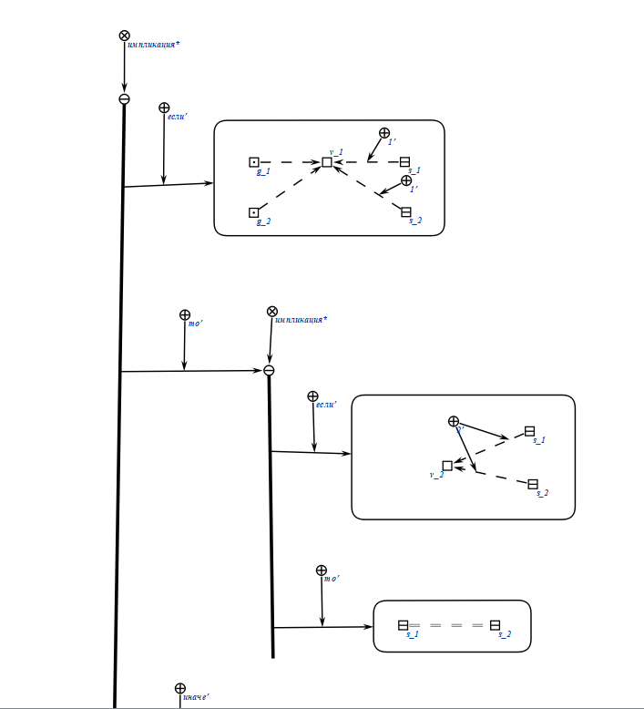
Иначе проверяется если вторая компонента `v_2` разная из двух вершин `s_1` и `s_2`, то проверяем если первая компонента `v_1` из двух вершин `s_1` и `s_2` одинаковая тогда соединяем вершины `s_1` и `s_2`

### Это единственные случае при которых мы соединяем 2 вершины, остальные случаи являются неверными

7. Продолжаем алгоритм вытаскивая из `not_visited` каждую не посещенную вершину пока не останется 0 вершин для посещения

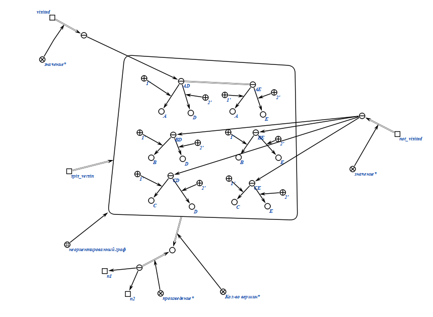
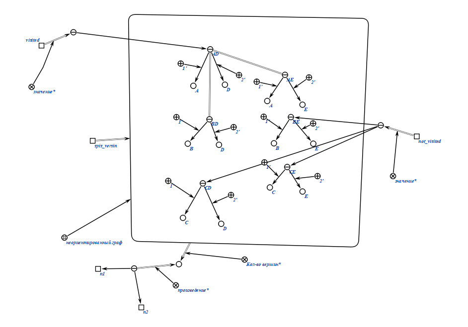
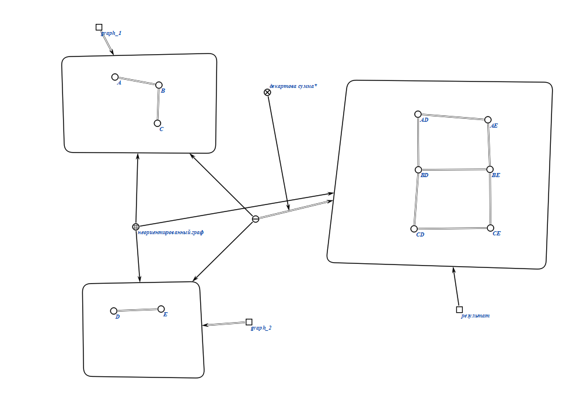
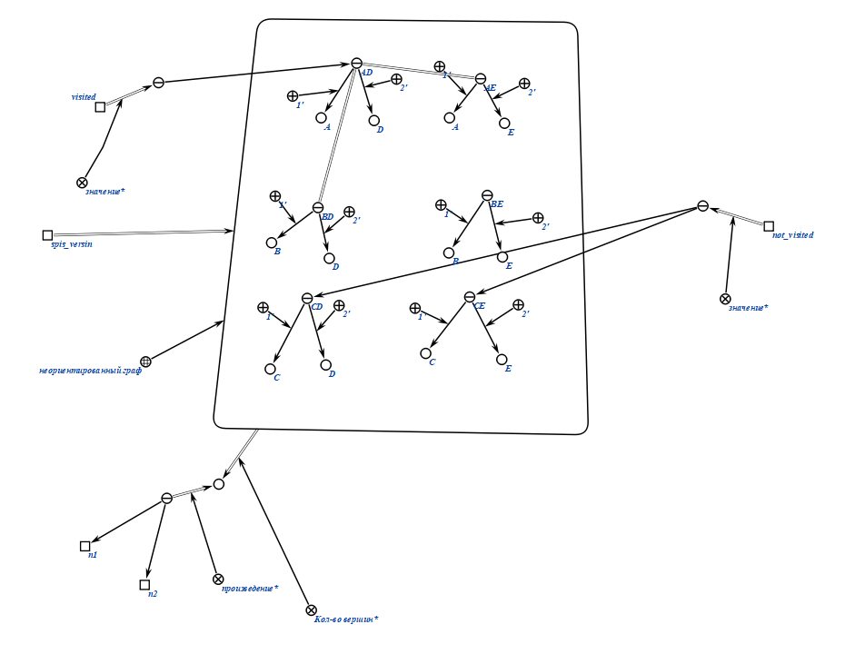
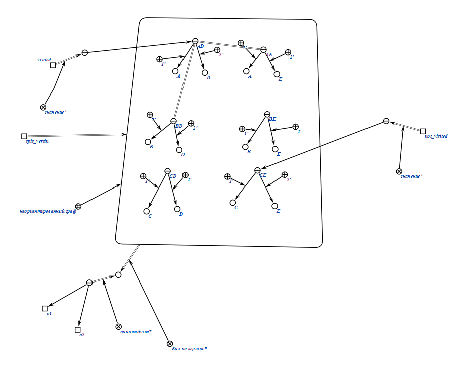

8. После того как у нас все вершины посещены мы удаляем вершину из `visited` и добавляем следующую вершину и формируем новое `not_visited` со всеми вершинами кроме той которая в `visited`

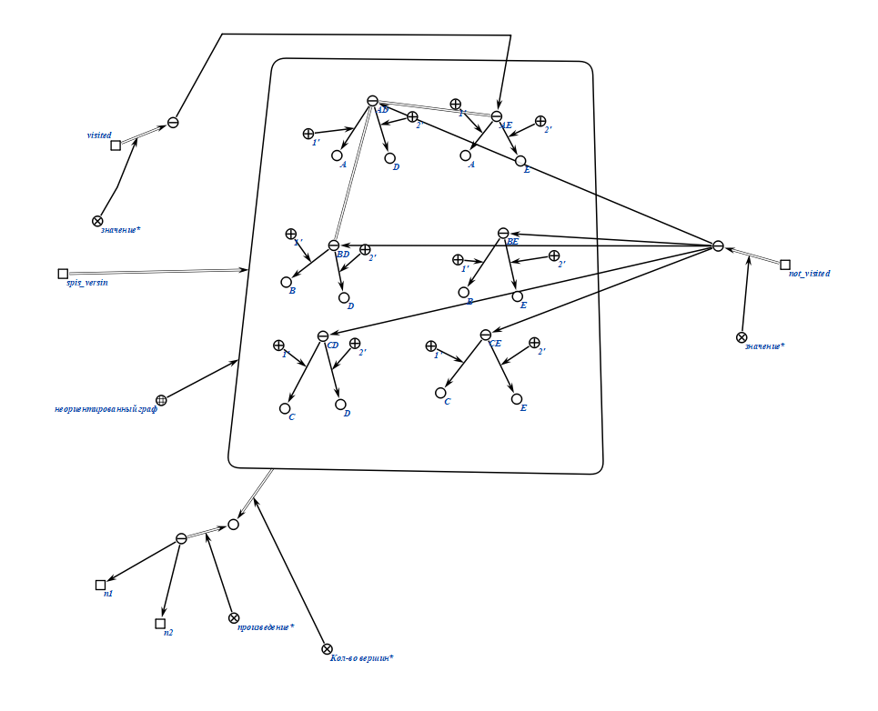

### Тесты
Пример 1
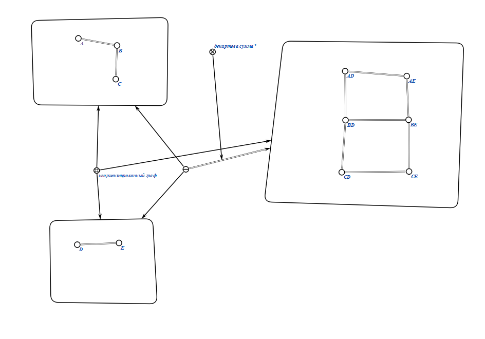
Пример 2
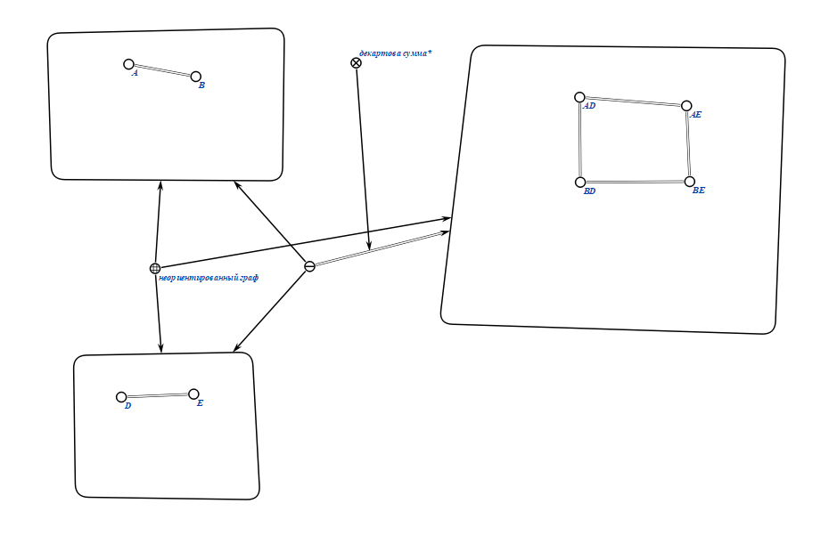
Пример 3
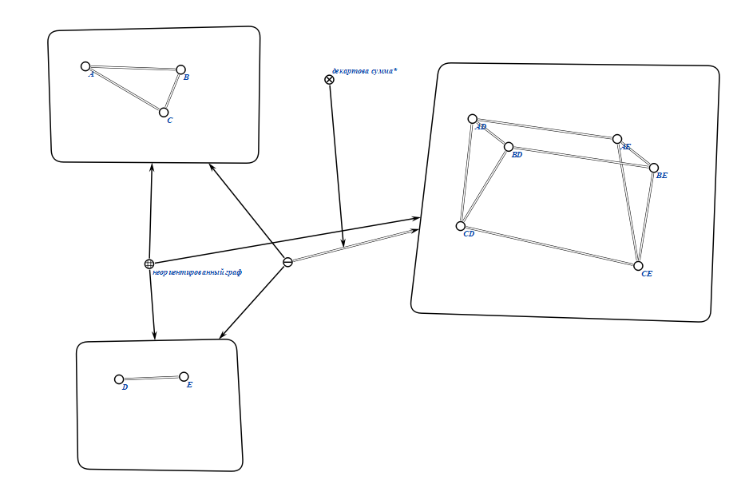
Пример 4
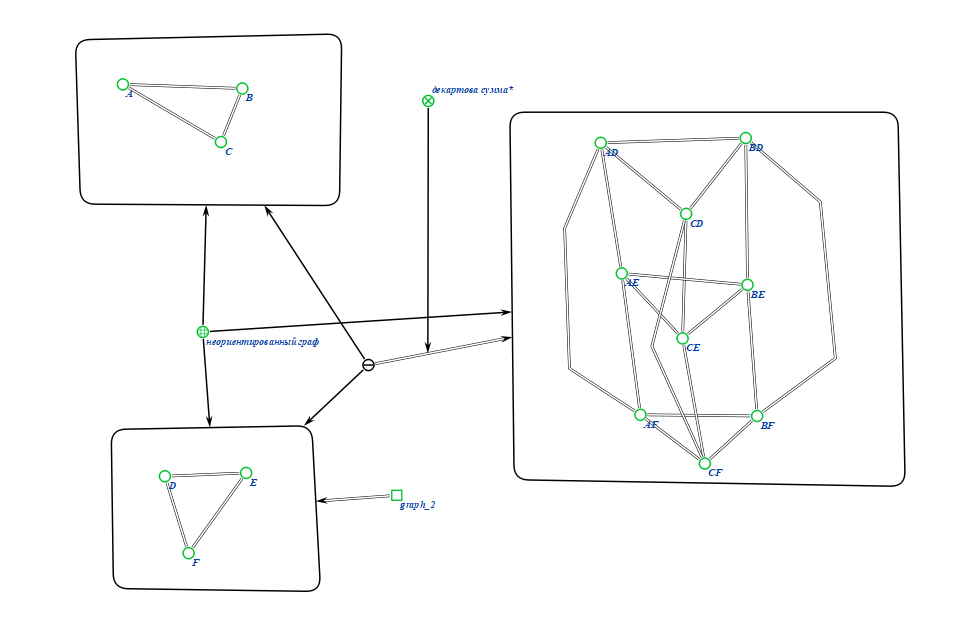
Пример 5
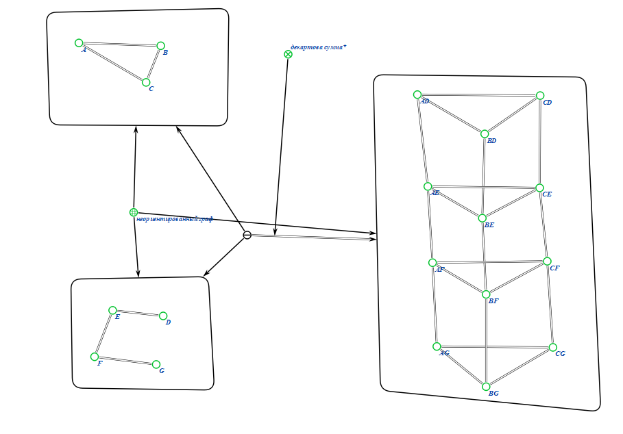

### Результат погружения в метасистему OSTIS
Граф

Неориентированный граф

