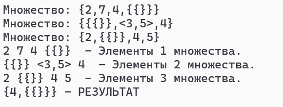

# Лабораторная работа №2
---

## Задача				
Вариант 11
 Реализовать программу, формирующую множество равное пересечению произвольного количества исходных множеств (с учётом кратных вхождений элементов).
---

## Цель:

 Исследовать свойства структур данных и разработать библиотеку алгоритмов обработки структур данных (для нахождения пересечения множеств, считанных из файла).
---

## Список ключевых понятий:
 **Множество** — простейшая информационная конструкция и математическая структура,
позволяющая рассматривать какие-то объекты как целое, связывая их.
 **Мультимножество (множество с учётом кратных вхождений элементов)** модификация понятия множества, допускающая включение одного и того же элемента в совокупность по нескольку раз. Число элементов в мультимножестве, с учётом повторяющихся элементов, называется его размером или мощностью.различаются не более, чем на единицу.
 **Пересечение** - это множество, которому принадлежат те и только те элементы, которые одновременно принадлежат всем данным множествам.
---

## **Список используемых алгоритмов в данном коде:**

1. **Чтение из файла (Read):**
   - Читает множество по строкам из файла.
   - Проверяет соответствие открывающих и закрывающих скобок.

2. **Вывод множеств на экран (Write):**
   - Цикл для вывода информации о множествах на экран.
   - Записывает общее количество множеств.

3. **Обработка подмножеств (Analys):**
   - Разбивает множество на элементы.

4. **Разбиение всех множеств на элементы (Subsets):**
   - Записывает элементы множеств и выводит их на экран.

5. **Функция вычисления пересечения множеств (intersection):**
   - Находит одинаковые элементы, записывает их, удаляет совпавшие и несовпавшие одиночные элементы.
   - Использует `Analys` для повторного вычисления пордмножеств.
   - Рекурсивно вызывает саму себя до проверки всех элементов.
---

## Тесты

№1

№2

---

##Вывод

В ходе выполнения был реализован алгоритм нахождения пересичения произвольного количества множеств