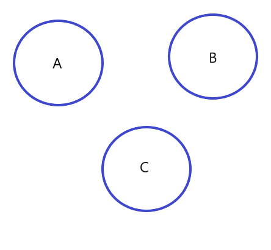
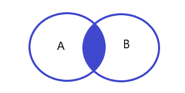
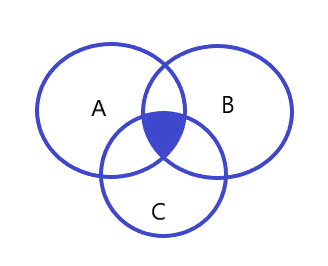
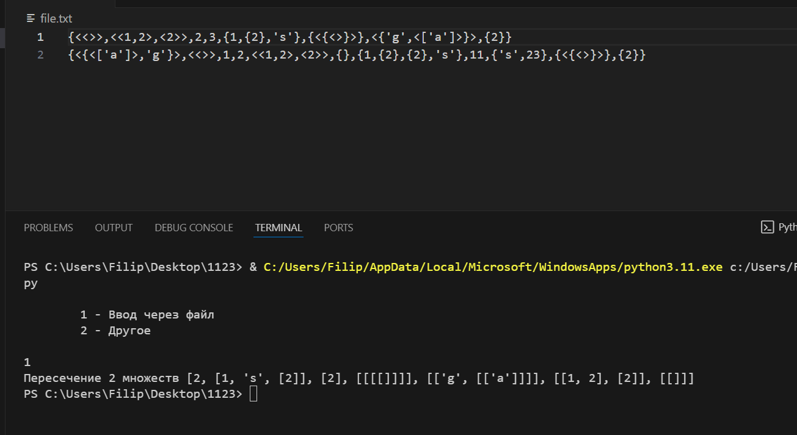
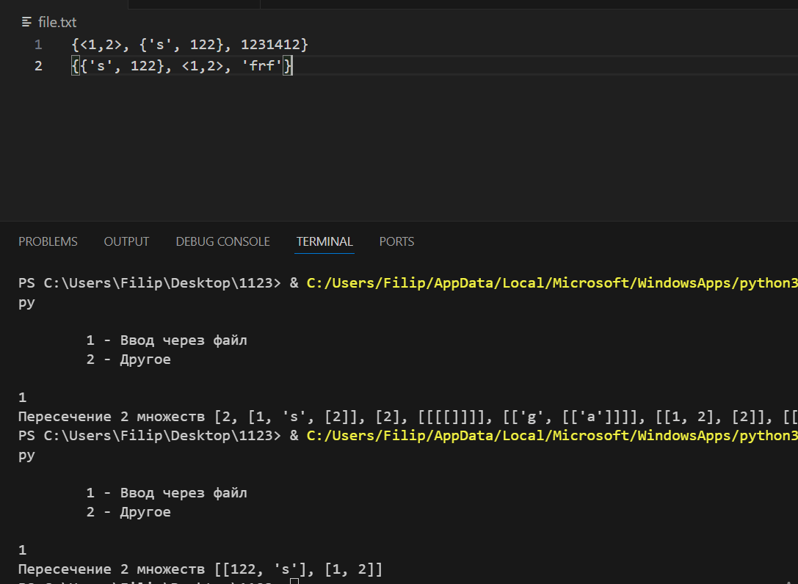

# Лабараторная работа №2
## `Вариант 2`
## Задание

Реализовать программу, формирующую множество равное пересечению произвольного
количества исходных множеств (без учёта кратных вхождений элементов).

## Ключевые понятия 
***`Множество`*** – простейшая информационная конструкция и математическая структура,
позволяющая рассматривать какие-то объекты как целое, связывая их.

***`Множеством без кратных вхождений элементов`*** -  называют множество S тогда и только тогда,
когда для любого x истинно S|x| < 2.

***`Пересечением неориентированных множеств A и B без учёта кратных вхождений элементов`*** -
будем называть неориентированное множество S тогда и только тогда, когда для любого x
истинно S|x| = min{A|x|, B|x|, 1}.

## Алгоритм нахождения пересечения

Предположим что у нас есть 3 множества и нам надо найти их пересечение.




После найдем пересечение A и B и запишем это в новое мно-во F.



После найдем пересечение мн-в F (A ∩ B) и C и запишем в финальное мн-во.




По такому алгоритму будем искать пересечение неограниченного кол-ва мно-в.

Часть программы реализующая данный алгоритм:

1. Мы создаем список `novoe` где будет хранится наш результат;
2. Для начала помещаем 1ый элемент списка `spis_mnozestv`;
3. После находим пересечение `novoe` и `spis_mnozestv` и записываем все это в `novoe`;
4. Перебираем все мн-ва для нахождение результата.

**Функция выполняющая пересечение всех сножеств**

```python
novoe = list()
novoe = spis_mnozestv[0]
for i in range(y):
    novoe = perecezenie(novoe, spis_mnozestv[i + 1])
    
print('Пересечение',y,'множеств',novoe)

```
**Функция выполняющая пересечение 2 множеств**
```python

def perecezenie(a:list, b:list):
    d = []
    for e in a: 
        if e in b:
            d.append(e)
    return d

```


## Алгоритм ввода множеств:
Разберем один из возможных вводов в программе через файл:

Множества записываются в список `lines` откуда после по очередности извлекаются и добавляются в `spis_mnozestv`
```python
spis_mnozestv = list()
    with open('file.txt', 'r') as file: 
        content = file.read() 
        lines = content.split('\n')
        for i in range(len(lines)):
            x_new = zamena_skobok(lines[i])
            xxx = add_commas(x_new)
            branch = ast.literal_eval(xxx)
            x_per = get_list(branch)
            spis_mnozestv.append(x_per)
```
Сначала ко мн-ву применяется функция `zamena_skobok` она нужна для замены всех скобок на нужные, так как будет использована библиотека аст, и так как в питоне кортежи записываются в круглых а скобки квадратные.
```python
def zamena_skobok(a:list):
    x_new = a.replace('{', '[')
    x_got = x_new.replace('}', ']')
    x_new_1 = x_got.replace('<', '(')
    x_got_2 = x_new_1.replace('>', ')')
    return x_got_2

```
Потом ко мн-ву применяется функция `add_comas` она нужна для раставления запятых в одиночных кортежах, так как синтаксис питона тип данных кортежей не воспринимает.Пример <1> данный кортеж в питоне будет выглядеть как пустой, а такой <1,> данный кортеж в питоне будет выглядеть как не пустой <1>.
```python
def add_commas(expression):
    expression = expression.replace(")", ",)")
    expression = expression.replace("(,)", "()")
    return expression
```
Потом ко мн-ву применяется функция, библиотеки аст,смысл заключается в безопасном преобразовании строковых представлений литералов в соответствующие объекты.И после вызывается функция get_list.
```python
def get_list(branch):
    se = []
    kor = []
    new_branch = []
    string_set = set()
    nums_set = set()
    bool_set = set()
    for i in branch:
        if type(i) == list:
            se.append(get_list(i))
        elif type(i) == str:
            string_set.add(i)
        elif type(i) == bool:
            bool_set.add(i)
        elif type(i) == tuple:
            kor.append(get_list(i))
        else:
            nums_set.add(i)
    nums_set = list(nums_set)
    nums_set.sort()
    string_set = list(string_set)
    string_set.sort()
    new_branch.extend(nums_set)
    new_branch.extend(string_set)
    bool_set = list(bool_set)
    bool_set.sort()
    new_branch.extend(bool_set)
    if se:
        sorted_list = sorted(se, key=lambda x:  repr(x))
       
        se1 = delete_povtory(sorted_list)
        new_branch.extend(se1)
    if kor:
        sorted_kor = sorted(kor, key=lambda x: repr(x))
        
        kor1 = delete_povtory(sorted_kor)
        new_branch.extend(kor1)
    return new_branch
```
Разберем
Мы создаем все возможные объекты которые у нас могут быть
- списки(`se`)
- кортежи(`kor`)
- числа(`nums_set`)
- буквы(`string_set`)
- булевые переменные (`bool_set`)
- а так же учитываем вложенные мн-во

После мы идем по нашему массиву и если натыкаемся на объект добавляем его в соответсвующий список или мн-во.

Если это числа или буквы или булевые переменные то добавляем их во мн-ва.Если это списки и кортежи вызываем рекурсивно `get_list()`, для обработки содержимого списков и кортежей.

После мы сортируем все мн-ва и кортежи.Если сл мн-вами проблем не было.То с сортировкой списков где есть вложенные кортежи были пэтому использовалась функция 

`sorted_list = sorted(se, key=lambda x:  repr(x))`

- sorted() - встроенная функция в Python, которая принимает последовательность и возвращает новую последовательность, отсортированную в порядке возрастания.
- key=lambda x: repr(x) - это функция, которая применяется к каждому элементу se перед сравнением. В данном случае, repr(x) возвращает строковое представление элемента x.
- Таким образом, сортировка будет происходить на основе строкового представления элементов, а не на основе их значений, это помогает обойти ошибку при сортировке.

После все мн-ва преобразуются в списки и сливаются с помощью `extend` в один список.А после сливаются списки и кортежи в большой список.

### Весь код
```python
import random
import ast


def add_commas(expression):
    expression = expression.replace(")", ",)")
    expression = expression.replace("(,)", "()")
    return expression

            

def delete_povtory(a):
    d = []
    for element in a:
        if element not in d:
            d.append(element)
    return d        

def perecezenie(a:list, b:list):
    d = []
    for e in a: 
        if e in b:
            d.append(e)
    return d

def get_list(branch):
    se = []
    kor = []
    new_branch = []
    string_set = set()
    nums_set = set()
    bool_set = set()
    for i in branch:
        if type(i) == list:
            se.append(get_list(i))
        elif type(i) == str:
            string_set.add(i)
        elif type(i) == bool:
            bool_set.add(i)
        elif type(i) == tuple:
            kor.append(get_list(i))
        else:
            nums_set.add(i)
    nums_set = list(nums_set)
    nums_set.sort()
    string_set = list(string_set)
    string_set.sort()
    new_branch.extend(nums_set)
    new_branch.extend(string_set)
    bool_set = list(bool_set)
    bool_set.sort()
    new_branch.extend(bool_set)
    if se:
        sorted_list = sorted(se, key=lambda x:  repr(x))
       
        se1 = delete_povtory(sorted_list)
        new_branch.extend(se1)
    if kor:
        sorted_kor = sorted(kor, key=lambda x: repr(x))
        
        kor1 = delete_povtory(sorted_kor)
        new_branch.extend(kor1)
    return new_branch

def zamena_skobok(a:list):
    x_new = a.replace('{', '[')
    x_got = x_new.replace('}', ']')
    x_new_1 = x_got.replace('<', '(')
    x_got_2 = x_new_1.replace('>', ')')
    return x_got_2


     
vybor_2 = int(input('''
        1 - Ввод через файл
        2 - Другое     
                        \n'''))

if vybor_2 == 1:
    spis_mnozestv = list()
    with open('file.txt', 'r') as file: 
        content = file.read() 
        lines = content.split('\n')

        for i in range(len(lines)):

            x_new = zamena_skobok(lines[i])
            xxx = add_commas(x_new)
            branch = ast.literal_eval(xxx)
            x_per = get_list(branch)
            spis_mnozestv.append(x_per)
        spis_mnozestv = delete_povtory(spis_mnozestv)
        novoe = list()
        novoe = spis_mnozestv[0]
        
        for i in range(len(lines)-1):

            novoe = perecezenie(novoe, spis_mnozestv[i + 1])
            
        print('Пересечение',len(lines),'множеств',novoe)
else:
    y = int(input('Введите количество множеств которые желаете пересечь\n'))
    while y !=0:
        vybor = int(input('''
        1 - Ввод автоматически
        2 - Ввод самому              
                        \n'''))
                        
        spis_mnozestv = list()
        for i in range(y):
            mnozestvo = list()
            if vybor == 1:
                kol_elementov = random.randint(1, 10)
                for i in range(kol_elementov):
                    mnozestvo.append(random.randint(1,10))
                spis_mnozestv.append(mnozestvo)
            if vybor == 2:
                x = input("Введите множество")
                x_new = x.replace('{', '[')
                x_got = x_new.replace('}', ']')
                x_new_1 = x_got.replace('<', ')')
                x_got_2 = x_new_1.replace('>', ')')
                branch = ast.literal_eval(x_got_2)
                x_per = get_list(branch)
                spis_mnozestv.append(x_per)
                
        print(spis_mnozestv)

        novoe = list()
        novoe = spis_mnozestv[0]
        for i in range(y):
            novoe = perecezenie(novoe, spis_mnozestv[i + 1])
            
        print('Пересечение',y,'множеств',novoe)

        y = int(input('''Если желаете пересечь еще произвольные множества тогда:
    Введите количество множеств которые желаете пересечь
    Иначе введите 0 для завершения программы\n'''))
```


## Тесты



