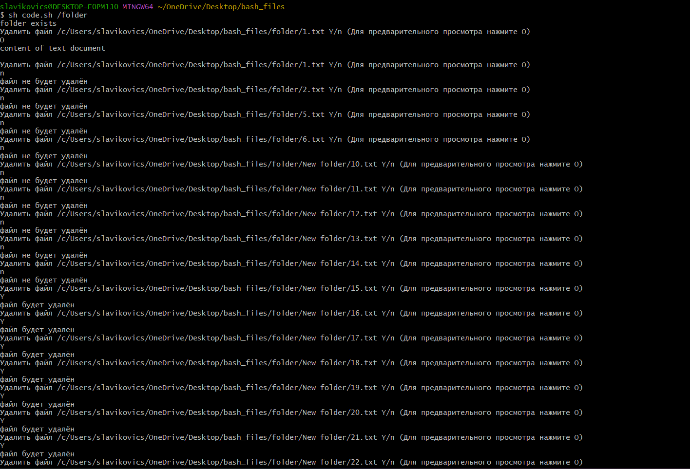

# Лабораторная работа 1 Отчёт
### Самович Вячеслав
### Группа 321 701
### Вариант 23
## Задание
Создать файл sh и bat, который выполняет следующее: 
На вход пакетному файлу приходит относительный путь к папке (как параметр пакетного файла). Если такой папки нет, то писать “Данной папки нет” и завершить выполнение программы. Если такая папка есть, то в ней и ее подкаталогах найти все файлы с расширением txt. Для каждого файла выводить пользователю сообщение “Удалить файл [название файла] Y/n (Для предварительного просмотра нажмите O)”. [название файла] - название удаляемого файла. Если пользователь нажал Y, то удаляем файл и переходим к следующему, если пользователь нажал n, то не удаляем файл и переходим к следующему. Если пользователь нажал О, то выводим содержимое файла в консоль и повторно задаем вопрос для этого же файла. При нажатии любой другой кнопки повторно задавать вопрос для того же файла.

## Исходный код

### batch
```bat
@echo off
chcp 65001

setlocal enabledelayedexpansion
set dp=%~dp0
set p=%1
if not exist %dp%%p% echo папка не существует
set "InputLetter="

for /r %dp%%p% %%f in (*.txt) do (
    set /p InputLetter="Удалить файл %%f Y/n (Для предварительного просмотра нажмите O) "
    echo InputLetter = !InputLetter!
    if not exist %%f EXIT /B
        if "!InputLetter!" == "Y" (
        echo файл будет удалён
        del "%%f"
    )

    if "!InputLetter!" == "n" (
        echo файл не будет удалён
    )

    if "!InputLetter!" == "O" (
        echo Содержимое файла:
        type "%%f"
        echo+
        set "InputLetter="
        call :function "%%f"
    )
    if not "!InputLetter!" == "Y" (
        if not "!InputLetter!" == "n" (
            if not "!InputLetter!" == "O" (
                set "InputLetter="
                call :function "%%f"
            )
        )
    )
set "InputLetter="
)
endlocal

:function
if not exist %~1 EXIT /B
set /p InputLetter="Удалить файл %~1 Y/n (Для предварительного просмотра нажмите O) "
echo InputLetter = !InputLetter!

if "!InputLetter!" == "Y" (
    echo файл будет удалён
    del "%~1"
)

if "!InputLetter!" == "n" (
    echo файл не будет удалён
)
if "!InputLetter!" == "O" (
    echo Содержимое файла:
    type "%~1"
    echo+
    set "InputLetter="
    call :function "%~1"
)
if not "!InputLetter!" == "Y" (
    if not "!InputLetter!" == "n" (
        if not "!InputLetter!" == "O" (
            set "InputLetter="
            call :function "%~1"
        )
    )
)

EXIT /B 0

pause
```

### bash

```bash
#!/bin/bash
path=$(pwd)$1
if test -d $path; then
	echo folder exists
else
	echo папка не существует
	exit 0
fi
IFS=$'\n'
i=1
for file in $(find $path -type f -name "*.txt"); do
	let i=1
	while [[ $i -eq 1 ]]; do
		echo "Удалить файл "$file" Y/n (Для предварительного просмотра нажмите O) "
		read responce
		if [ $responce = "Y" ]; then
			echo файл будет удалён
			rm $file
			let i=0
		fi
		if [ $responce = "n" ]; then
			echo файл не будет удалён
			let i=0
		fi
		if [ $responce = "O" ]; then
			cat $file
			echo -e "\n"
			let i=1
		fi
	done
done

```

## Как запускать

### Относительный путь к каталогу - аргумент sh и bat файла. 

### cmd

```bat
"полный путь к bat файлу" "относительный путь к каталогу"
```
или

```bat
call "полный путь к bat файлу" "относительный путь к каталогу"
```
### bash
```bash
sh "полный путь к sh файлу" "относительный путь к каталогу"
```

## Примеры выполнения программы

### 1. bat


### 2. sh

