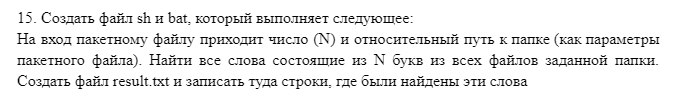
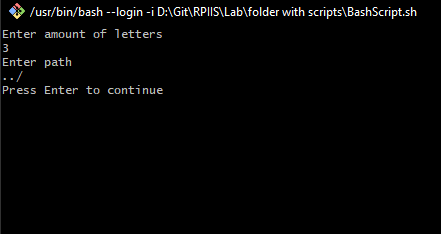

# Неборский Иван, 321701, 15 Вариант

# Условие задачи



# Реализация на Bash

```bash
echo Enter amount of letters
read Amount_Of_Letters 
echo Enter path
read path

grep -h -E -i "\b[а-яёa-z]{$Amount_Of_Letters}\b" $path*.txt > result.txt

echo Press Enter to continue
read randomVar
```

## Аргументы

- $Amount_Of_Letters - Вводимое пользователем количество букв в словах, которые мы ищем.
- $path - Вводимый пользователем путь, по которому расположены текстовые файлы, в которых мы ищем слова.

## Как работает

- Пользователь вводит запрашиваемые у него переменные (Количество букв в словах и Путь к текстовым файлам);
- Команда **grep** ищет и выписывает строки с искомыми нами словами;
- Команда запрашивает пользователя ввести **Enter** для завершения программы.

## Пример запуска



## Результат


# Реализация на Batch

```batch
setlocal EnableDelayedExpansion
@echo off
chcp 65001
set /p amountOfLetters=Enter amount of letters 
set /p path=Enter path 
set pastStr=
echo. > "result.txt"
cd "%path%"


for %%f in (*.txt) do (
    call :afunc %%f
)
pause


:afunc 
for /f "tokens=*" %%a in (%1) do (
    set curStr=%%a
    for %%i in (%%a) do (
        call :cfunc %%i
    )
)
exit /b


:cfunc
set "word=%1"
set /a "wordLength=0"
:loop

set "word=!word:~1!"
rem echo %word%
set /a wordLength=!wordLength!+1
rem echo %wordLength%


if DEFINED word goto loop 
set "word=%1"


call :ffunc !wordLength!

exit /b


:ffunc
if !amountOfLetters! EQU %1 (
    if !curStr! NEQ !pastStr! (
        echo %curStr% >> "D:\Git\RPIIS\Lab\folder with scripts\result.txt"
        set pastStr=%curStr%

    ) else (
        exit /b
    )
)
exit /b
```

## Аргументы

- amountOfLetters - Вводимое пользователем количество букв в словах, которые мы ищем.
- path - Вводимый пользователем путь, по которому расположены текстовые файлы, в которых мы ищем слова.
- pastStr и curStr - Переменные необходимые для избежания записи одной и той же строки более одного раза.
- wordLength - Переменная, в которую записывается длина слова.

## Как работает

- Пользователь вводит запрашиваемые у него переменные (Количество букв в словах и Путь к текстовым файлам);
- Программа с помощью циклов перебирает все файлы в нужной нам директории, все строки в файлах, все слова в строках и передаёт их в функцию **cfunc**;
- В функции программа записывает попавшее в неё слово в отдельную переменную **word** и попадает в ~~очередной~~ цикл, в котором по одной убирает буквы в словах и записывает количество убранных букв в переменную **wordLength**;
- Когда букв не остаётся, цикл прерывается и количество насчитанных букв передаётся в функцию **ffunc**, где там сравнивается с нужным на количеством букв, и если они совпадают, то строка с этим словом записывается в файл-результат, если же не совпадают цикл переходит к следующему слову.

## Пример запуска


## Результат


