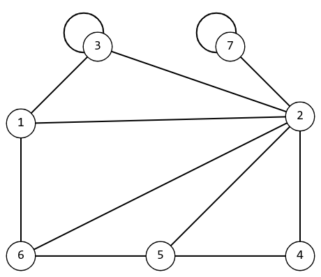

# Расчетная работа 


## Введение

### Цель

Изучить основы теории графов, способы представления графов, базовые алгоритмы для работы с графами, 

### Задание

Реализовать на C++ код, который может найти все подграфы в неориентированном графе, изоморфные графу образцу.

Графы представляются в виде списка смежности (списка инцидентности).

Поскольку по условию не сказано какой должен быть формат вывода, будет считаться, что это должна быть изоморфная подстановка.

Результат работы программы будет выводится в файл с префиксом `_exit`.

### Ключевые понятия

`Граф` - математическая абстракция реальной системы любой природы, объекты которой обладают парными связями. 

Два графа называются `изоморфными`, если у них одинаковое число вершин (обозначим его n) и вершины каждого из них можно занумеровать так числами от 1 до n, что в первом графе две вершины соединены ребром тогда и только тогда, когда вершины с такими же номерами во втором графе соединены.

`Подграф` - это часть графа, в которой мы берем некоторые его вершины и ребра. Другими словами, граф `H` является подграфом графа `G`, если вершины и ребра `H` являются подмножеством вершин и ребер `G`.

Графы, в которых все ребра являются звеньями, то есть порядок двух концов ребра графа не существенен, называются `неориентированными`. 

`Список смежности` - один из способов представления графа в виде коллекции списков вершин. Каждой вершине графа соответствует список, состоящий из «соседей» этой вершины.

`Матрица смежности` - это вид представления графа в виде матрицы, когда пересечение столбцов и строк задаёт дуги. Используя матрицу смежности, можно задать вес дуг и ориентацию. Каждая строка и столбец матрицы соответствуют вершинам, номер строки соответствует вершине, из которой выходит дуга, а номер столбца - в какую входит дуга.

`Изоморфная подстановка` - это понятие, используемое в теории графов, которое описывает биективное отображение между вершинами двух графов, сохраняющее связи между вершинами исходного графа.

## Идея решения

Рассмотрим два графа графическом представлении и в виде матрицы смежности

<table>
<tr>
  <td>
    
  </td>
  <td>
    
  </td>
</tr>
<tr>

</tr>
<tr>
  <td>
    <table>
      <tr>
        <td></td> <td>1</td> <td>2</td> <td>3</td> <td>4</td>
      </tr>
      <tr>
        <td>1</td> <td>0</td> <td>1</td> <td>0</td> <td>0</td>
      </tr>
      <tr>
        <td>2</td> <td>1</td> <td>0</td> <td>1</td> <td>1</td>
      </tr>
      <tr>
        <td>3</td> <td>0</td> <td>1</td> <td>0</td> <td>0</td>
      </tr>
      <tr>
        <td>4</td> <td>0</td> <td>1</td> <td>0</td> <td>0</td>
      </tr>
    </table>
  </td>
  <td>
    <table>
      <tr>
        <td></td> <td>1</td> <td>2</td> <td>3</td> 
      </tr>
      <tr>
        <td>1</td> <td>0</td> <td>1</td> <td>0</td> 
      </tr>
      <tr>
        <td>2</td> <td>1</td> <td>0</td> <td>1</td> 
      </tr>
      <tr>
        <td>3</td> <td>0</td> <td>1</td> <td>0</td> 
      </tr>
    </table>
  </td>
</tr>
</table>

Как видно из рисунков графов мы можем объединить их путем наложения узла `1` графа образца на узел `1` исходного графа, узел `2` на узел `2` и узел `3` на узел `3` (`1 -> 1` `2 -> 2` `3 -> 3`). Так же видно, что матрица смежности графа образца совпадает с матрицей смежности исходного графа, для которого рассматриваются только узлы с номерами `1`, `2` и `3`.


> [!NOTE] 
> Однако, путем простого перебора всех вариантов наложения графов друг на друга можно найти все шесть решений: 
> - `1 -> 1` `2 -> 2` `3 -> 3`
> - `1 -> 1` `2 -> 2` `3 -> 4`
> - `1 -> 3` `2 -> 2` `3 -> 1`
> - `1 -> 3` `2 -> 2` `3 -> 4` 
> - `1 -> 4` `2 -> 2` `3 -> 1`
> - `1 -> 4` `2 -> 2` `3 -> 3`

Так как же найти все эти решения?

> [!NOTE]
> Мы ведь можем просто сдвигать матрицу смежности на одинаковое кол-во строк и столбцов, и сравнивать уже их.
>
> Очень важно сдвигать их на одинаковое кол-во строк и столбцов, ведь иначе номера узлов графов записанные по абсциссам и ординатам не будет совпадать, что приведет к ошибкам.

Рассмотрим на примере:

<table>
<tr>
    <td>Исходный граф</td> <td>Граф образец</td>
</tr>

<tr></tr>

<tr>
<td>
   <table>
      <tr>
        <td></td> <td>1</td> <td>2</td> <td>3</td> <td>4</td>
      </tr>
      <tr>
        <td>1</td> <td>0</td> <td>1</td> <td>0</td> <td>0</td>
      </tr>
      <tr>
        <td>2</td> <td>1</td> <td>0</td> <td>1</td> <td>0</td>
      </tr>
      <tr>
        <td>3</td> <td>0</td> <td>1</td> <td>0</td> <td>1</td>
      </tr>
      <tr>
        <td>4</td> <td>0</td> <td>0</td> <td>1</td> <td>0</td>
      </tr>
    </table>
</td>
<td>
    <table>
      <tr>
        <td></td> <td>1</td> <td>2</td> <td>3</td> 
      </tr>
      <tr>
        <td>1</td> <td>0</td> <td>1</td> <td>0</td> 
      </tr>
      <tr>
        <td>2</td> <td>1</td> <td>0</td> <td>1</td> 
      </tr>
      <tr>
        <td>3</td> <td>0</td> <td>1</td> <td>0</td> 
      </tr>
    </table>
</td>
</tr>
</table>

Сравнив нив эти две матрицы можно заметить, что есть как минимум два совпадения для этих графов, которые мы можем определить смещая таблицы относительно друг друга:
- `1 -> 1` `2 -> 2` `3 -> 3`
- `1 -> 2` `2 -> 3` `3 -> 4`

Возьмем еще один пример:

<table>
<tr>
    <td>Исходный граф</td> <td>Граф образец</td>
</tr>

<tr></tr>

<tr>
<td>
   <table>
      <tr>
        <td></td> <td>1</td> <td>2</td> <td>3</td> <td>4</td>
      </tr>
      <tr>
        <td>1</td> <td>0</td> <td>0</td> <td>1</td> <td>0</td>
      </tr>
      <tr>
        <td>2</td> <td>0</td> <td>1</td> <td>0</td> <td>1</td>
      </tr>
      <tr>
        <td>3</td> <td>1</td> <td>0</td> <td>1</td> <td>0</td>
      </tr>
      <tr>
        <td>4</td> <td>0</td> <td>1</td> <td>0</td> <td>0</td>
      </tr>
    </table>
</td>
<td>
    <table>
      <tr>
        <td></td> <td>1</td> <td>2</td> <td>3</td> 
      </tr>
      <tr>
        <td>1</td> <td>0</td> <td>1</td> <td>0</td> 
      </tr>
      <tr>
        <td>2</td> <td>1</td> <td>0</td> <td>1</td> 
      </tr>
      <tr>
        <td>3</td> <td>0</td> <td>1</td> <td>0</td> 
      </tr>
    </table>
</td>
</tr>
</table>

Хотя с первого взгляда может показаться, что эти две матрицы можно наложить друг на друга, важно понять, что делать это КАТЕГОРИЧЕСКИ НЕЛЬЗЯ, ведь тогда номера узлов графов записанные по абсциссам и ординатам не будут совпадать и мы не сможем корректно записать изоморфную подстановку.

Рассмотрим третий пример:

<table>
<tr>
    <td>Исходный граф</td> <td>Граф образец</td>
</tr>

<tr></tr>

<tr>
<td>
   <table>
      <tr>
        <td></td> <td>1</td> <td>2</td> <td>3</td> <td>4</td>
      </tr>
      <tr>
        <td>1</td> <td>0</td> <td>1</td> <td>1</td> <td>1</td>
      </tr>
      <tr>
        <td>2</td> <td>1</td> <td>0</td> <td>1</td> <td>0</td>
      </tr>
      <tr>
        <td>3</td> <td>1</td> <td>1</td> <td>0</td> <td>1</td>
      </tr>
      <tr>
        <td>4</td> <td>1</td> <td>0</td> <td>1</td> <td>0</td>
      </tr>
    </table>
</td>
<td>
    <table>
      <tr>
        <td></td> <td>1</td> <td>2</td> <td>3</td> 
      </tr>
      <tr>
        <td>1</td> <td>0</td> <td>1</td> <td>0</td> 
      </tr>
      <tr>
        <td>2</td> <td>1</td> <td>0</td> <td>1</td> 
      </tr>
      <tr>
        <td>3</td> <td>0</td> <td>1</td> <td>0</td> 
      </tr>
    </table>
</td>
</tr>
</table>

С первого взгляда может показаться, что нельзя накладывать матрицы по узлам `1 -> 1` `2 -> 2` `3 -> 3`, однако на самом деле это можно делать

> [!NOTE]
> надо лишь игнорировать те ячейки графа образца, где стоят нули, и сравнивать те, в которых стоят единицы.

Ну хорошо, мы нашли пару комбинацию вершин для наших двух графов, а как найти остальные.

> [!NOTE]
> Нужно найти все графы изоморфные исходному и сравнивать их с графом образцом

Рассмотрим на примере:

<table>
<tr>
    <td>Исходный граф</td> <td>Граф образец</td>
</tr>

<tr></tr>

<tr>
<td>
    <table>
      <tr>
        <td></td> <td>1</td> <td>2</td> <td>3</td> 
      </tr>
      <tr>
        <td>1</td> <td>0</td> <td>1</td> <td>0</td> 
      </tr>
      <tr>
        <td>2</td> <td>1</td> <td>0</td> <td>1</td> 
      </tr>
      <tr>
        <td>3</td> <td>0</td> <td>1</td> <td>0</td> 
      </tr>
</table>
</td>
<td>
    <table>
      <tr>
          <td></td> <td>1</td> <td>2</td>
      </tr>
      <tr>
          <td>1</td> <td>0</td> <td>1</td>
      </tr>
    <tr>
          <td>2</td> <td>1</td> <td>0</td>
      </tr>
</table>
</td>
</tr>
</table>

Найдем и запишем все графы изоморфные исходному:

<table>
<tr>
<td>
   <table>
      <tr>
        <td></td> <td>1</td> <td>2</td> <td>3</td> 
      </tr>
      <tr>
        <td>1</td> <td>0</td> <td>1</td> <td>0</td> 
      </tr>
      <tr>
        <td>2</td> <td>1</td> <td>0</td> <td>1</td> 
      </tr>
      <tr>
        <td>3</td> <td>0</td> <td>1</td> <td>0</td> 
      </tr>
    </table>
</td>
<td>
   <table>
      <tr>
        <td></td> <td>1</td> <td>3</td> <td>2</td> 
      </tr>
      <tr>
        <td>1</td> <td>0</td> <td>0</td> <td>1</td> 
      </tr>
      <tr>
        <td>3</td> <td>0</td> <td>0</td> <td>1</td> 
      </tr>
      <tr>
        <td>2</td> <td>1</td> <td>1</td> <td>0</td> 
      </tr>
    </table>
</td>
<td>
   <table>
      <tr>
        <td></td> <td>2</td> <td>1</td> <td>3</td> 
      </tr>
      <tr>
        <td>2</td> <td>0</td> <td>1</td> <td>1</td> 
      </tr>
      <tr>
        <td>1</td> <td>1</td> <td>0</td> <td>0</td> 
      </tr>
      <tr>
        <td>3</td> <td>1</td> <td>0</td> <td>0</td> 
      </tr>
    </table>
</td>
<td>
   <table>
      <tr>
        <td></td> <td>2</td> <td>3</td> <td>1</td> 
      </tr>
      <tr>
        <td>2</td> <td>0</td> <td>1</td> <td>1</td> 
      </tr>
      <tr>
        <td>3</td> <td>1</td> <td>0</td> <td>0</td> 
      </tr>
      <tr>
        <td>1</td> <td>1</td> <td>0</td> <td>0</td> 
      </tr>
    </table>
</td>
<td>
   <table>
      <tr>
        <td></td> <td>3</td> <td>1</td> <td>2</td> 
      </tr>
      <tr>
        <td>3</td> <td>0</td> <td>0</td> <td>1</td> 
      </tr>
      <tr>
        <td>1</td> <td>0</td> <td>0</td> <td>1</td> 
      </tr>
      <tr>
        <td>2</td> <td>1</td> <td>1</td> <td>0</td> 
      </tr>
    </table>
</td>
<td>
   <table>
      <tr>
        <td></td> <td>3</td> <td>2</td> <td>1</td> 
      </tr>
      <tr>
        <td>3</td> <td>0</td> <td>1</td> <td>0</td> 
      </tr>
      <tr>
        <td>2</td> <td>1</td> <td>0</td> <td>1</td> 
      </tr>
      <tr>
        <td>1</td> <td>0</td> <td>1</td> <td>0</td> 
      </tr>
    </table>
</td>
</tr>
</table>

Всего существует шесть форм записи этого графа и если теперь попробовать наложить матрицы друг на друга, то мы сможем найти все изоморфные подставки для этих графов:
- `1 -> 1` `2 -> 2`
- `1 -> 2` `2 -> 3`
- `1 -> 3` `2 -> 2`
- `1 -> 2` `2 -> 1`

Теперь подытожим и запишем все найденные правила

> [!NOTE]
> - Можно сдвигать матрицы смежности на одинаковое кол-во строк и столбцов, и сравнивать их
> - Очень важно сдвигать на одинаковое кол-во строк и столбцов, ведь иначе номера узлов графов записанные по абсциссам и ординатам не будет совпадать, что приведет к ошибкам
> - Надо игнорировать те ячейки графа образца, где стоят нули, и сравнивать те, в которых стоят единицы.
> - Нужно найти все графы изоморфные исходному и сравнить их матрицы
> - Путем перебора всех вариантов наложения изоморфных графов друг на друга можно найти все решения


## Реализация

> [!IMPORTANT] 
> Код реализации данной работы написан на [python](main.py) и [C++](main.cpp) однако поскольку алгоритмическая часть у них практически идентичная, будет разобрана только реализация на [C++](main.cpp).

```c++
#include <vector>
#include <iostream>
#include <fstream>
#include <string>
#include <algorithm>


void findCombs(std::vector<int>& lst, std::vector<std::vector<int>>& result, int start = 0) {
    int length = lst.size();

    if (start == length - 1) {
        result.push_back(lst);
    } else {
        for (int i = start; i < length; ++i) {
            std::swap(lst[start], lst[i]);
            findCombs(lst, result, start + 1);
            std::swap(lst[start], lst[i]); 
        }
    }
}

bool isEqual(std::vector<std::vector<bool>> graph, std::vector<std::vector<bool>> pat, int k) {
    for (int i = 0; i < pat.size(); i += 1) {
        for (int j = 0; j < pat.size(); j += 1) {
            if (pat[i][j] == 1 and graph[i + k][j + k] != pat[i][j]) {
                return false;

            }
        }
    }
    return true;
}

std::vector<std::vector<std::vector<bool>>> findIsom(auto graph, auto combs) {
    std::vector<std::vector<std::vector<bool>>> kombGraphs;
    std::vector<std::vector<bool>> a;
    std::vector<bool> sub;

    for (auto k : combs) {
        a.clear();

        for (auto i : k) {
            sub.clear();
            for (auto j : k) {
                sub.push_back(graph[i][j]);
            }
            a.push_back(sub);
        }

        kombGraphs.push_back(a);
    }

    return kombGraphs;
}

int main() {
    std::ifstream f1;
    std::string line;
    std::cout << "Enter file name: ";
//     line = "";
    std::cin >> line;
    f1.open(line);

    int n, t;
    bool i;
    f1 >> n;
    t = 0;
    std::vector<std::vector<bool>> graph(n, std::vector<bool>(n));
    while (t < n * n) {
        f1 >> i;
        graph[t / n][t % n] = i;
        t += 1;
    }

    std::vector<int> l;

    for (int i = 0; i < n; i += 1) {
        l.push_back(i);
    }

    std::vector<std::vector<int>> combs;
    findCombs(l, combs);

    auto combsGr = findIsom(graph, combs);

    f1 >> n;
    t = 0;
    std::vector<std::vector<bool>> pat(n, std::vector<bool>(n));
    while (t < n * n) {
        f1 >> i;
        pat[t / n][t % n] = i;
        t += 1;
    }

    f1.close();

    std::vector<std::vector<int>> res;

    for (int k = 0; k < combsGr.size(); k += 1) {
        for (int i = 0; i < graph.size() - pat.size() + 1; i += 1) {
            if (isEqual(combsGr[k], pat, i)) {
                std::vector<int> n;

                for (int j = 0; j < pat.size(); j += 1) {
                    n.push_back(combs[k][j + i] + 1);
                }


                if (not std::count(res.begin(), res.end(), n)) {
                    res.push_back(n);
                }
            }
        }
    }

    std::ofstream f2;
    f2.open(line + "_exit");

    for (auto i : res) {
        for (int j = 0; j < i.size(); j += 1) {
            f2 << j + 1 << " -> " << i[j] << '\n';
        }
        f2 << '\n';
    }

    f2.close();

    return 0;
}
```

## Разбор кода

```c++
void findCombs(std::vector<int>& lst, std::vector<std::vector<int>>& result, int start = 0) {
    int length = lst.size();

    if (start == length - 1) {
        result.push_back(lst);
    } else {
        for (int i = start; i < length; ++i) {
            std::swap(lst[start], lst[i]);
            findCombs(lst, result, start + 1);
            std::swap(lst[start], lst[i]);
        }
    }
}
```

Данная функция `findCombs` реализует алгоритм поиска всех возможных комбинаций (перестановок) элементов вектора `lst` и сохраняет их в векторе `result`. В каждой комбинации элементы вектора `lst` переставляются между собой.

Входные параметры функции:

- `lst` - ссылка на вектор, содержащий элементы, для которых нужно найти комбинации.
- `result` - ссылка на вектор векторов, в который будут сохраняться найденные комбинации.
- `start` - опциональный параметр, указывающий индекс начального элемента для рекурсивного поиска комбинаций. По умолчанию равен 0.

Алгоритм функции работает следующим образом:

- Проверяется базовый случай рекурсии: если `start` равно `length - 1`, где `length` - длина вектора `lst`, значит мы достигли последнего элемента вектора. В этом случае текущая перестановка является комбинацией, и она добавляется в `result` с помощью `result.push_back(lst)`.
- Если базовый случай не выполняется, то происходит цикл `for` с переменной `i`, начиная со значения `start`.
- В каждой итерации цикла выполняются следующие действия:
  - Элементы `lst[start]` и `lst[i]` обмениваются местами с помощью функции `std::swap`, чтобы получить новую перестановку.
  - Рекурсивно вызывается функция `findCombs` с обновленным вектором `lst`, увеличенным значением `start` (на 1).
  - После вызова рекурсивной функции элементы `lst[start]` и `lst[i]` снова обмениваются местами, чтобы восстановить исходное состояние вектора `lst` для следующей итерации цикла.
- По завершении всех итераций цикла будут найдены все комбинации элементов вектора `lst`, и они будут сохранены в `result`.

Функция `findCombs` использует рекурсию для перебора всех возможных комбинаций элементов вектора. Каждый элемент рассматривается в качестве первого элемента и рекурсивно вызывает себя для оставшихся элементов. После каждого вызова рекурсивной функции происходит восстановление исходного состояния вектора для следующей итерации.

```c++
bool isEqual(std::vector<std::vector<bool>> graph, std::vector<std::vector<bool>> pat, int k) {
    for (int i = 0; i < pat.size(); i += 1) {
        for (int j = 0; j < pat.size(); j += 1) {
            if (pat[i][j] == 1 and graph[i + k][j + k] != pat[i][j]) {
                return false;

            }
        }
    }
    return true;
}
```

Данная функция `isEqual` принимает два вектора векторов булевых значений (`graph` и `pat`), а также целочисленное значение `k`. Она проверяет, равны ли соответствующие подграфы в `graph` и `pat`, начиная с индекса `k`.

Входные параметры функции:

- `graph` - вектор векторов булевых значений, представляющий исходный граф.
- `pat` - вектор векторов булевых значений, представляющий граф-образец.
- `k` - целочисленное значение, указывающее смещение (индекс начала подграфа) для сравнения подграфов в `graph` и `pat`.

Алгоритм функции работает следующим образом:

- Внешний цикл `for` перебирает строки (вершины) графа-образца `pat` с помощью индекса `i`.
- Внутренний цикл `for` перебирает столбцы (ребра) графа-образца `pat` с помощью индекса `j`.
- Внутри циклов происходит следующая проверка:
  - Если в графе-образце `pat` значение `pat[i][j]` равно `1` (соответствует ребру), то происходит проверка соответствующего значения в исходном графе `graph`.
  - Если значение `graph[i + k][j + k]` не равно значению `pat[i][j]`, значит подграфы не равны, и функция возвращает `false`.
- Если после завершения всех итераций циклов не произошло ни одного несоответствия, функция возвращает `true`, что означает, что подграфы равны.
- Функция `isEqual` сравнивает соответствующие элементы подграфов в `graph` и `pat`, начиная с указанного смещения `k`. Она используется для проверки изоморфизма графов, где `graph` представляет исходный граф, а `pat` - граф-образец, с которым сравниваются подграфы. Если все ребра в подграфах соответствуют друг другу, то функция возвращает `true`, иначе - `false`.

```C++
std::vector<std::vector<std::vector<bool>>> findIsom(auto graph, auto combs) {
    std::vector<std::vector<std::vector<bool>>> kombGraphs;
    std::vector<std::vector<bool>> a;
    std::vector<bool> sub;

    for (auto k : combs) {
        a.clear();

        for (auto i : k) {
            sub.clear();
            for (auto j : k) {
                sub.push_back(graph[i][j]);
            }
            a.push_back(sub);
        }

        kombGraphs.push_back(a);
    }

    return kombGraphs;
}
```

Данная функция `findIsom` принимает два параметра: `graph` и `combs`. Она создает и возвращает вектор векторов векторов булевых значений `kombGraphs`, представляющий изоморфные подграфы в соответствии с комбинациями `combs` в графе `graph`.

Входные параметры функции:

- `graph` - граф, представленный в виде контейнера (например, вектор векторов) с булевыми значениями, где g`raph[i][j]` указывает наличие ребра между вершинами `i` и `j`.
- `combs` - контейнер комбинаций, содержащий комбинации вершин графа `graph`.

Алгоритм функции работает следующим образом:

- Создается пустой вектор `kombGraphs`, который будет содержать изоморфные подграфы в соответствии с комбинациями `combs`.
- Для каждой комбинации `k` в `combs` выполняются следующие действия:
  - Очищается вектор `a`.
  - Для каждой вершины `i` в комбинации `k` выполняются следующие действия:
    - Очищается вектор `sub`.
    - Для каждой вершины `j` в комбинации `k` Добавляется значение `graph[i][j]` в вектор `sub`, представляющий ребра между вершинами.
    - Вектор `sub` добавляется в вектор `a`, представляющий подграф.
  - Вектор `a` добавляется в вектор `kombGraphs`, представляющий изоморфные подграфы.
- По завершении всех итераций возвращается вектор `kombGraphs`, содержащий изоморфные подграфы в соответствии с комбинациями `combs`.

Функция `findIsom` используется для создания изоморфных подграфов `kombGraphs` на основе комбинаций `combs` и исходного графа `graph`. Каждая комбинация `k` в `combs` определяет группу вершин в `graph`, которые будут представлять подграф в `kombGraphs`. Значения ребер между вершинами сохраняются в подграфах, чтобы представить их структуру.

```C++
int main() {
    std::ifstream f1;
    std::string line;
    std::cout << "Enter file name: ";
//     line = "";
    std::cin >> line;
    f1.open(line);

    int n, t;
    bool i;
    f1 >> n;
    t = 0;
    std::vector<std::vector<bool>> graph(n, std::vector<bool>(n));
    while (t < n * n) {
        f1 >> i;
        graph[t / n][t % n] = i;
        t += 1;
    }

    std::vector<int> l;

    for (int i = 0; i < n; i += 1) {
        l.push_back(i);
    }

    std::vector<std::vector<int>> combs;
    findCombs(l, combs);

    auto combsGr = findIsom(graph, combs);

    f1 >> n;
    t = 0;
    std::vector<std::vector<bool>> pat(n, std::vector<bool>(n));
    while (t < n * n) {
        f1 >> i;
        pat[t / n][t % n] = i;
        t += 1;
    }

    f1.close();

    std::vector<std::vector<int>> res;

    for (int k = 0; k < combsGr.size(); k += 1) {
        for (int i = 0; i < graph.size() - pat.size() + 1; i += 1) {
            if (isEqual(combsGr[k], pat, i)) {
                std::vector<int> n;

                for (int j = 0; j < pat.size(); j += 1) {
                    n.push_back(combs[k][j + i] + 1);
                }


                if (not std::count(res.begin(), res.end(), n)) {
                    res.push_back(n);
                }
            }
        }
    }

    std::ofstream f2;
    f2.open(line + "_exit");

    for (auto i : res) {
        for (int j = 0; j < i.size(); j += 1) {
            f2 << j + 1 << " -> " << i[j] << '\n';
        }
        f2 << '\n';
    }

    f2.close();

    return 0;
}
```

Данный фрагмент кода представляет собой основную функцию `main()`, которая выполняет следующие действия:

- Открывает файл с именем, введенным пользователем.
- Считывает размер графа `n` и заполняет матрицу `graph` булевыми значениями из файла.
- Создает вектор `l`, содержащий числа от 0 до `n-1`.
- Создает пустой вектор `combs`.
- Вызывает функцию `findCombs(l, combs)` для нахождения всех комбинаций элементов вектора `l` и сохраняет результат в `combs`.
- Вызывает функцию `findIsom(graph, combs)` для нахождения изоморфных подграфов `combsGr` в графе `graph`.
- Снова считывает размер графа `n` и заполняет матрицу `pat` булевыми значениями из файла.
- Закрывает файл.
- Создает пустой вектор `res` для хранения результатов.
- Вложенными циклами перебирает все комбинации `combsGr` и проверяет, равны ли они графу-образцу `pat` с помощью функции `isEqual`.
- Если комбинация равна графу-образцу, то создается вектор `n`, содержащий соответствующие вершины.
- Если вектор `n` не содержится в `res`, то он добавляется в `res`.
- Открывается файл с именем `line + "_exit"` для записи результатов.
- Результаты записываются в файл в формате "вершина -> вершина" для каждой найденной комбинации.
- Закрывается файл.
- Функция `main()` возвращает 0, завершая программу.

Данный код представляет собой программу для нахождения изоморфных подграфов в графе на основе графа-образца.

## Тестирование

Поскольку по условию нужно представляють графы в виде списка смежности (списка инцидентности), а код разрабатывался для работы с матрицей смежности, то был написан [этот]() файл для преобразования графов из списка смежности в матрицу смежности. 

Хотя данный код разрабатыватся для работы с неоринтированными графами, он должен работать и с ориентированными, поэтому данный код будет тестироваться на трёх неоринтировынных и двух оринтированных наборах графов.

### Набор первый

Данный набор находится в [этом](tasks/task1) файле

<table>
<tr>
    <td>Исфодный граф</td> <td>Граф образец</td>
</tr>

<tr>
</tr>
    
<tr>
  <td>
    
  </td>
  <td>
    
  </td>
</tr>

<tr>
</tr>

<tr>
  <td>
    <table>
      <tr>
        <td></td> <td>1</td> <td>2</td> <td>3</td> <td>4</td>
      </tr>
      <tr>
        <td>1</td> <td>0</td> <td>1</td> <td>0</td> <td>0</td>
      </tr>
      <tr>
        <td>2</td> <td>1</td> <td>0</td> <td>1</td> <td>1</td>
      </tr>
      <tr>
        <td>3</td> <td>0</td> <td>1</td> <td>0</td> <td>0</td>
      </tr>
      <tr>
        <td>4</td> <td>0</td> <td>1</td> <td>0</td> <td>0</td>
      </tr>
    </table>
  </td>
  <td>
    <table>
      <tr>
        <td></td> <td>1</td> <td>2</td> <td>3</td> 
      </tr>
      <tr>
        <td>1</td> <td>0</td> <td>1</td> <td>0</td> 
      </tr>
      <tr>
        <td>2</td> <td>1</td> <td>0</td> <td>1</td> 
      </tr>
      <tr>
        <td>3</td> <td>0</td> <td>1</td> <td>0</td> 
      </tr>
    </table>
  </td>
</tr>
</table>

Решения для данного набора:
- `1 -> 1` `2 -> 2` `3 -> 3`
- `1 -> 1` `2 -> 2` `3 -> 4`
- `1 -> 3` `2 -> 2` `3 -> 1`
- `1 -> 3` `2 -> 2` `3 -> 4` 
- `1 -> 4` `2 -> 2` `3 -> 1`
- `1 -> 4` `2 -> 2` `3 -> 3`

### Набор второй

Данный набор находится в [этом](tasks/task5) файле

<table>
<tr>
    <td>Исходный граф</td> <td>Граф образец</td>
</tr>

<tr>
</tr>
    
<tr>
  <td>
    
  </td>
  <td>
    
  </td>
</tr>

<tr>
</tr>

<tr>
  <td>
    <table>
      <tr>
        <td></td> <td>1</td> <td>2</td> <td>3</td> <td>4</td> <td>5</td>
      </tr>
      <tr>
        <td>1</td> <td>0</td> <td>1</td> <td>0</td> <td>1</td> <td>0</td>
      </tr>
      <tr>
        <td>2</td> <td>1</td> <td>0</td> <td>1</td> <td>1</td> <td>1</td>
      </tr>
      <tr>
        <td>3</td> <td>0</td> <td>1</td> <td>0</td> <td>0</td> <td>1</td>
      </tr>
      <tr>
        <td>4</td> <td>0</td> <td>1</td> <td>0</td> <td>0</td> <td>1</td>
      </tr>
      <tr>
        <td>5</td> <td>0</td> <td>1</td> <td>1</td> <td>1</td> <td>0</td>
      </tr>
    </table>
  </td>
  <td>
    <table>
      <tr>
        <td></td> <td>1</td> <td>2</td> <td>3</td> 
      </tr>
      <tr>
        <td>1</td> <td>0</td> <td>1</td> <td>1</td> 
      </tr>
      <tr>
        <td>2</td> <td>1</td> <td>0</td> <td>1</td> 
      </tr>
      <tr>
        <td>3</td> <td>1</td> <td>1</td> <td>0</td> 
      </tr>
    </table>
  </td>
</tr>
</table>

Решения для данного набора:
- `1 -> 2` `2 -> 3` `3 -> 5`
- `1 -> 1` `2 -> 2` `3 -> 4`
- `1 -> 2` `2 -> 4` `3 -> 5`
- `1 -> 2` `2 -> 5` `3 -> 3`
- `1 -> 2` `2 -> 5` `3 -> 4`
- `1 -> 3` `2 -> 2` `3 -> 5`
- `1 -> 4` `2 -> 2` `3 -> 5`
- `1 -> 4` `2 -> 5` `3 -> 2`
- `1 -> 3` `2 -> 5` `3 -> 2`
- `1 -> 5` `2 -> 2` `3 -> 4`
- `1 -> 5` `2 -> 4` `3 -> 2`
- `1 -> 1` `2 -> 4` `3 -> 2`
- `1 -> 5` `2 -> 2` `3 -> 3`
- `1 -> 5` `2 -> 3` `3 -> 2`
- `1 -> 2` `2 -> 1` `3 -> 4`
- `1 -> 2` `2 -> 4` `3 -> 1`
- `1 -> 4` `2 -> 1` `3 -> 2`
- `1 -> 4` `2 -> 2` `3 -> 1`


### Набор третий

Данный набор находится в [этом](tasks/task3) файле

<table>
<tr>
    <td>Исходный граф</td> <td>Граф образец</td>
</tr>

<tr>
</tr>
    
<tr>
  <td>
    
  </td>
  <td>
    
  </td>
</tr>

<tr>
</tr>

<tr>
  <td>
    <table>
      <tr>
        <td></td> <td>1</td> <td>2</td> <td>3</td> <td>4</td> <td>5</td> <td>6</td> <td>7</td>
      </tr>
      <tr>
        <td>1</td> <td>0</td> <td>1</td> <td>1</td> <td>0</td> <td>0</td> <td>1</td> <td>0</td>
      </tr>
      <tr>
        <td>2</td> <td>1</td> <td>0</td> <td>1</td> <td>1</td> <td>1</td> <td>1</td> <td>1</td>
      </tr>
      <tr>
        <td>3</td> <td>1</td> <td>1</td> <td>1</td> <td>0</td> <td>0</td> <td>0</td> <td>0</td>
      </tr>
      <tr>
        <td>4</td> <td>0</td> <td>1</td> <td>0</td> <td>0</td> <td>1</td> <td>0</td> <td>0</td>
      </tr>
      <tr>
        <td>5</td> <td>0</td> <td>1</td> <td>0</td> <td>1</td> <td>0</td> <td>1</td> <td>0</td>
      </tr>
      <tr>
        <td>6</td> <td>1</td> <td>1</td> <td>0</td> <td>0</td> <td>1</td> <td>0</td> <td>0</td>
      </tr>
      <tr>
        <td>7</td> <td>0</td> <td>1</td> <td>0</td> <td>0</td> <td>0</td> <td>0</td> <td>1</td>
      </tr>
    </table>
  </td>
  <td>
    <table>
      <tr>
        <td></td> <td>1</td> <td>2</td> <td>3</td> <td>4</td>
      </tr>
      <tr>
        <td>1</td> <td>0</td> <td>1</td> <td>0</td> <td>0</td>
      </tr>
      <tr>
        <td>2</td> <td>1</td> <td>0</td> <td>1</td> <td>1</td>
      </tr>
      <tr>
        <td>3</td> <td>0</td> <td>1</td> <td>1</td> <td>0</td>
      </tr>
      <tr>
        <td>4</td> <td>0</td> <td>1</td> <td>0</td> <td>1</td>
      </tr>
    </table>
  </td>
</tr>
</table>

Решения для данного набора:
- `1 -> 1` `2 -> 2` `3 -> 3` `4 -> 7`
- `1 -> 1` `2 -> 2` `3 -> 7` `4 -> 3`
- `1 -> 4` `2 -> 2` `3 -> 3` `4 -> 7`
- `1 -> 4` `2 -> 2` `3 -> 7` `4 -> 3`
- `1 -> 5` `2 -> 2` `3 -> 3` `4 -> 7`
- `1 -> 5` `2 -> 2` `3 -> 7` `4 -> 3`
- `1 -> 6` `2 -> 2` `3 -> 3` `4 -> 7`
- `1 -> 6` `2 -> 2` `3 -> 7` `4 -> 3`

### Набор четвертый

Данный набор находится в [этом](tasks/task1dop) файле

<table>
<tr>
    <td>Исходный граф</td> <td>Граф образец</td>
</tr>

<tr>
</tr>
    
<tr>
  <td>
    
  </td>
  <td>
    
  </td>
</tr>

<tr>
</tr>

<tr>
  <td>
    <table>
      <tr>
        <td></td> <td>1</td> <td>2</td> <td>3</td> <td>4</td>
      </tr>
      <tr>
        <td>1</td> <td>0</td> <td>1</td> <td>1</td> <td>1</td>
      </tr>
      <tr>
        <td>2</td> <td>1</td> <td>0</td> <td>1</td> <td>0</td>
      </tr>
      <tr>
        <td>3</td> <td>0</td> <td>1</td> <td>0</td> <td>1</td>
      </tr>
      <tr>
        <td>4</td> <td>1</td> <td>0</td> <td>1</td> <td>0</td>
      </tr>
    </table>
  </td>
  <td>
    <table>
      <tr>
        <td></td> <td>1</td> <td>2</td> <td>3</td> 
      </tr>
      <tr>
        <td>1</td> <td>0</td> <td>1</td> <td>1</td> 
      </tr>
      <tr>
        <td>2</td> <td>1</td> <td>0</td> <td>1</td> 
      </tr>
      <tr>
        <td>3</td> <td>1</td> <td>1</td> <td>0</td> 
      </tr>
    </table>
  </td>
</tr>
</table>

Для четвертого набора нет решений.

### Набор пятый

Данный набор находится в [этом](tasks/task2dop) файле

<table>
<tr>
    <td>Исходный граф</td> <td>Граф образец</td>
</tr>

<tr>
</tr>
    
<tr>
  <td>
    
  </td>
  <td>
    
  </td>
</tr>

<tr>
</tr>

<tr>
  <td>
    <table>
      <tr>
        <td></td> <td>1</td> <td>2</td> <td>3</td> <td>4</td> <td>5</td>
      </tr>
      <tr>
        <td>1</td> <td>0</td> <td>1</td> <td>0</td> <td>0</td> <td>1</td>
      </tr>
      <tr>
        <td>2</td> <td>1</td> <td>0</td> <td>0</td> <td>1</td> <td>0</td>
      </tr>
      <tr>
        <td>3</td> <td>0</td> <td>1</td> <td>0</td> <td>1</td> <td>0</td>
      </tr>
      <tr>
        <td>4</td> <td>0</td> <td>1</td> <td>1</td> <td>0</td> <td>1</td>
      </tr>
      <tr>
        <td>5</td> <td>1</td> <td>1</td> <td>0</td> <td>1</td> <td>0</td>
      </tr>
    </table>
  </td>
  <td>
    <table>
      <tr>
        <td></td> <td>1</td> <td>2</td> <td>3</td> 
      </tr>
      <tr>
        <td>1</td> <td>0</td> <td>1</td> <td>1</td> 
      </tr>
      <tr>
        <td>2</td> <td>0</td> <td>0</td> <td>1</td> 
      </tr>
      <tr>
        <td>3</td> <td>1</td> <td>1</td> <td>0</td> 
      </tr>
    </table>
  </td>
</tr>
</table>

Решения для данного набора:
- `1 -> 3` `2 -> 2` `3 -> 4`
- `1 -> 5` `2 -> 2` `3 -> 4`
- `1 -> 5` `2 -> 2` `3 -> 1`

При тестировании написанной программы на приведенных выше наборах данных, различия между выводом программы и приведенными ответами отсутствовали (другой порядок выводимых наборов ответов не считается за отличие), поэтому можно считать, что данный код работает корректно.

В папке [tasks](tasks/) лежат еще несколько наборов для проверки правильности работы данной программы.

## Вывод
 
В результате выполнения данной работы были получены следующие практические навыки:
- изучены основы теории графов
- изучены способы представления графов
- изучены базовые алгоритмы для работы с графами
