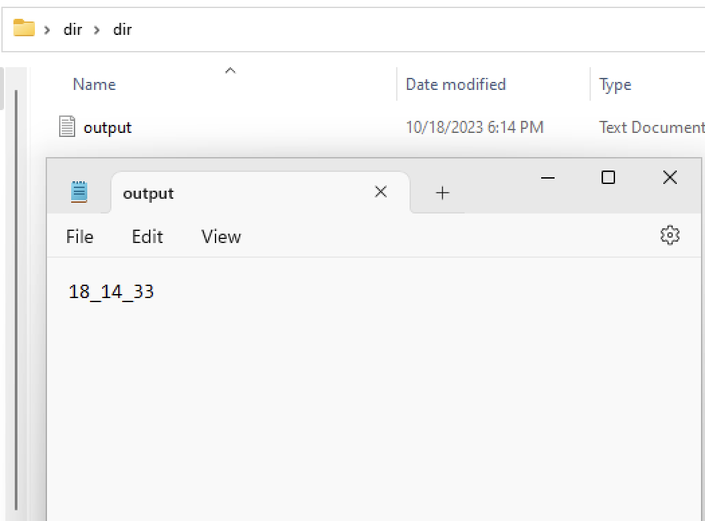
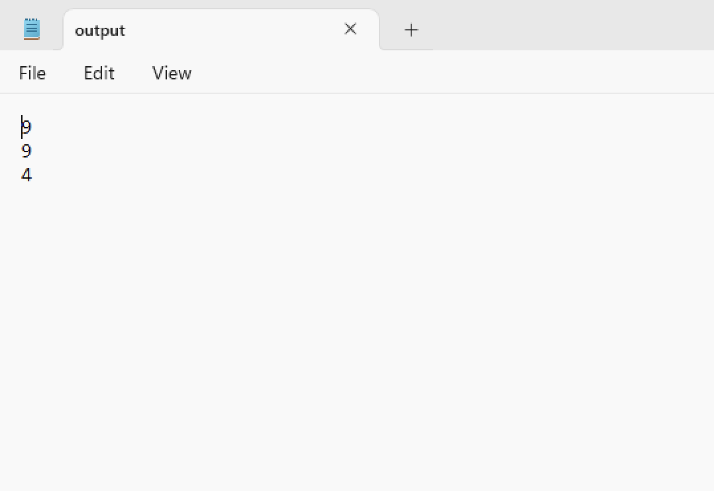
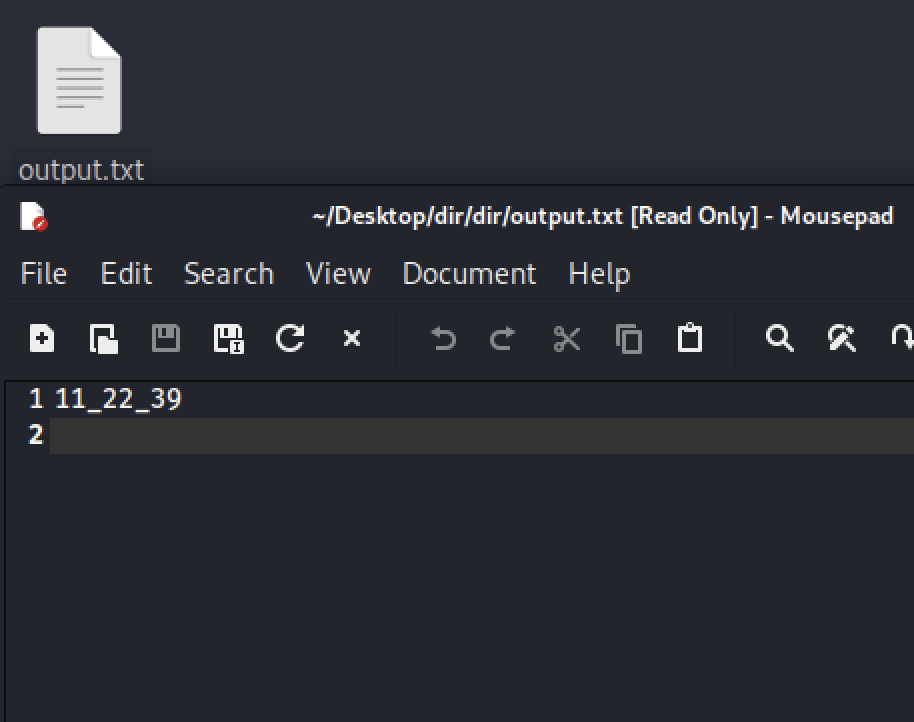
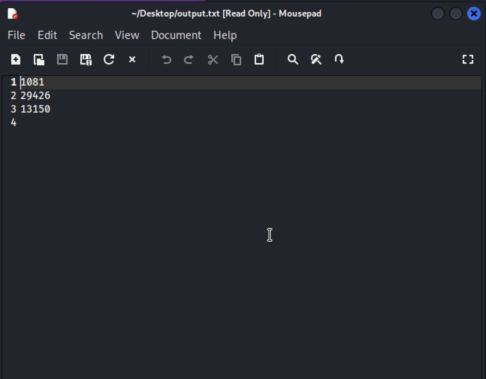

<<<<<<< HEAD
# ПОИИС
 Репозиторий дисциплины Представление и обработка информации в интеллектуальных системах 
 (Representation and processing of information in intelligent systems) для групп потока 32170х.
 С условиями лабораторных работ можно ознакомиться в папке соответствующего семестра.
=======
# Лабараторная работа №2
---
## Условие: Создать файл sh и bat, который выполняет следующее:
## На вход пакетному файлу приходит число (как параметр пакетного файла). Если число четное, то создается число папок, вложенных друг в друга циклически, равное указанному числу. В каждой папке создать файл, название которого совпадает с текущем временем (формат HH_MM_SS). Если число нечетное - создается файл, содержащий количество произвольных чисел, равное заданному как параметр числу.
---
### .bat файл
```bat
@echo off
@echo First argument is: %1
setlocal ENABLEDELAYEDEXPANSION
rem Команда SETLOCAL используется для временного изменения значений переменных среды в командных файлах Windows. 
rem ENABLEDELAYEDEXPANSION / DISABLEDELAYEDEXPANSION включает или отключает отложенное расширение переменной среды.
set /a c=%1%%2
for /f "tokens=2 delims==" %%G in ('wmic OS Get localdatetime /value') do set "datetime=%%G"
set "timestamp=%datetime:~8,2%_%datetime:~10,2%_%datetime:~12,2%"
if "%c%"=="0" (
	FOR /L %%A IN (1,1,%1) DO (
  mkdir dir
  cd dir
  echo %timestamp%>> output.txt
)
) else (
	FOR /L %%A IN (1,1,%1) DO (
		set /a randomNum=!random!%%15 + 1
 		echo !randomNum!>> output.txt
)
)
```
### Описание работы
Сначала мы звдвём переменную содержащую в себе результат остатка от деления заданного пользователем аргумента на 2 (переменная с), далее мы задаём переменную хранящую время(переменная timestamp). и переходим к основоной части решения задачи:
```bat
if "%c%"=="0" (
	FOR /L %%A IN (1,1,%1) DO (
  mkdir dir
  cd dir
  echo %timestamp%>> output.txt
)
) else (
	FOR /L %%A IN (1,1,%1) DO (
		set /a randomNum=!random!%%15 + 1
 		echo !randomNum!>> output.txt
)
)
```
### В том случае если аргумент чётный:
```bat
FOR /L %%A IN (1,1,%1) DO (
  mkdir dir
  cd dir
  echo %timestamp%>> output.txt
```
 Мы создадим папку с условным названием dir, переходим в неё, создеём файл output.txt в который записываем переменную хранящуюю время. Будем повторять данную последовательность действий количестыо рaз равное аргументу пользователя.


 ### Если аргумент нечётный:
```bat
FOR /L %%A IN (1,1,%1) DO (
		set /a randomNum=!random!%%15 + 1
 		echo !randomNum!>> output.txt
)
```
Мы создаём файл output.txt в который вписываем количетво случайных чисел равное аргументу введённому пользователем.


## Его вывод:
При чётном аргументе



При нечётном аргументе



---
### .sh файл

```sh
#!/bin/bash

temp=$(($1%2))
if [ $temp -eq 0 ]
then
    for((i=0; i<$1; i++))
    do
        mkdir dir
        cd dir
        date +%H_%M_%S > output.txt
    done
else
    for((i=0; i<$1; i++))
    do
        echo "$RANDOM" >> output.txt
    done
fi
exit 0
```
### Описание работы
Создаём переменную хранящую остаток от деления аргумента введённого пользователем на 2 (переменная temp). Далее переходим к решению задачи:
### В том случае если аргумент чётный:
```sh
for((i=0; i<$1; i++))
    do
        mkdir dir
        cd dir
        date +%H_%M_%S > output.txt
```
 Мы создадим папку с условным названием dir, переходим в неё, создеём файл output.txt в который записываем переменную хранящуюю время. Будем повторять данную последовательность действий количестыо рaз равное аргументу пользователя.


 ### Если аргумент нечётный:
 ```sh
  for((i=0; i<$1; i++))
    do
        echo "$RANDOM" >> output.txt
    done
 ```
 Мы создаём файл output.txt в который вписываем количетво случайных чисел равное аргументу введённому пользователем.
## Его вывод:
При чётном аргументе



При нечётном аргументе



---
### ВЫВОД:
## В ходе выполнения первой лабараторной работы приобрёл ценные в сфере информационных технологий навыки работы с консолью и терминалом, научился писать примитивные скрипты с помощью которых научился выполнять задачи.
        
>>>>>>> a3ff3cd (Adding images)
