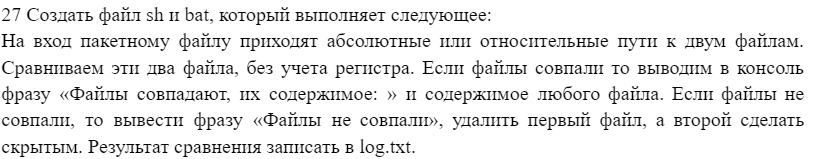
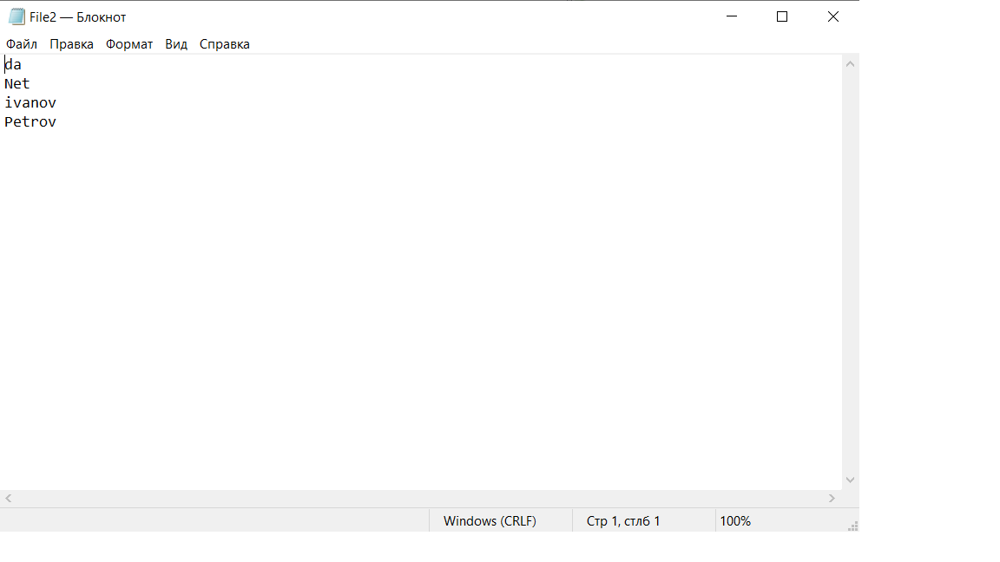
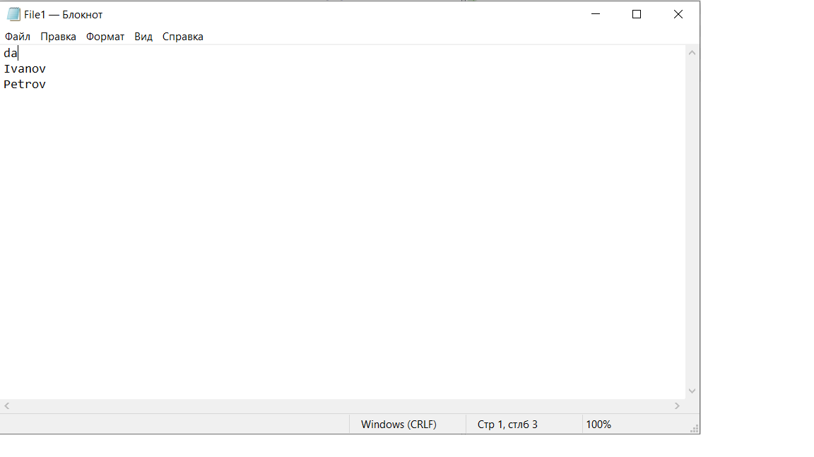
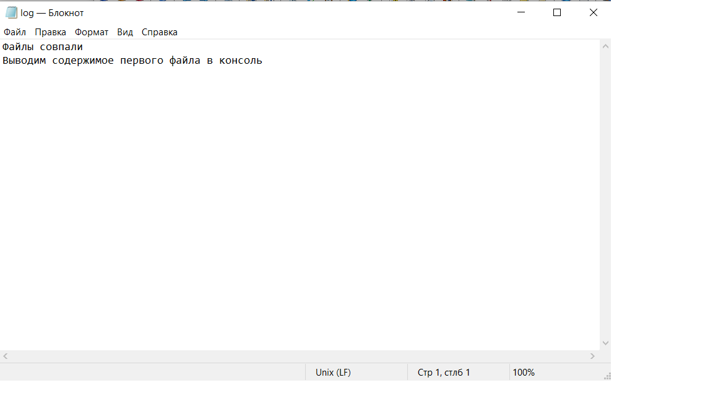
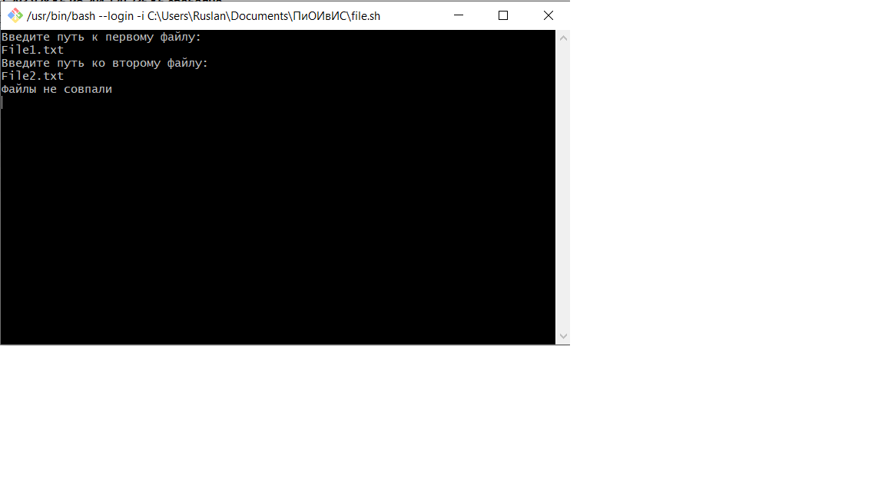
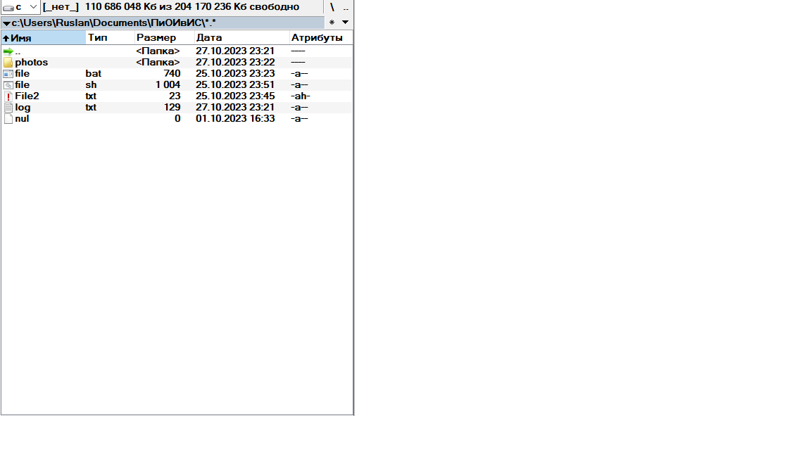
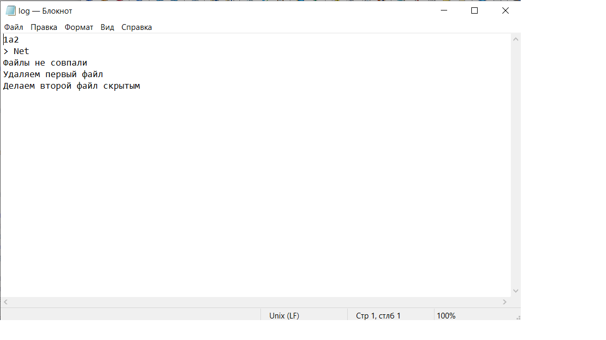

## Условие лабораторной работы №1(27 вариант)

## Код bat-файла

## Алгоритм работы bat-файла
1. Отключаем вывод команд в консоль
2. Добавляем русскую кодировку в консоли
3. Создаем первый файл, если его нет
4. Создаем второй файл, если его нет
5. Снимаем со второго файла аттрибут "скрытый"
6. Удаляем файл log.txt, в который записываются результаты работы(если он есть)
7. Запрашиваем пользователя ввести путь к первому файлу и отправляем его в переменную f1
8. Открываем первый файл
9. Запрашиваем пользователя ввести путь ко второму файлу и отправляем его в переменную f2
10. Открываем второй файл
11. Создаем файл log.txt, в который записываются результаты работы
12. Сравниваем первый и второй файлы без учета регистра, результат сравнения отправляем в файл log.txt
13. Присваиваем переменной r значение кода ошибки в результате сравнения двух файлов(%errorlevel%)
14. Если код ошибки равен нулю, выполняем следующее:  
    14.1. Выводим в консоль сообщение "Файлы совпадают, их содержимое:"  
    14.2. Выводим в файл log.txt сообщение "Файлы совпали"  
    14.3. Выводим в файл log.txt сообщение "Выводим содежримое первого файла в консоль"  
    14.4. Выводим содержимое первого файла в консоль  
15. Если код ошибки не равен нулю, выполняем следующее:  
    15.1. Выводим в консоль сообщение "Файлы не совпали"  
    15.2. Выводим в файл log.txt сообщение "Файлы не совпали"  
    15.3. Удаляем первый файл  
    15.4. Выводим в файл log.txt сообщение "Удаляем первый файл"
    15.5. Добавляем второму файлу аттрибут "Скрытый"  
    15.6. Выводим в файл log.txt сообщение "Делаем второй файл скрытым"
## Пример работы bat-файла
а) ***файлы совпадают***  
Первый файл:

Второй файл:

Консоль после выполнения работы bat-файлом:

Файл log.txt после выполнения работы bat-файлом:

б) ***файлы не совпадают***  
Первый файл:

Второй файл:

Папка до выполнения работы bat-файлом:

Консоль после выполнения работы bat-файлом:

Папка после выполнения работы bat-файлом:

Файл log.txt после выполнения работы bat-файлом:

## Переменные в bat-файле  
  -f1 - содержит путь к первому файлу  
  -f2 - содержит путь ко второму файлу  
  -r - содержит код ошибки в результате сравнения двух файлов(%errorlevel%)
## Код sh-файла

## Алгоритм работы sh-файла
1. Создаем первый файл, если его нет
2. Создаем второй файл, если его нет
3. Снимаем со второго файла аттрибут "скрытый"
4. Удаляем файл log.txt, в который записываются результаты работы(если он есть)
5. Создаем файл log.txt, в который записываются результаты работы
6. Запрашиваем пользователя ввести путь к первому файлу и отправляем его в переменную f1
7. Открываем первый файл
8. Запрашиваем пользователя ввести путь ко второму файлу и отправляем его в переменную f2
9. Открываем второй файл
10. Сравниваем первый и второй файлы без учета регистра, результат сравнения отправляем в файл log.txt
11. Присваиваем переменной r значение кода ошибки в результате сравнения двух файлов($?)
12. Если код ошибки равен нулю, выполняем следующее:
    12.1. Выводим в консоль сообщение "Файлы совпадают, их содержимое:"  
    12.2. Выводим в файл log.txt сообщение "Файлы совпали"  
    12.3. Выводим содержимое первого файла в консоль  
    12.4. Выводим в файл log.txt сообщение "Выводим содежримое первого файла в консоль"  
13. Если код ошибки не равен нулю, выполняем следующее:  
    13.1. ыводим в консоль сообщение "Файлы не совпали"  
    13.2. Выводим в файл log.txt сообщение "Файлы не совпали"  
    13.3. Выводим в файл log.txt сообщение "Удаляем первый файл"  
    13.4. Удаляем первый файл
    13.5. Выводим в файл log.txt сообщение "Делаем второй файл скрытым"  
    13.6. Добавляем второму файлу аттрибут "Скрытый"
## Пример работы sh-файла
а) ***файлы совпадают***  
Первый файл:

Второй файл:

Консоль после выполнения работы sh-файлом:

Файл log.txt после выполнения работы sh-файлом:

б) ***файлы не совпадают***  
Первый файл:

Второй файл:

Папка до выполнения работы sh-файлом:

Консоль после выполнения работы sh-файлом:

Папка после выполнения работы sh-файлом:

Файл log.txt после выполнения работы sh-файлом:

## Переменные в sh-файле  
  -file1 - содержит путь к первому файлу(для проверки на его существование)  
  -file2 - содержит путь ко второму файлу(для проверки на его существование)  
  -f1 - содержит путь к первому файлу(для его ввода)  
  -f2 - содержит путь ко второму файлу(для его ввода)  
  -r - содержит код ошибки в результате сравнения двух файлов($?)
