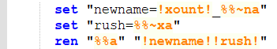
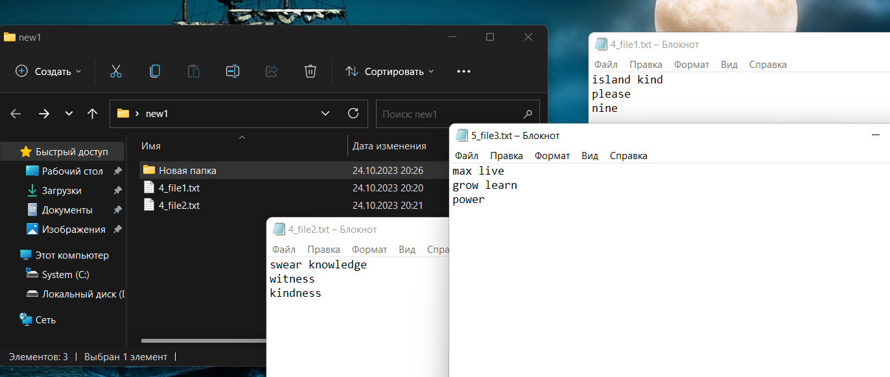
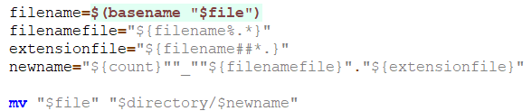

# BSUIR_cmd-bash
Данная лабораторная работа была предназначена для ознакомления с командной строкой Windows и Linux.В рамках ЛР 1 необходимо создать исполняемый файл .bat и .sh в соответсвии с заданным вариантом.
# Условие Лр 1 (44 вариант)

# Описание алгоритма , пример запуска и выпонения программы(.bat файл) 
## Вот так выглядит весь код

    
## Используемые переменные:
- _directory_ - хранит относительный путь к папке
- _xount_ - переменная , которая используется для подсчета слов в файле
- _newname_ - хранит название файла, который необходимо переименовать
- _rush_ - хранит расширение файла, который необходимо переименовать

# Подробное описание кода 
На вход пакетному файлу приходит относительный путь к папке (как параметр пакетного файла). Далее идет проверка, существует ли такая папка. Если нет, пользователь видит сообщение "Данной папки нет". 

Далее запускается цикл который обходит данную директорию и ее поддиректории.Затем  просматривается каждый файл данной директории и ее поддиректории и подсчитывается количество слов в файле с помощью переменной "xount".  

Затем мы рекурентно переименновываем файлы , добавляя в начало названия этого файла количество слов в нем.

## Пример запуска .bat файла:
Создадим папку с файлами и подкаталогами.

Откроем bat файл через с cmd, для этого запустим cmd через Windows+R.

Запустим скрипт через cmd подав на вход название папки.

После в папке которую мы передали как параметр, после в начале названия  каждого файла появилось количество слов в этом файле.
 
# Описание алгоритма , пример запуска и выпонения программы(.sh файл)
## Вот так выглядит весь код

## Используемые переменные:
- _directory_ - хранит относительный путь к папке
- _count_ - переменная , которая хранит количество слов в файле
- _filenewnamefile_ - хранит название файла, который необходимо переименовать
- _extenshionfile_ - хранит расширение файла, который необходимо переименовать
- _newname_ - хранит новое название файла
# Подробное описание кода 
На вход пакетному файлу приходит относительный путь к папке (как параметр пакетного файла). Далее идет проверка, существует ли такая папка. Если нет, пользователь видит сообщение "Данного каталога не существует". 

Далее запускается цикл который обходит данную директорию и ее поддиректории.Затем  просматривается каждый файл данной директории и ее поддиректории и в переменную "count" записывается количество слов в файле.  

Затем мы рекурентно переименновываем файлы , добавляя в начало названия этого файла количество слов в нем.

## Пример запуска .sh файла:
Создадим папку с файлами и подкаталогами.

Откроем sh файл через bash.Запустим скрипт через bash подав на вход название папки.

В папке, которую мы передали как параметр,  в начале названия  каждого файла появилось количество слов в этом файле.

# Итог
В ходе работы были получены и приобретены навыки работы в командной строке Windows и Linux.А так же команды для работы в GitHub.