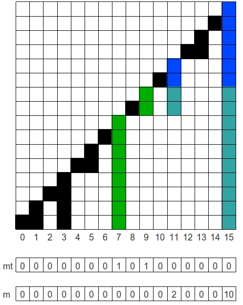
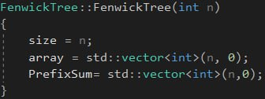
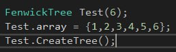
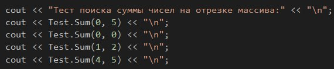
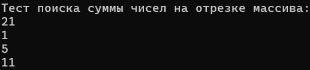
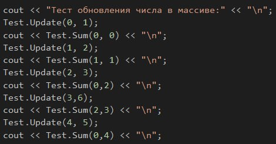
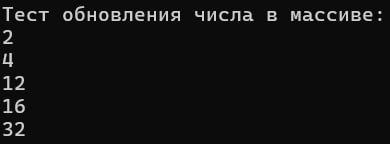
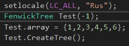
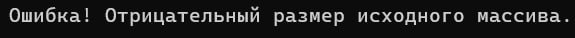

# Лабораторная работа №1

## Цель работы: 

Исследовать свойства структур данных и разработать библиотеку алгоритмов обработки структур данных

## Условие лабораторной работы вариант 14:

Дерево Фенвика. Поиск суммы чисел на отрезке массива. Обновление числа в массиве.

### График Дерева Фенвика:

## Используемые понятия:

`Дерево`-одна из наиболее широко распространённых структур данных в информатике, эмулирующая древовидную структуру в виде набора связанных узлов.

`Дерево Фенвика`- структура данных, позволяющая быстро изменять значения в массиве и находить некоторые функции от элементов массива.

`Побитовые операции`- это операции, которые применяются к каждому биту из цепочки битов.

`Структура` - производный тип данных, который используется для группировки элементов.

`Конструкторы структур`- специальные методы, используемые для инициализации объектов структуры.

## Используемый алгоритм:

Структура `FenwickTree` включающая в себя все последующие функции и конструктор.

Конструктор `FenwickTree` с параметром `n`- размер массива, который присваивает полю `size` значение n, создает массивы array и PrefixSum из n нулей 

Public поля структуры: 

`array`- исходный массив.

Private поле структуры:

`size`- размер массива,

`PrefixSum`- массив сумм некоторых элементов массива array.

Public функции:

`void CreateTree()`- заполняет массив `PrefixSum` определенными суммами элементов array.

`int Sum(int start, int pos)`- находит сумму на отрезке массива от start до pos.

`void Update(int pos, int value)`- увеличивает значение элемента массива `PrefixSum` на позиции pos на значение value. 

Private функции:

`int f(int i)`- возвращает побитовое 'И' от i и i+1

`int g(int i)`- возвращает побитовое 'ИЛИ' от i и i+1

### Начальные значения тестов:

### Тесты нахождения суммы на отрезке:

### Результат:

### Тесты обновления значения в массиве:

### Результат:

### Тест обработки отрицательного значения размера массива:

### Результат:

## Вывод:

Исследовал структуру данных Дерево Фенвика, разработал статическую библиотеку обработки этой структуры данных

