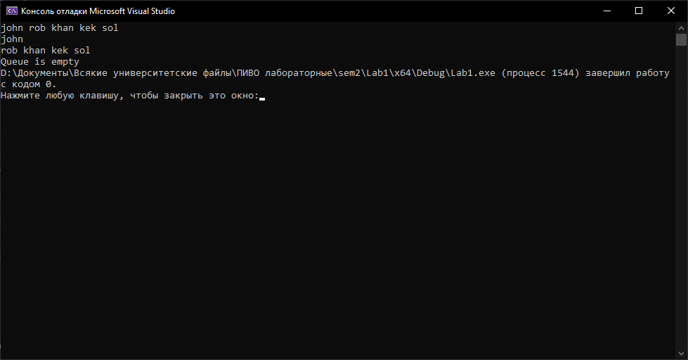

# Лабораторная работа №1
## Цель работы

Исследовать свойства структур данных и разработать библиотеку алгоритмов обработки структур данных.

## Задача

Создать очередь с приоритетом и реализовать следующий функционал:

- Добавление элемента в очередь
- Извлечение элемента из очереди

## Список ключевых понятий

- `Очередь с приоритетом` — контейнер, предоставляющий интерфейс для хранения элементов с учетом их приоритета. В отличие от обычной очереди, где элементы добавляются в конец и извлекаются из начала, элементы в очереди с приоритетом хранятся так, чтобы элемент с наивысшим приоритетом был доступен для извлечения.

## Реализация

Элемент очереди, по своей сути, является кортежом длиной 2, где первой его компонентой является значение, хранимое в очереди, а второй — значение приоритета.
Вершиной подобной очереди является значение с наивысшим приоритетом.

##### Структурный тип данных очереди содержащий информационную и адресную часть
```c++
struct MyQueue
{
	int prio;
	T info;
	MyQueue* next, *prev;
};
```

##### Добавление элемента в очередь
```c++
template<typename T> void InQueue(MyQueue<T>** b, MyQueue<T>** e, T in, int prio)
{
	MyQueue<T>* t = new MyQueue<T>;
	t->info = in;
	t->prio = prio;
	t->next = t->prev = NULL;
	if (*b == NULL)
		*b = *e = t;
	else {
		t->prev = NULL;
		t->next = *b;
		(*b)->prev = t;
		*b = t;
	}
}
```

##### Извлечение элемента из очереди
```c++
template<typename T> T OutQueue(MyQueue<T>** p)
{
	MyQueue<T>* t = *p;
	T out;
	out = (*p)->info;
	*p = (*p)->prev;
	delete t;
	return out;
}
```

В программе представлены и другие методы для взаимодействия с очередью. Их можно просмотреть в [заголовочном файле](MyQueue.h).

Для удобства взаимодействя с очередью с приоритетом был создан класс `MyQueueWithPriority`, реализовывающий интерфейс для очереди.
```c++
class MyQueueWithPriority
{
	MyQueue* beginQ, * endQ;

public:
	MyQueueWithPriority();
	~MyQueueWithPriority();

	void AddToQueue(int);
	T GetFromQueue();
	void ViewQueue();
	void DeleteQueue();
	bool empty = EmptinessCheck(endQ);
};
```

## Пример работы программы

Проект содержит [текстовый документ](tasks/example.txt), содержащий 5 строковых значений и их приоритеты: `<kek, 2>, <rob,3>, <sol, 1>, <john, 5>,<khan, 3>`. 

[Тестовая программа](Lab1.cpp) работает следующим образом:

1. Программа считывает значения и их приоритеты из текстового файла и записывает их в очередь.
2. Просматривается вся очередь.
3. Извлекается и выводится 1 элемент очереди.
4. Очередь вновь просматривается (в выводе не будет прежде извлечённого элемента).
5. Вся очередь очищается.
6. Происходит проверка: если очередь пуста, выводится сообщение `Queue is empty`, в противном случае выводится очередь.
7. Т.к. после очистки очередь ничего не содержит, выводится сообщение `Queue is empty`.



## Вывод

В ходе выполнения работы была реализована очередь с приоритетом и интерфейс для работы с ней.