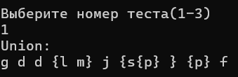
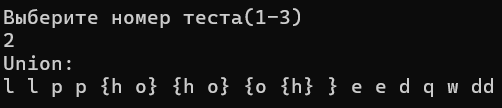
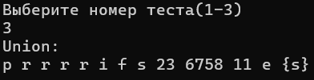

# Лабораторная работа №2

## Цель работы:

Разработатать библиотеку алгоритмов для работы со множествами

## Условие лабораторной работы вариант 10:

Реализовать программу, формирующую множество равное объединению произвольного 
количества исходных множеств (с учётом кратных вхождений элементов).

## Используемые понятия:

`Множество` - совокупность каких-либо объектов — элементов этого множества.

`Объединение множеств с учетом кратных вхождений` - множество S тогда и только тогда, когда для любого x
истинно S|x| = max{A|x|, B|x|}.

`Множество с кратными вхождениями` - т множество S тогда и только 
тогда, когда существует x такой, что истинно S|x| > 1

## Используемый алгоритм:

Функции:

`int CountStr(const string& file_name)` - считает количество множеств в файле file_name.

`void MakeSet(const string & file_name,vector<vector<string>> & Set)` - создает множество из каждой строки файла, записывая элементы каждого множества в вектор `Set` в отсортированном порядке.

`vector<vector<pair<string, int>>> MultiplCount(const vector<vector<string>>& Set)`- считает количество каждого элемента в каждом множестве.

`vector<pair<string, int>> Union(const vector<vector<pair<string, int>>>& multipl_count)` - находит объединение всех исходных множеств с учетом кратных вхождений.

`Result` - выводит на экран объединение всех исходных множеств.

## Начальные значения тестов:

## Результаты:

## Вывод:

Исследовал операциии над множествами и способы работы с множествами с учетом кратных вхождений

