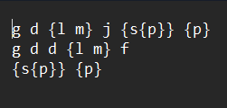
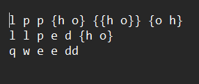

# Лабораторная работа №2

## Цель работы:

Разработатать библиотеку алгоритмов для работы со множествами

## Условие лабораторной работы вариант 10:

Реализовать программу, формирующую множество равное объединению произвольного 
количества исходных множеств (с учётом кратных вхождений элементов).

## Используемые понятия:

`Множество` - совокупность каких-либо объектов — элементов этого множества.

`Объединение множеств с учетом кратных вхождений` - множество S тогда и только тогда, когда для любого x
истинно S|x| = max{A|x|, B|x|}.

`Множество с кратными вхождениями` - т множество S тогда и только 
тогда, когда существует x такой, что истинно S|x| > 1

## Используемый алгоритм:

Функции:

`int CountStr(string& file_name)` - считает количество множеств в файле file_name.

`bool IsCorrect(string& str)` - проверяет вводимую строку на корректность.

`void MakeUnion(string file_name)`- создает из строк вектор из элементов множества, которые используются в других функциях

`void MakeElement(vector<vector<Element>>& arr)` - создает элемент множества из иго частей в векторе создаваемом `MakeUnion`

`void Swap(char& a, char& b)`- меняет местами необходимые элементы (используется в методе `Sort`)

`string Sort(string str)` - возвращает отсортированную строку, не изменяя исходную.

`void Union(vector<vector<Element>>& arr)` - формирует объединение в виде вектора пар и выводит результат(объединение множеств)

`bool IsEqual(vector<vector<Element>>& arr, int pos1, int pos2)`- проверяет поэлементно равны ли элементы множества, сравнивая их значения в отсортированном виде и "глубину"

`int SymbolNumber(vector<vector<Element>>& arr, int i)` - подсчитывает количество элементов которые не являются скобками в элементе множества.

`int ElemNumber(vector<vector<Element>>& arr, int j)` - подсчитывает количество каждого элемента и возвращает максимальное количество данного элемента во всех множествах.

## Начальные значения тестов:

## Результаты:

## Вывод:

Исследовал операциии над множествами и способы работы с множествами с учетом кратных вхождений

