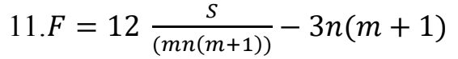
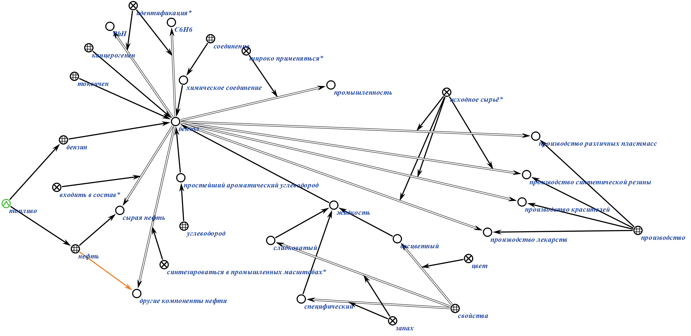
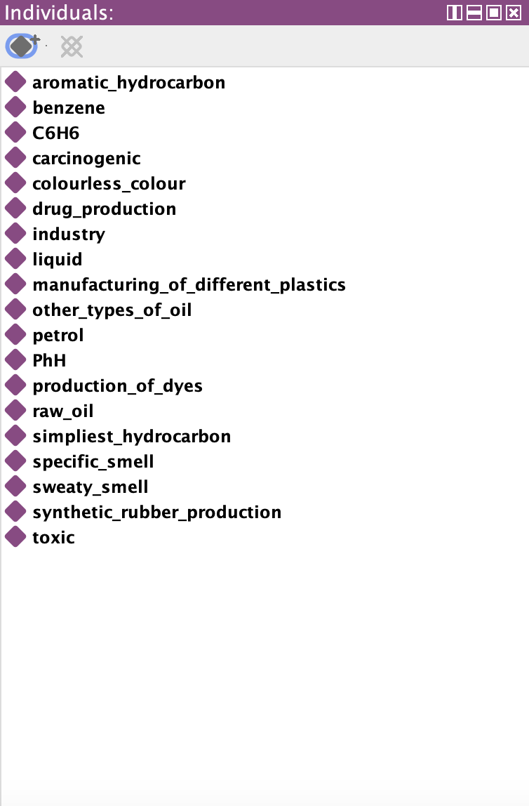
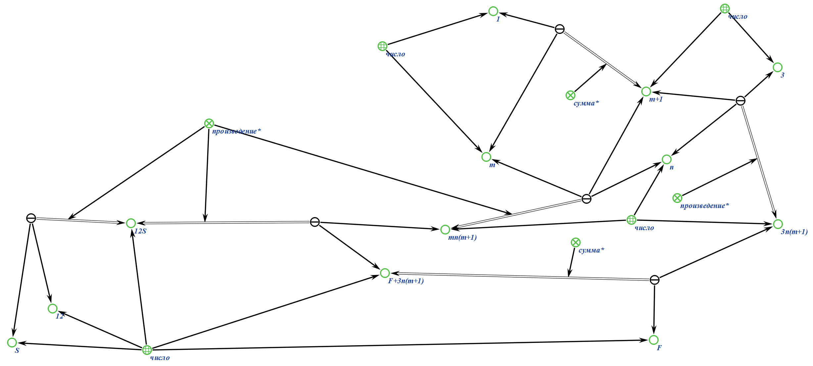

# Практическое задание по предмету 'Представление и обработка информации в интеллектуальных системах'
## Задание (*вариант 23*):
**Задание №1** 
*27. Бензо́л (C6H6, PhH) — органическое химическое соединение, бесцветная жидкость со
специфическим сладковатым запахом. Простейший ароматический углеводород. Бензол входит
в состав бензина, широко применяется в промышленности, является исходным сырьём для
производства лекарств, различных пластмасс, синтетической резины, красителей. Хотя бензол
входит в состав сырой нефти, в промышленных масштабах он синтезируется из других её
компонентов. Токсичен, канцерогенен.*
**Задание №2** 

## Выполнение:

### Задание №1 (*KBE*):

### Задание №1 (*Protege*):

### Задание №2 (*KBE*):

## Вывод:
Научился формализовать текст, математические уравнения и работать в KBE, Protege
