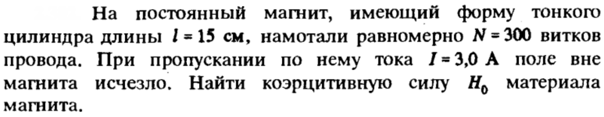
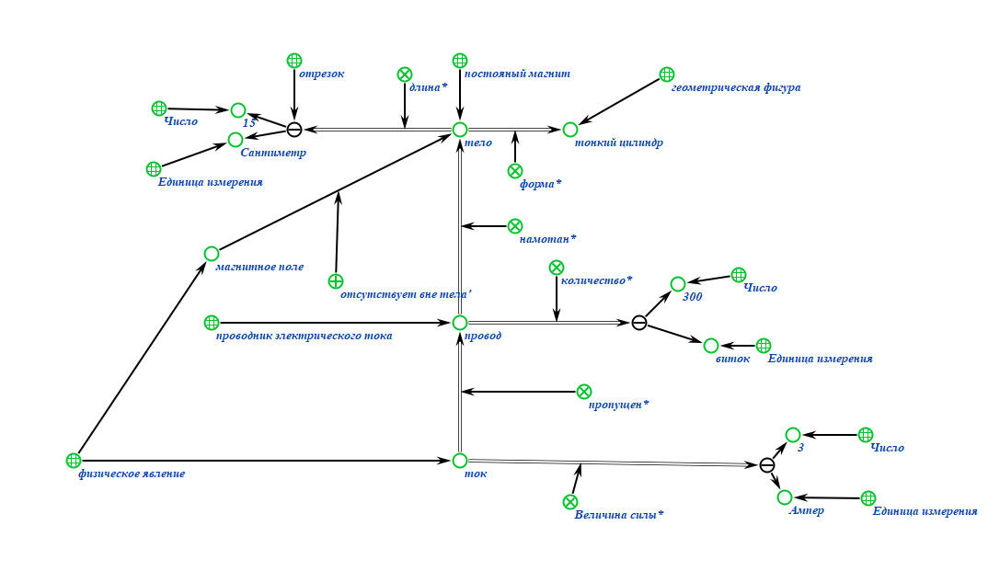
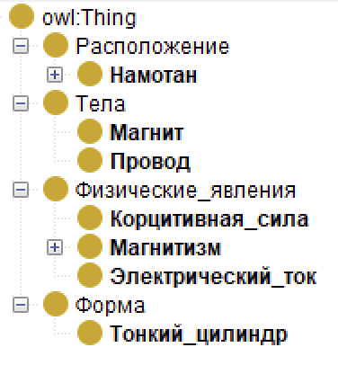
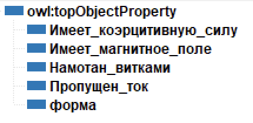
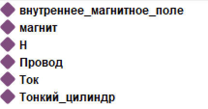
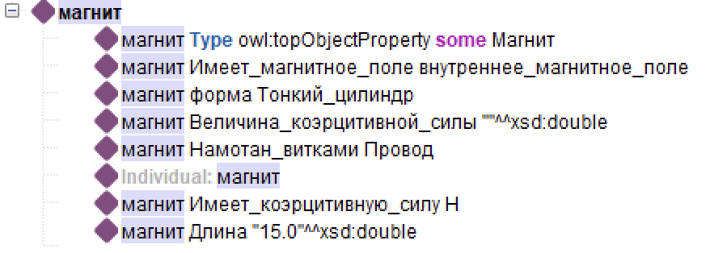
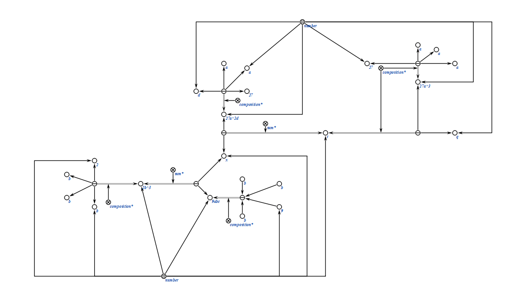

# Практические занятия
---
### Тема: Формализация
### Цель: Научиться формализвать знания с помощью редакторов баз знаний (KBE и Protege).

## Первая задача:

### Её реализация в КВЕ:

### Её реализация в Protege:

---

## Вторая задача:

### Её реализация в КВЕ:

---

## Вывод: изучил и на практике и освоил основы формализации знаний.
