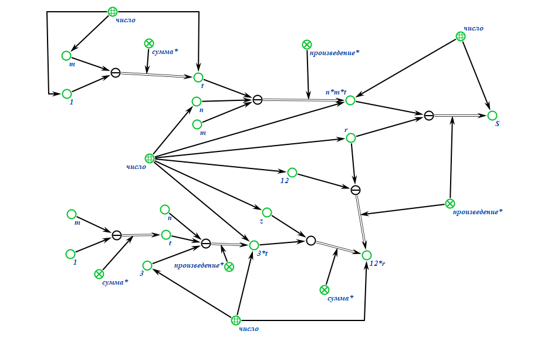

# Самостоятельная работа
---

## Задание №1	
Заданный текст (условие задачи) формализовать в двух вариантах:
1. При помощи стандартов консорциума _W3C_, используя редактор _Protégé_
2. При помощи стандартов технологии _OSTIS_, используя редактор _KBE_ и
язык _SCg_			
### Вариант 27
Бензо́л (_C6H6_, _PhH_) — органическое химическое соединение, бесцветная жидкость со
специфическим сладковатым запахом. Простейший ароматический углеводород. Бензол входит
в состав бензина, широко применяется в промышленности, является исходным сырьём для
производства лекарств, различных пластмасс, синтетической резины, красителей. Хотя бензол
входит в состав сырой нефти, в промышленных масштабах он синтезируется из других её
компонентов. Токсичен, канцерогенен.

---
### Результат сделанный с помощью стандартов консорциума _W3C_, используя редактор _Protégé_:

.png)

---
### Результат сделанный с помощью стандартов технологии _OSTIS_, используя редактор _KBE_ и язык _SCg_:
---

.png)

---
## Задание №2	
Заданное математическое выражение формализовать при помощи стандартов
технологии _OSTIS_, используя редактор _KBE_ и язык _SCg_. При формализации
учитывать отношения, приведенные в файле _Числа.pdf_
### Вариант 11

.png)

---
### Результат сделанный при помощи стандартов технологии _OSTIS_, используя редактор _KBE_ и язык _SCg_:
---

---
