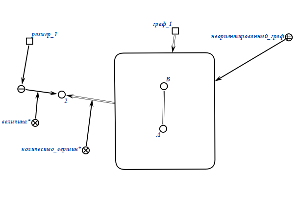
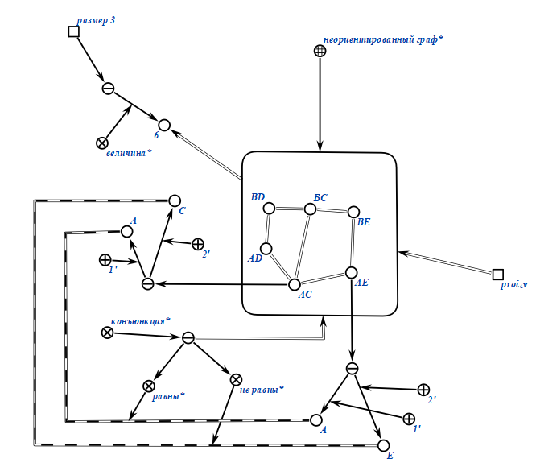
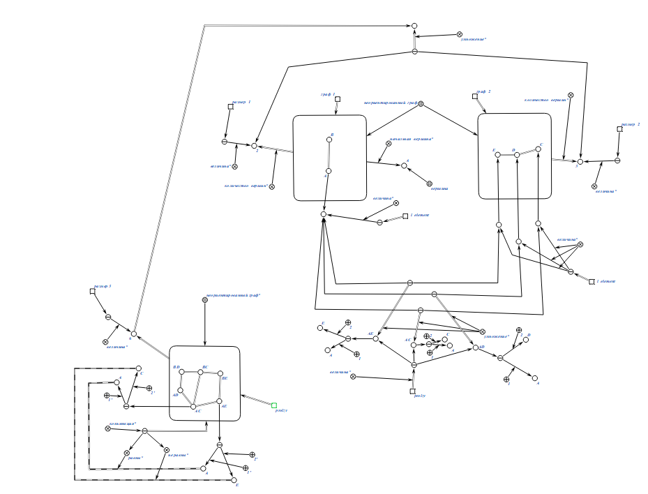
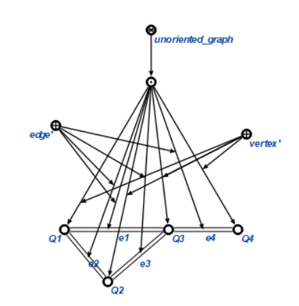

# Формализация расчетной работы.
## Декартово произведение 2 неориентированных графов

1. Задаем 2 неориентированных графа:

Первый граф 

Второй граф

2. Выбираем начальную вершину, с которой начнем выполнять декартово произведение:

3. Перемножаем вершины и получаем новые, которые заносим в новый граф (для вершины В делаем то же самое):

4. Более детально: Сначала проверяется если первая компонента v_1 разная из двух вершин s_1 и s_2, то проверяем если вторая компонента v_2 из двух вершин s_1 и s_2 одинаковая тогда соединяем вершины s_1 и s_2

.png)

Иначе проверяется если вторая компонента v_2 разная из двух вершин s_1 и s_2, то проверяем если первая компонента v_1 из двух вершин s_1 и s_2 одинаковая тогда соединяем вершины s_1 и s_2

.png)

5. Соединяем новые вершины дугами: если 1ые компоненты равны, а 2ые не равны:

6. Полный алгоритм:

## Формализация понятий

Неориентированный граф:

Декартово произведение:

