# Расчётная работа
---
### Тема: Демонстрация работы программы решения теоретико-графовой задачи в семантической паияти
### Цель: Исследовать правила построения алгоритмов решений теоретико-графовых задач в самантической памяти.

### Условие: Построение фрагмента онтологии теоретико-графовой задачи. демонстрация работы программы решения теоретико-графовой задачи в семантической памяти
---
#### Список ключевых понятий:
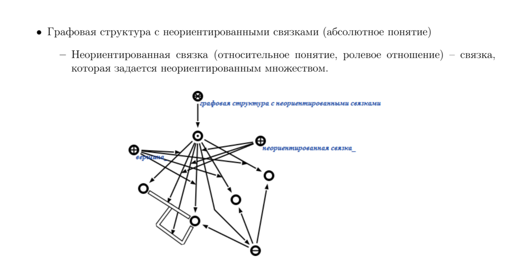
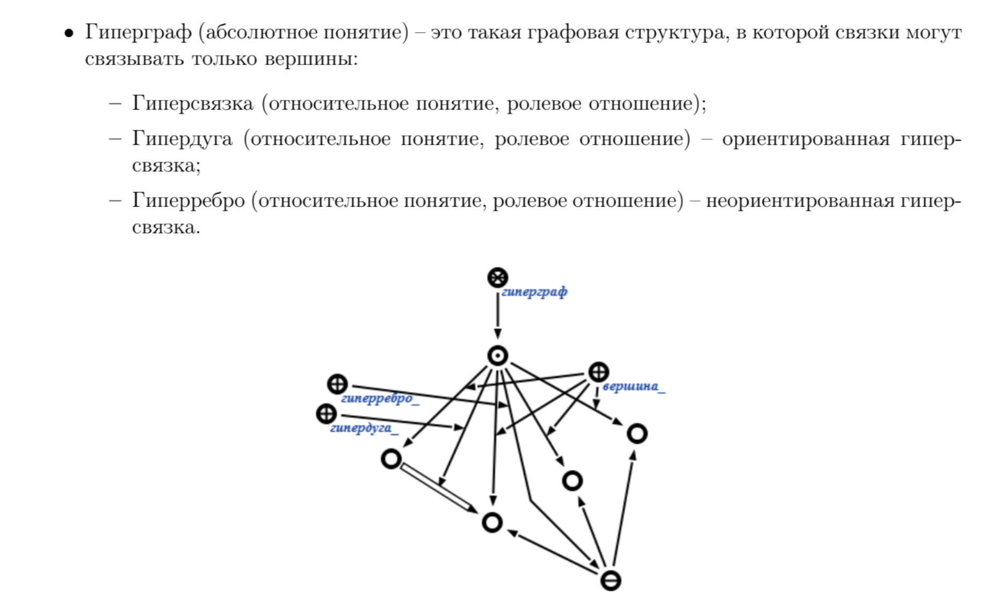
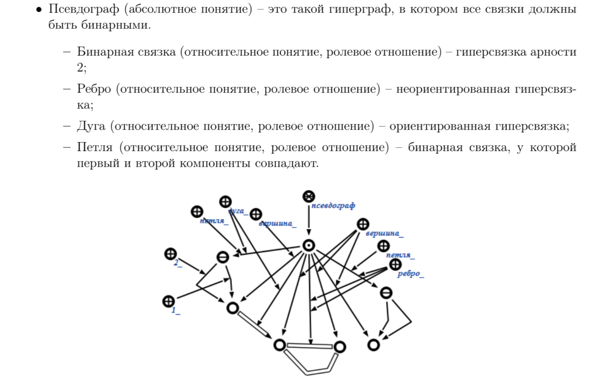
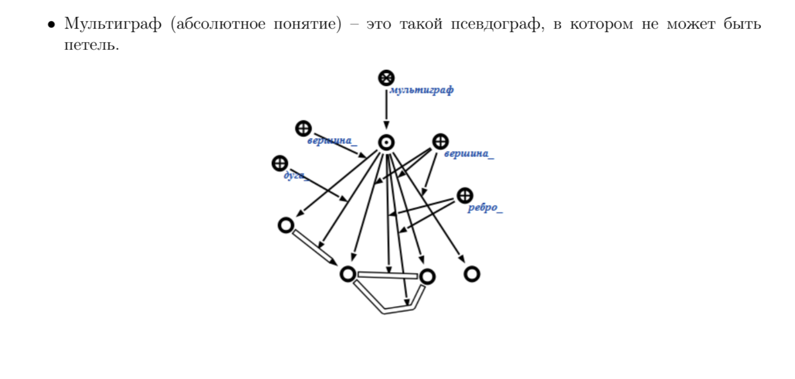
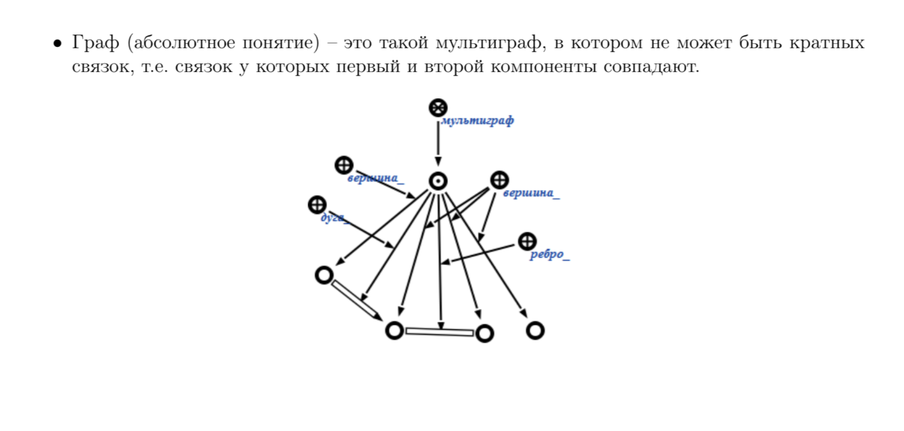
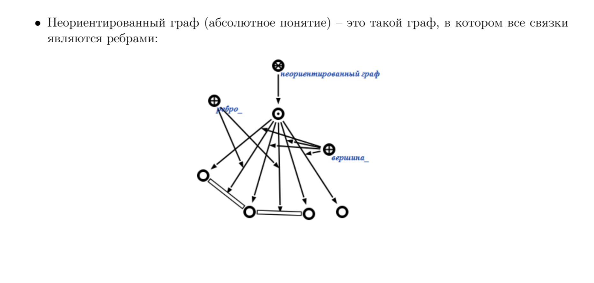
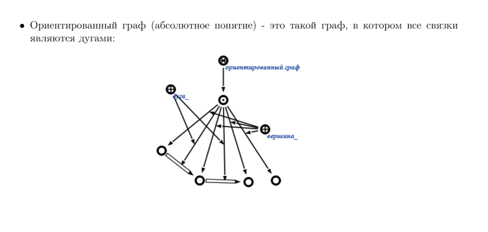
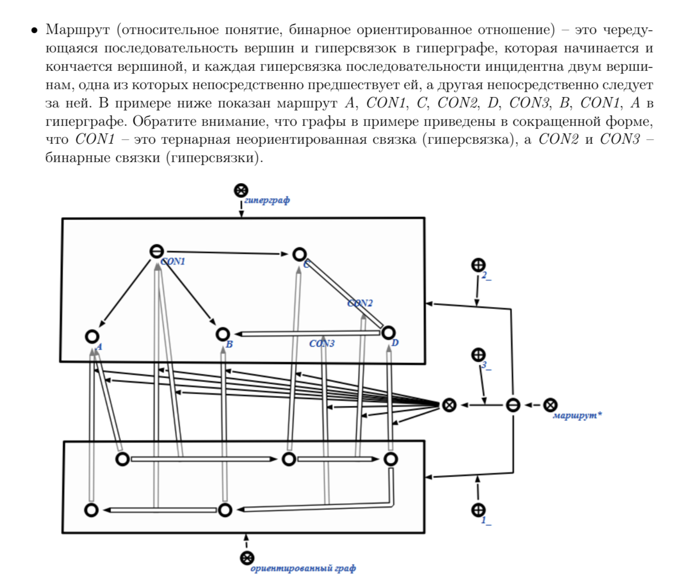
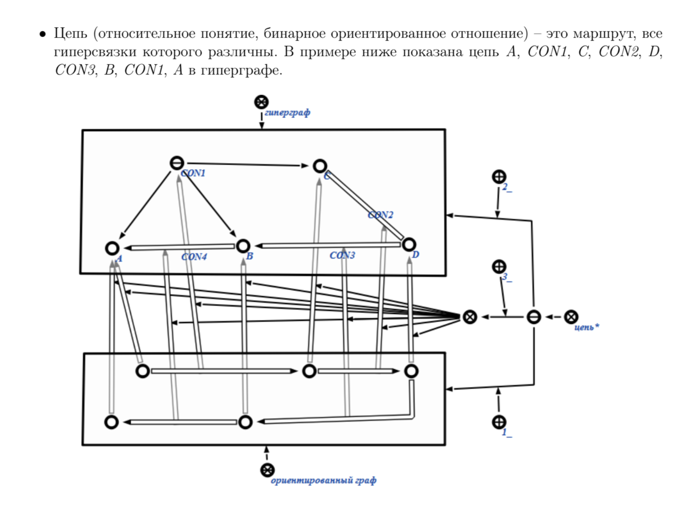
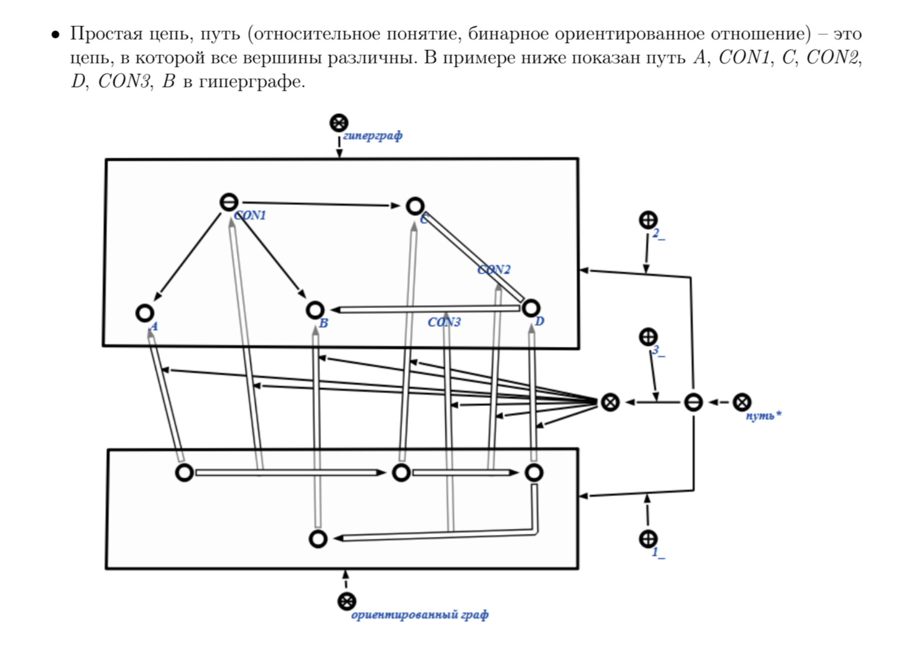

---
## Примеры тестов:
### 1.
#### Входные данные
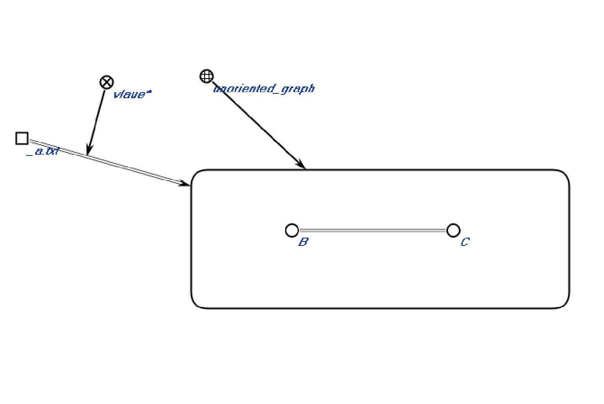
#### Результат
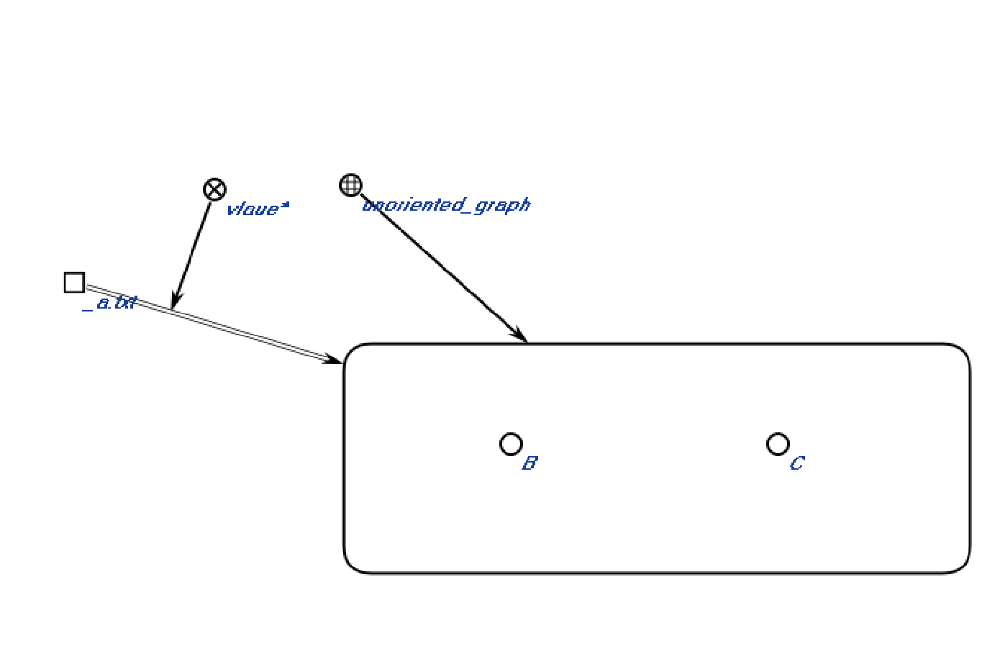
### 2.
#### Входные данные
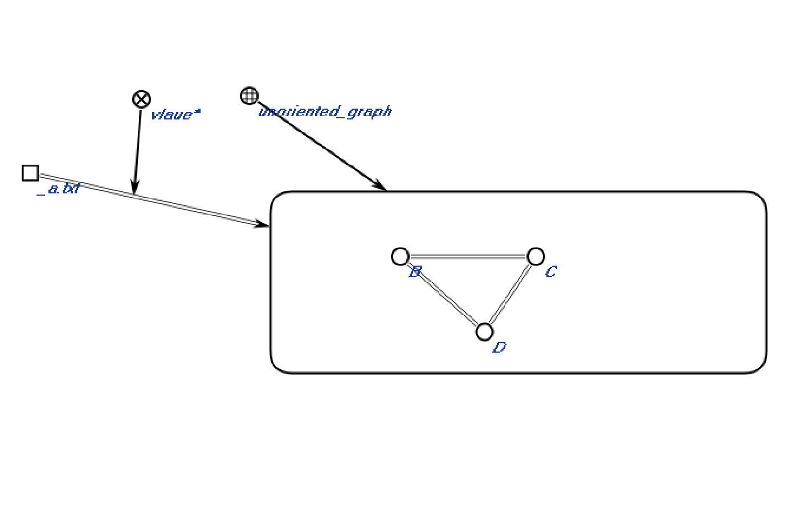
#### Результат
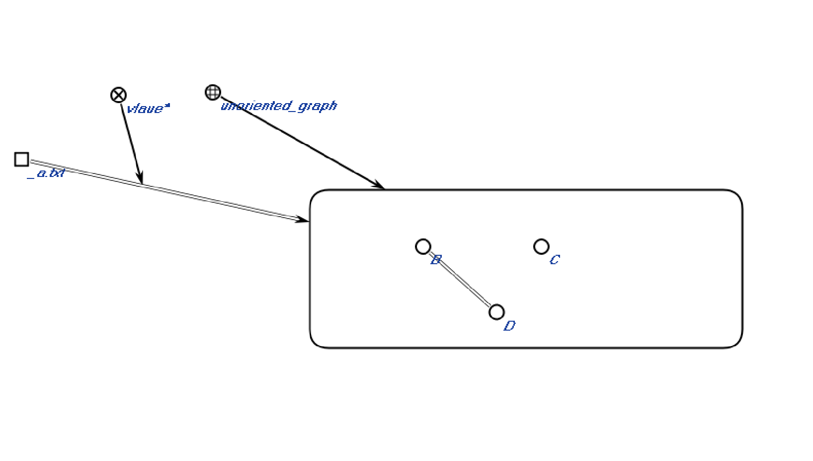
### 3.
#### Входные данные
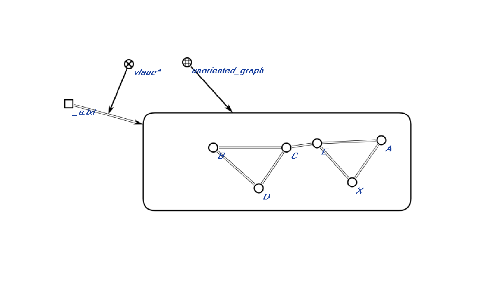
#### Результат
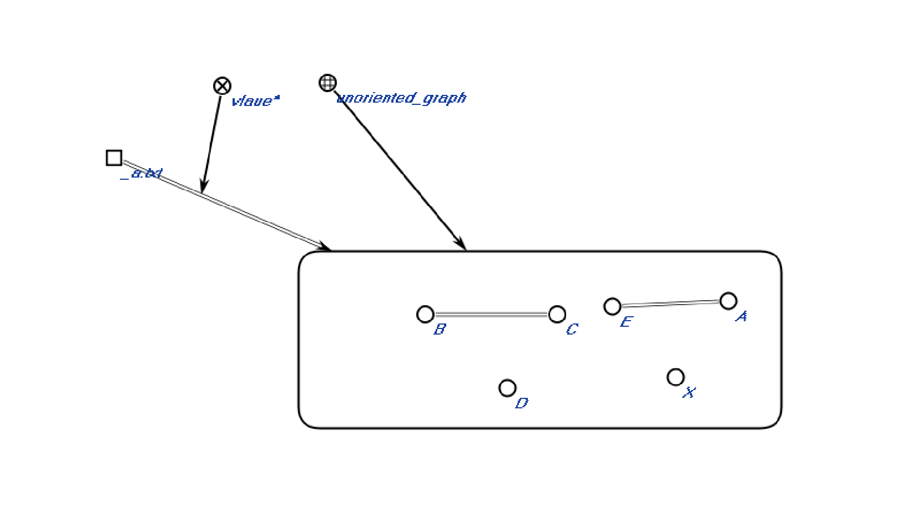
___

### Демонстрация работы алгоритма:
Шаг 1: Создание множества непроверенных вершин

Шаг 2-6: создание волн включающих все вершины

Шаг 8-11: нахождение простой цепи

Шаг 12-21: удаление рёбер простой цепи (нахождение индекс-компонента)
___

## Вывод: Исследовал правила построения алгоритмов решений теоретико-графовых задач в самантической памяти.