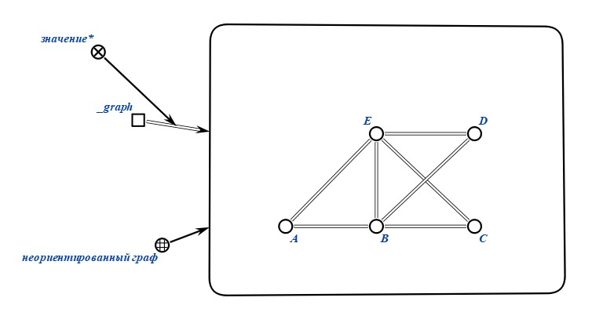
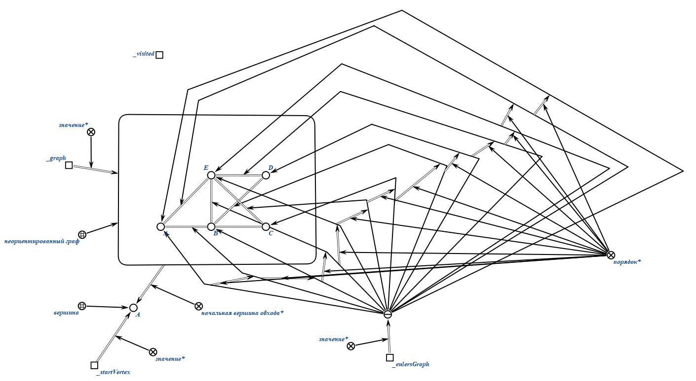
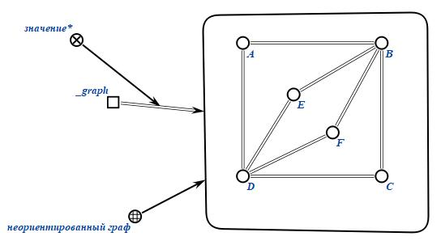
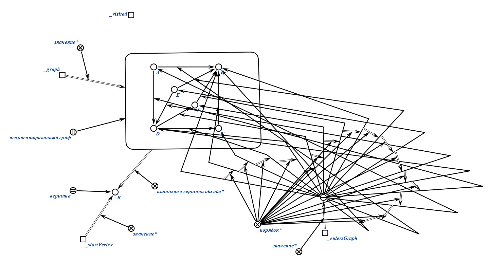
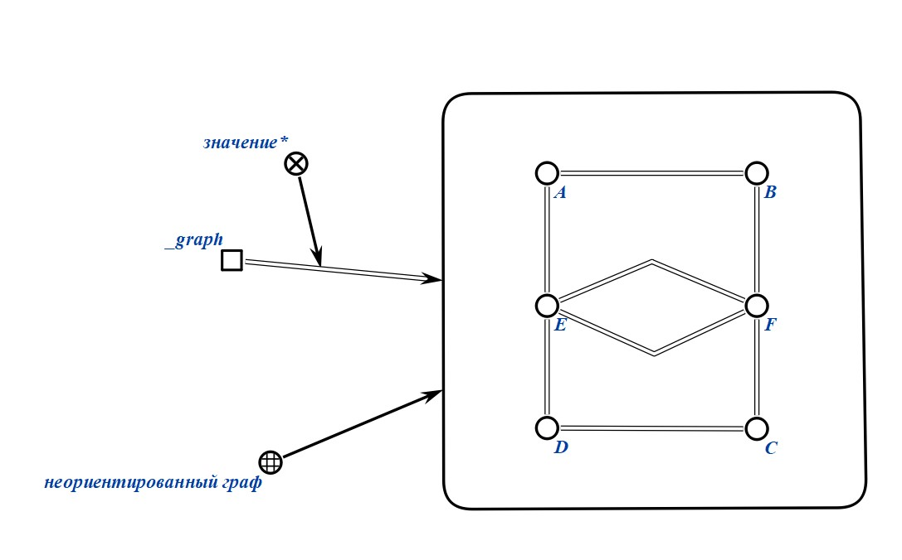
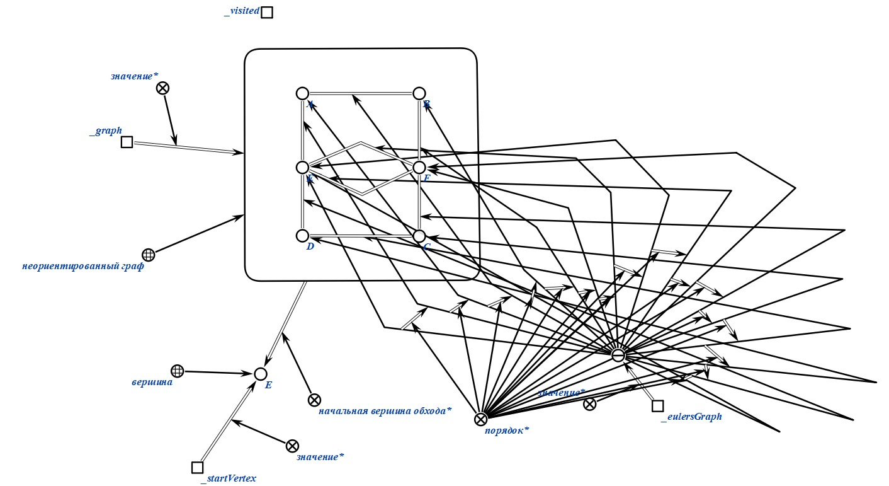
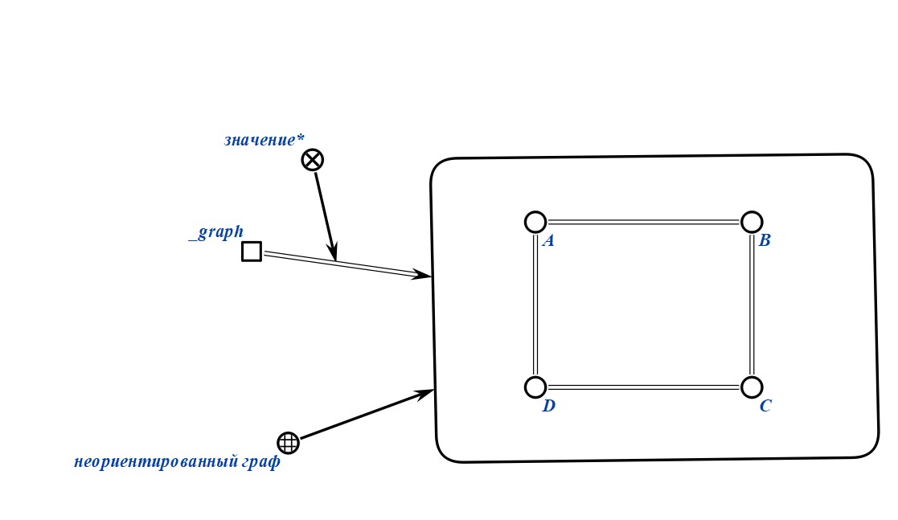
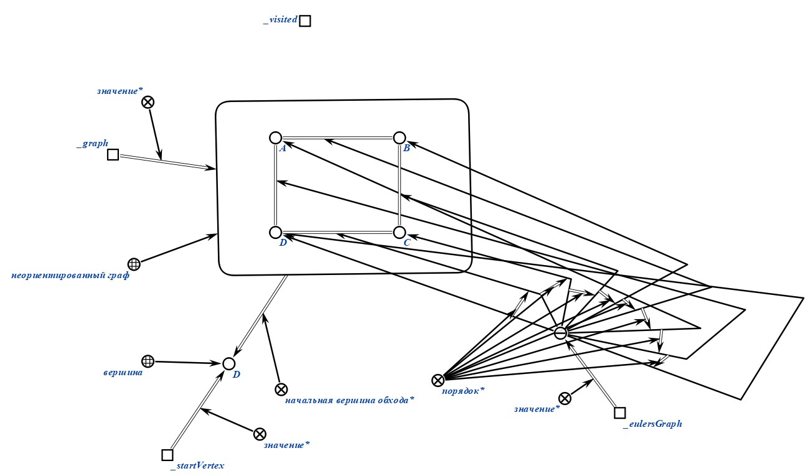
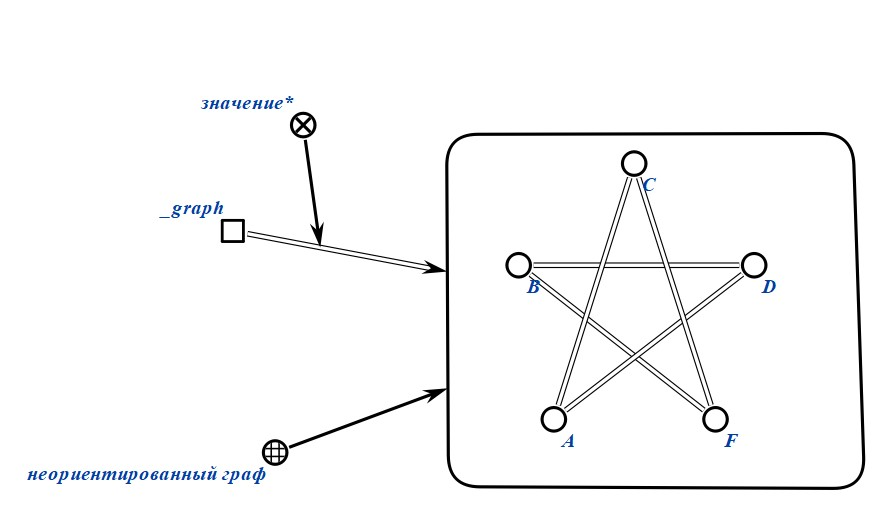

# Формализация алгоритма расчетной работы (РР)

### Задание РР 
5.2 Найти эйлеров цикл в графе 

Реализовать на C++ код, который может найти эйлеров цикл в неориентированном графе.

Граф представляется в виде матрицы смежности.

### Формализация используемых понятий

### Алгоритм РР

1. Пользователь задает неориентированный граф.
2. Пользователь выбирает вершину для начала обхода.
3. При помощи DFS и двух списков (visited, eulersGraph) находится эйлеровов цикл, если он существует. Обход начинается с заданной вершины. Направление обхода случайное, после перехода от одной вершины к другой, ребро между ними "стирается", а вершина, к которой был выполнен переход, записывается в список visited. Если у вершины нет ребер, то она переносится в список eulersGraph.
4. Результат представляет собой список вершин: eulersGraph.

### Результат формализации алгоритма РР

1. Пользователь задает неориентированный граф.
   

2. Пользователь выбирает вершину для начала обхода (предположим, A).
   

3. Начинаем обход с вершины A, заносим ее в список visited.
   

4. Идем к следующей вершине: E, убирая ребро AE и записывая E в список visited.

5. Повторяем это, пока не доходим до вершины, из коротой "выхода" нет: A.
    

6. Следуя нашему алгоритму, переносим вершину A в список eulersGraph и возвращаемся к вершине, из которой мы пришли. Продолжаем алгоритм.

7. Формируем граф, который является ответом, соединяя вершины в том порядке, как они записаны.
   

### Примеры работы (вход/выход)
Пример 1.

Пример 2.

Пример 3.

Пример 4.

Пример 5.

