# Формализация алгоритма расчетной работы (РР)

### Задание РР 
5.2 Найти эйлеров цикл в графе 

Реализовать на C++ код, который может найти эйлеров цикл в неориентированном графе.

Граф представляется в виде матрицы смежности.

### Формализация используемых понятий

### Алгоритм РР

1. Пользователь задает неориентированный граф.
2. Пользователь выбирает вершину для начала обхода.
3. При помощи DFS и двух списков (visited, eulersGraph) находится эйлеровов цикл, если он существует. Обход начинается с заданной вершины. Направление обхода случайное, после перехода от одной вершины к другой, ребро между ними "стирается", а вершина, к которой был выполнен переход, записывается в список visited. Если у вершины нет ребер, то она переносится в список eulersGraph.
4. Результат представляет собой список вершин: eulersGraph.

### Результат формализации алгоритма РР

1. Пользователь задает неориентированный граф.
   
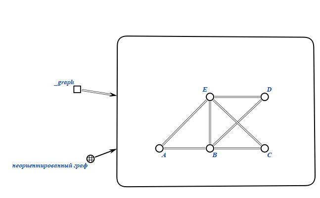

2. Пользователь выбирает вершину для начала обхода (предположим, A).
   
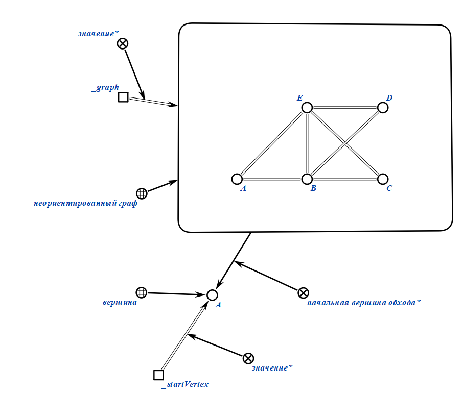

3. Начинаем обход с вершины A, заносим ее в список visited.
   
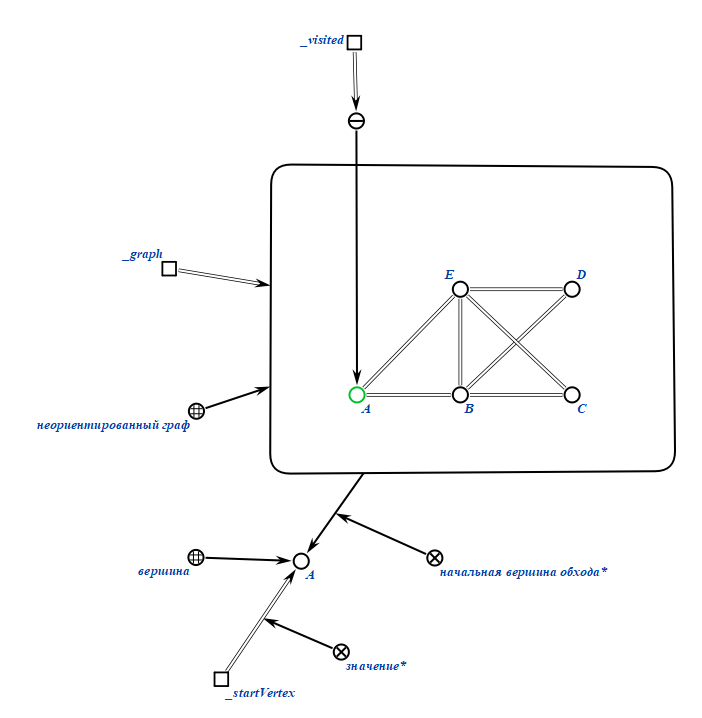

4. Идем к следующей вершине: E, убирая ребро AE и записывая E в список visited.

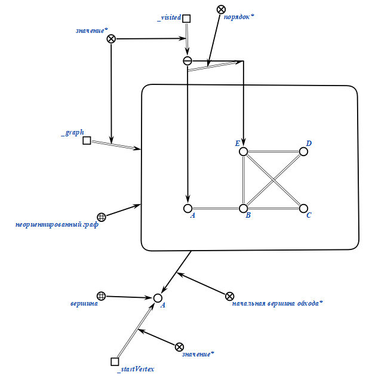

5. Повторяем это, пока не доходим до вершины, из коротой "выхода" нет: A.
    
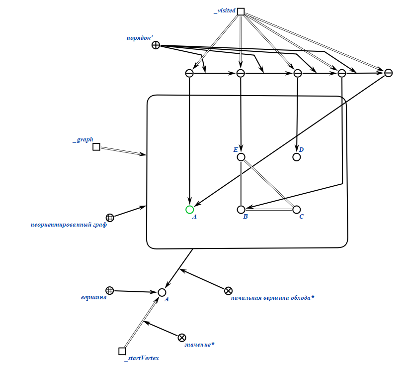

6. Следуя нашему алгоритму, переносим вершину A в список eulersGraph и возвращаемся к вершине, из которой мы пришли. Продолжаем алгоритм.

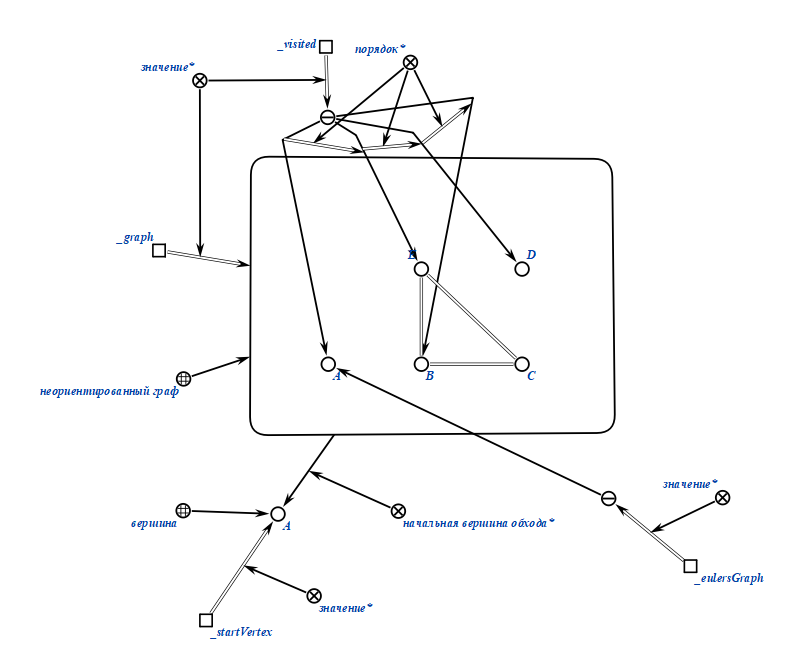

7. Формируем граф, который является ответом, соединяя вершины в том порядке, как они записаны.
   
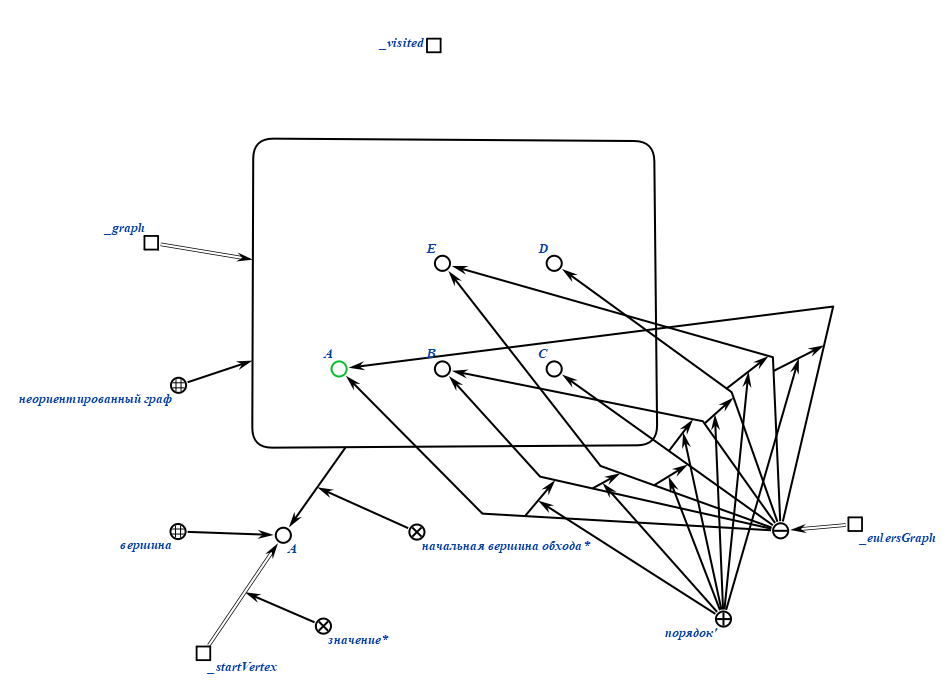

### Примеры работы (вход/выход)
Пример 1.

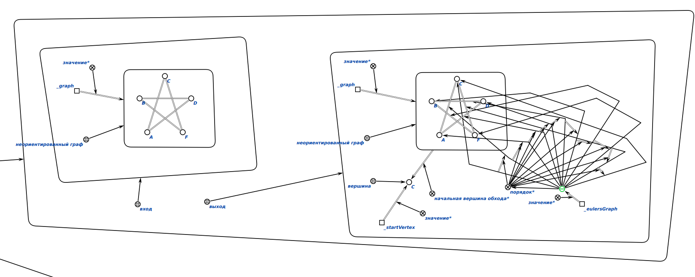

Пример 2.

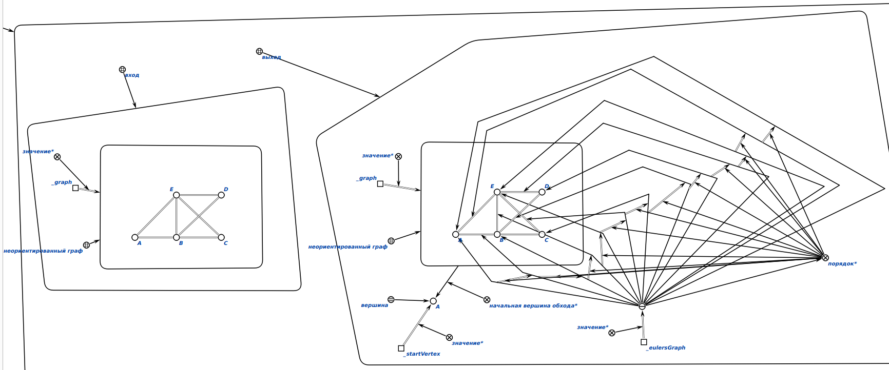

Пример 3.

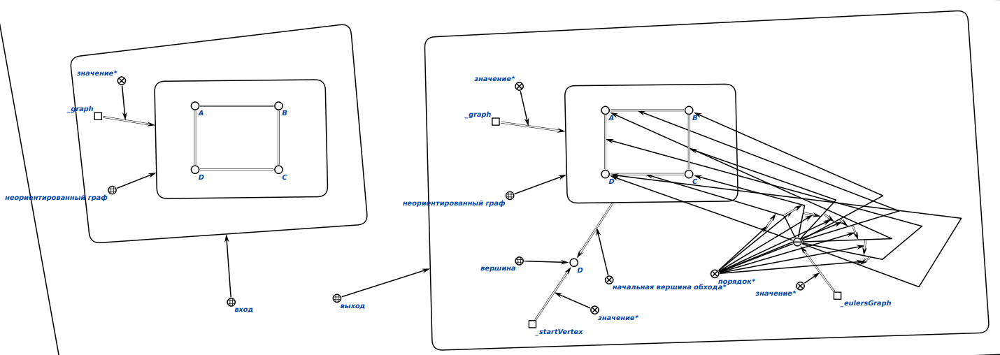

Пример 4.

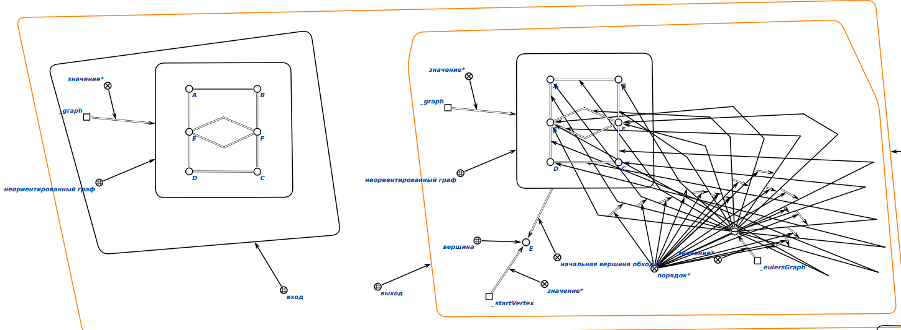

Пример 5.

### Результат погружения в метасистему OSTIS

1. В метасистему были погружены примеры алгоритма, а также тесты (вход/выход).

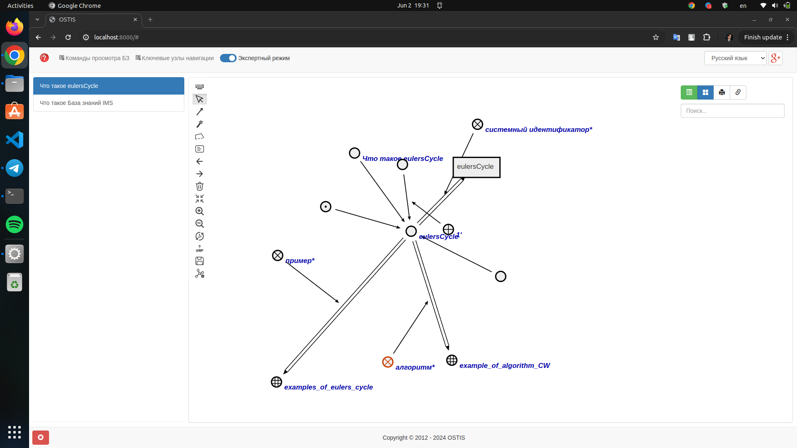

2. Существует 5 примеров.

3. У каждого примера есть граф вход и выход. Рассмотрим один из примеров.

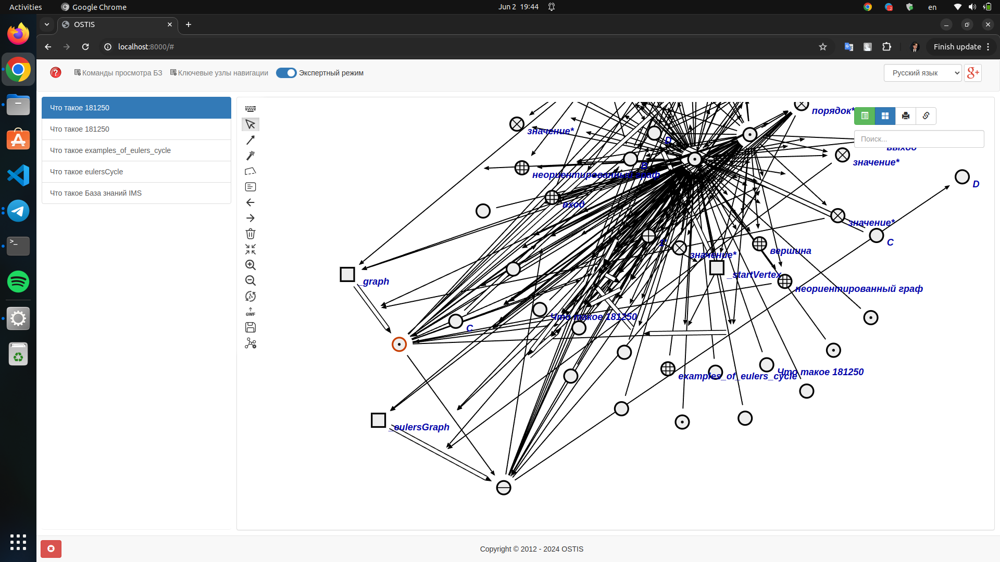

4. Вход.

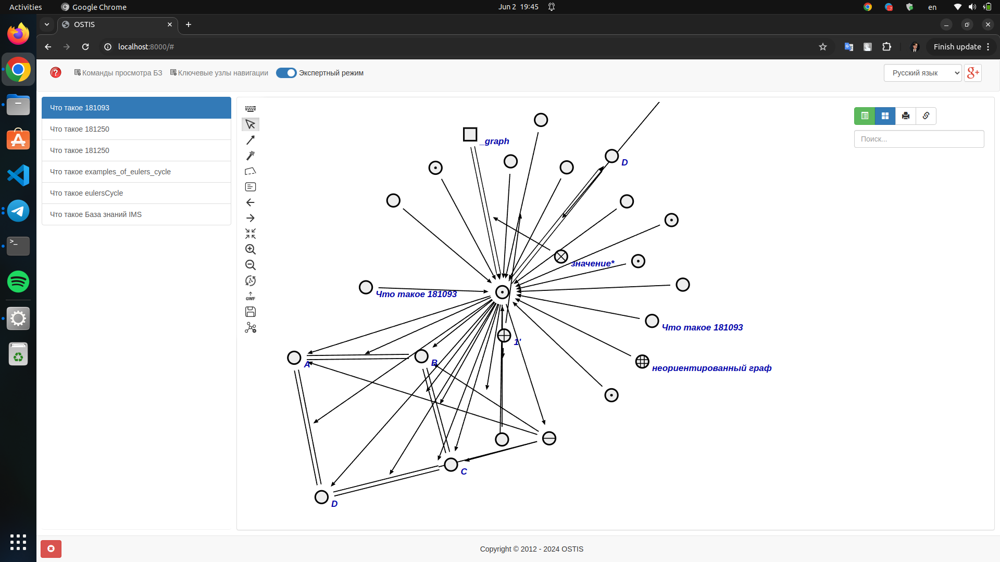

5. Выход.
   
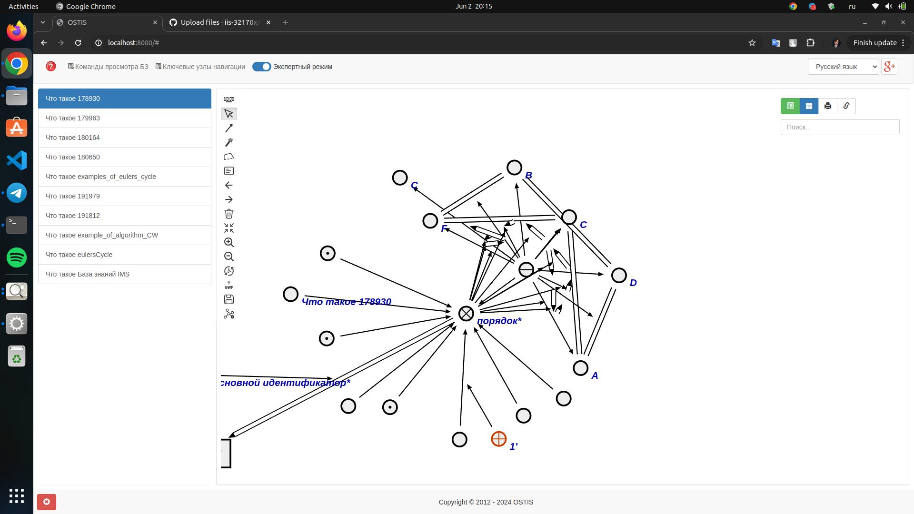

6. Также погружен алгоритм выполнения РР, который оформлен также.

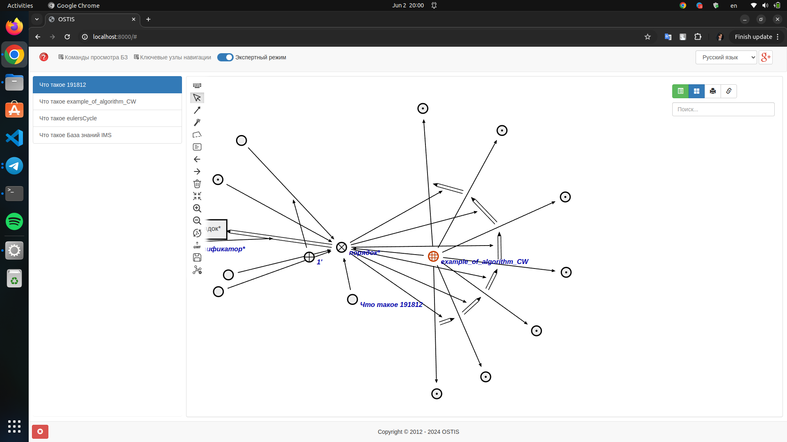

7. Присутствует понятие неориентированный граф.

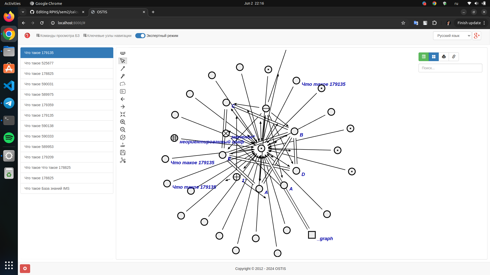
 
