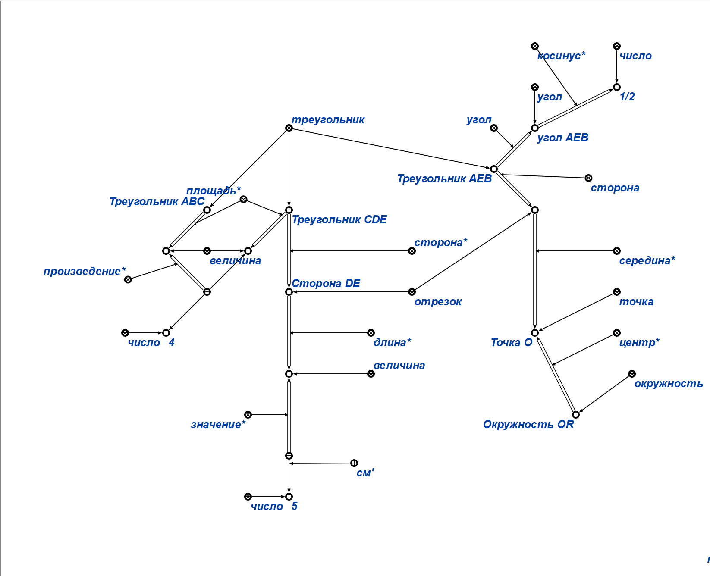
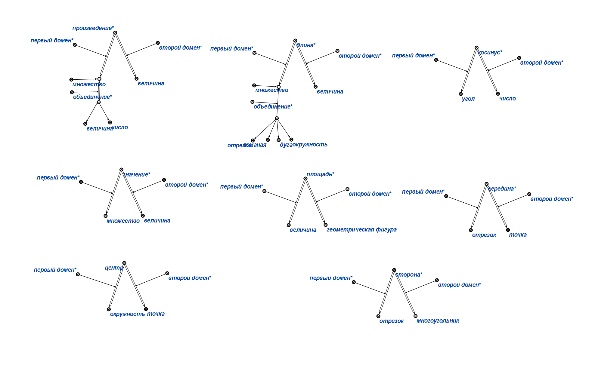
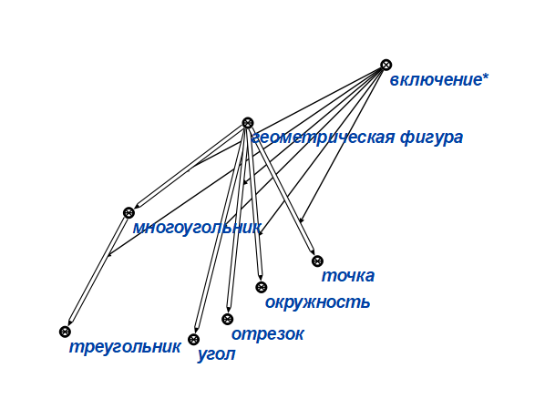
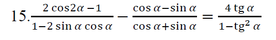

# Практические занятия по дисциплине ПиОИвИС
## 1-ая часть задания: формализация текста (вариант №27)
Бензо́л (C6H6, PhH) — органическое химическое соединение, бесцветная жидкость со
специфическим сладковатым запахом. Простейший ароматический углеводород. Бензол входит
в состав бензина, широко применяется в промышленности, является исходным сырьём для
производства лекарств, различных пластмасс, синтетической резины, красителей. Хотя бензол
входит в состав сырой нефти, в промышленных масштабах он синтезируется из других её
компонентов. Токсичен, канцерогенен.
### Выполнение задания
Формализация в редакторе баз знаний Protégé:
- Описание классов:

- Описание отношений, связывающих между собой экземпляры классов

- Описание отношений, связывающих между собой экземпляры классов и некоторые свойства:

- Экземпляры классов:

Для каждого экземпляра указывается класс, к которому он принадлежит, а также описываются их свойства с использованием введённых отношений. К примеру:

AEB относится к классу треугольников, который является подклассом многоугольников, имеет вершины A, E, B, некоторую сторону AEB_side и некоторый угол AEB_angle.

Окружность OR имеет центр O и хорду DE.

---

Формализация текста на SCg коде в редакторе KBE:

Описание доменов отношений:

Иерархия классов:

## 2-ая часть задания: формализация математического выражения (вариант №15):

