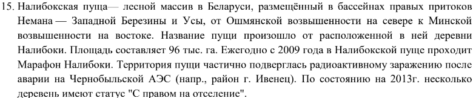
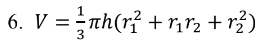
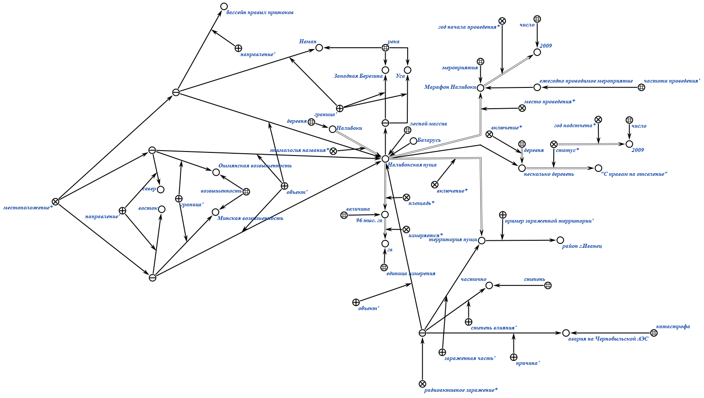
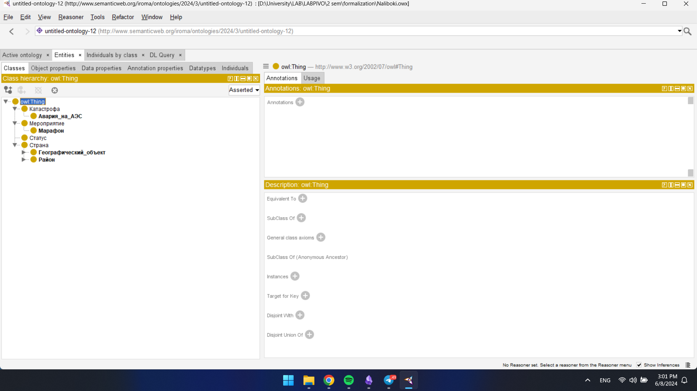
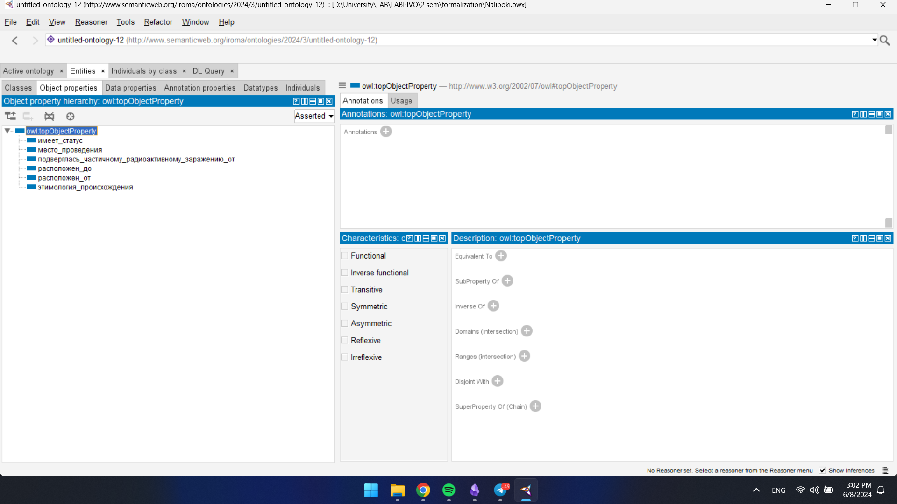
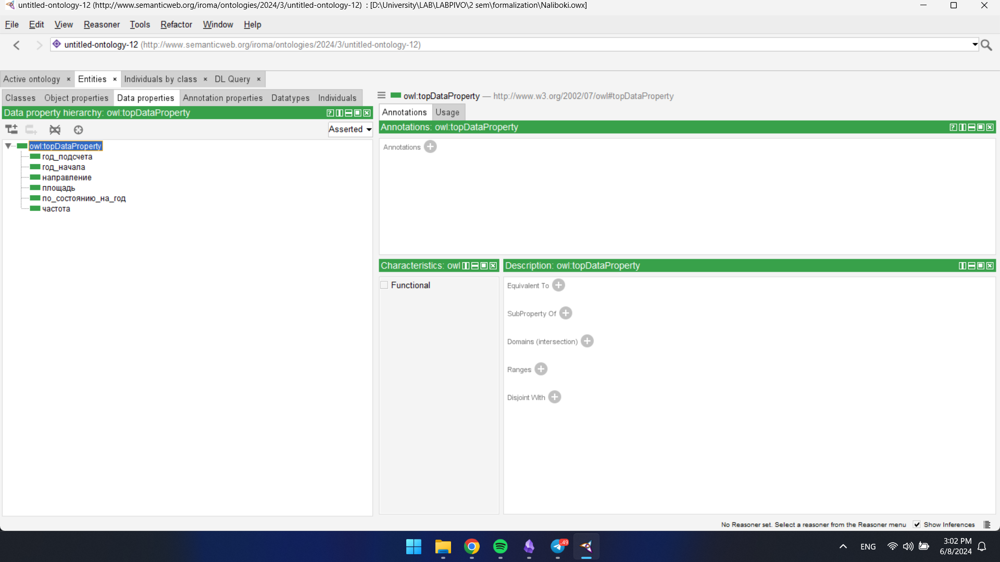
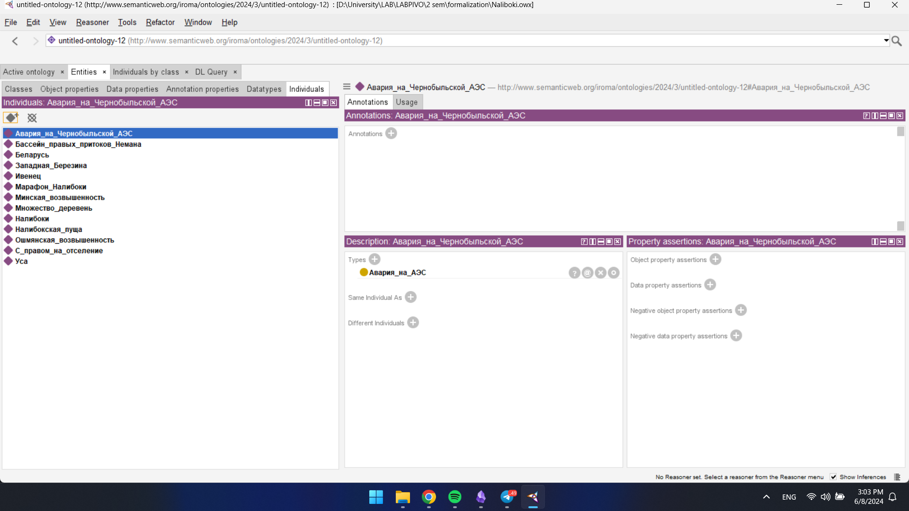

# Постановка задачи
Требовалось формализовать отрывок текста (формулу) при помощи двух стандартов: OSTIS(KBE)  и W3C(Protégé).
# Задание

# Формализация текста (KBE, Protégé)

# Формализация формулы (KBE)

