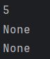

<a id="anchor"></a>
# Цель лабораторной работы №1 (Вариант 16) 

1. Разработать библиотеку для работы с хэш-таблицами на выбранном императивном языке программирования (например, __`C++`__, __`Java`__, __`Python`__).
2. Создать тестовую программу для демонстрации функциональности разработанной библиотеки.
3. Разработать систему тестов для проверки работоспособности и корректности библиотеки, учитывая требования полноты, адекватности и непротиворечивости.
4. Обеспечить обработку некорректных данных, предусмотрев корректное завершение программы при возникновении ошибок.
5. Составить отчет по выполнению лабораторной работы.
___
# Задачи лабораторной работы №1 (Вариант 16) 

1. Изучить спецификацию задачи по работе с хэш-таблицами.
2. Выбрать язык программирования для реализации библиотеки (например, __`C++`__, __`Java`__, __`Python`__) в соответствии с индивидуальным заданием.
3. Разработать и реализовать библиотеку для работы с хэш-таблицей, включая операции вставки, поиска и удаления элементов.
4. Написать тестовую программу, которая демонстрирует основные сценарии использования библиотеки.
5. Провести тестирование разработанной библиотеки, убедившись в ее правильной работе на различных входных данных.
6. Составить подробный отчет, включая описание решения задачи, результаты тестирования и выводы.

# Список используемых понятий
1. Хэш-функция: это функция, которая преобразует произвольное количество входных данных (например, строку или файл) в фиксированное количество выходных данных, называемых хэш-значением или хэшем. Хэш-значение обычно представляет собой строку фиксированной длины, состоящую из цифр и/или букв.
2. Хэш-таблица: это структура данных, которая использует хэш-функцию для хранения и поиска данных. Хэш-таблица состоит из массива, называемого таблицей, и каждый элемент массива называется ячейкой.
3. Метод __`__init__`__ это специальный метод класса в __`Python`__, который вызывается при создании экземпляра класса. Этот метод используется для инициализации атрибутов экземпляра класса.

# Описание алгоритма

__`__init__`__  - Инициализирует хеш-таблицу с заданным размером. Создает массив __`self.table`__ с заданным размером и заполняет его значениями __`None`__
```
def __init__(self, size):
  self.size = size
  self.table = [None] * size
```
__`hash_function`__ - Вычисляет хеш-код для заданного ключа, используя встроенную функцию __`hash()`__, и возвращает остаток от деления хеш-кода на размер таблицы. Это гарантирует, что индекс будет в диапазоне от 0 до __`self.size - 1`__.
```
def hash_function(self, key):
  return hash(key) % self.size
```
__`dobavlenie`__ - Добавляет пару ключ-значение в хеш-таблицу. Вычисляет индекс с помощью хеш-функции и проверяет, свободен ли индекс. Если индекс свободен, добавляет пару ключ-значение. Если индекс занят, использует линейное пробирование для поиска следующего свободного индекса. Если ключ уже существует, обновляет значение. 
```
def dobavlenie(self, key, value):
   if sum(1 for x in self.table if x is None) < 9:
   # выводит сообщение об ошибке, если в таблице меньше 10 свободных ячеек
   raise RuntimeError("Недостаточно места в хэш-таблице. Минимальное значение 10")
    index = self.hash_function(key)
    while self.table[index] is not None:
      if self.table[index][0] == key:
          self.table[index] = (key, value)
          return
      index = (index + 1) % self.size
    self.table[index] = (key, value)
```
__`prosmotr`__ - Возвращает значение для заданного ключа. Вычисляет индекс с помощью хеш-функции и проверяет, существует ли пара ключ-значение в этом индексе. Если пара существует, возвращает значение. Если пара не существует, использует линейное пробирование для поиска пары ключ-значение. Если пара не найдена, возвращает __`None`__.
```
def prosmotr(self, key):
    index = self.hash_function(key)
    while self.table[index] is not None:
      if self.table[index][0] == key:
        return self.table[index][1]
      index = (index + 1) % self.size
    return
```
__`udalenie`__ - Удаляет пару ключ-значение для заданного ключа. Вычисляет индекс с помощью хеш-функции и проверяет, существует ли пара ключ-значение в этом индексе. Если пара существует, удаляет пару ключ-значение и возвращает __`None`__. Если пара не существует, использует линейное пробирование для поиска пары ключ-значение. Если пара не найдена, генерирует исключение __`KeyError`__.
```
def udalenie(self, key):
    index = self.hash_function(key)
    while self.table[index] is not None:
      if self.table[index][0] == key:
        self.table[index] = None
        return
      index = (index + 1) % self.size
        raise KeyError("Key is not found")
```
# Тестирование программы
```
from hash_lib_lab1 import HashTable

table = HashTable(10)
table.dobavlenie("apple", 5)
table.dobavlenie("banana", 2)
print(table.prosmotr("apple"))  
print(table.prosmotr("orange")) 
table.udalenie("apple")
print(table.prosmotr("apple"))  
```
### Объяснение кода:
- Сначала мы импортируем класс __`HashTable`__ из модуля __`hash_lid_lab1`__. Этот класс нам нужен , чтобы мы могли использовать для создания объектов хэш_таблицы. 
- Потом мы создаем хэш-таблицу размером 10. 
- Запускаем функцию __`dobavlenie`__  и с помощью нее добавляем элемент 5 с ключом для поиска __`"apple"`__ и элемент 2 с ключом для поиска __`"banana"`__.
- С помощью функции __`prosmotr`__ выводим на экран значение, которое имеет ключ __`"apple"`__. Также для проверки выводим на экран значение, которое имеет ключ __`"orange"`__.
- Для того, чтобы проверить функцию __`udalenie`__ удаляем ключ __`"apple"`__, который имеет значение 5. И пробуем вывести на экран значение, которое имеет ключ __`"apple"`__.

### Результат выполнения:

<br> После того, как мы запустили код и получили результат, мы можем видеть, что после того, как мы вывели на экран значение, которое имеет ключ __`"orange"`__, данная программы вывела __`None`__, что значит, что нет значения с ключом __`"orange"`__. 
<br> Также мы можем видеть, что, после удаления значение с ключом __`"apple"`__, программа выводит __`None`__, что говорит нам, что значения с ключом __`"apple"`__ нет.
# Используемые источники
- https://adamgold.github.io/posts/python-hash-tables-under-the-hood (Что такое хэш-таблица и хэш-функция)
- https://docs.python.org/3/reference/datamodel.html#object.__init__ (Что такое метод __`init`__)
