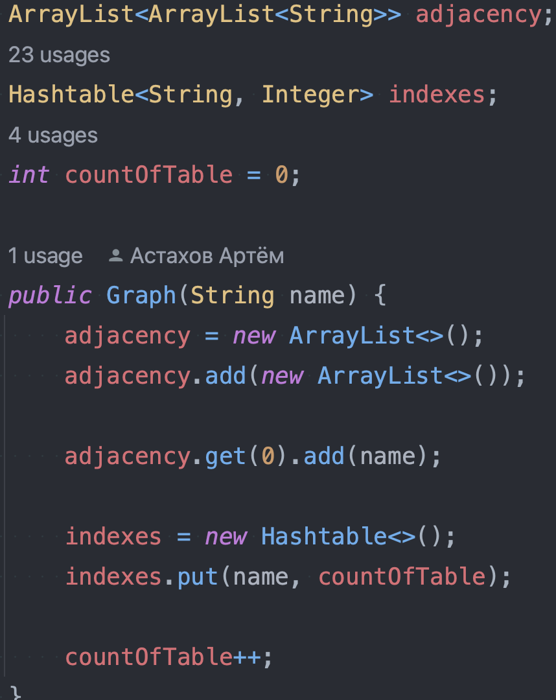
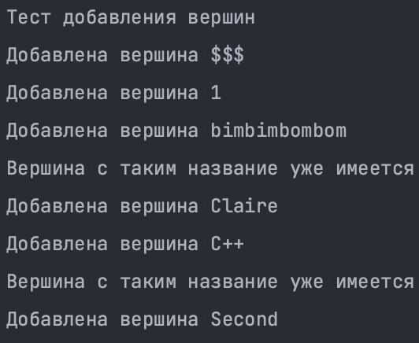
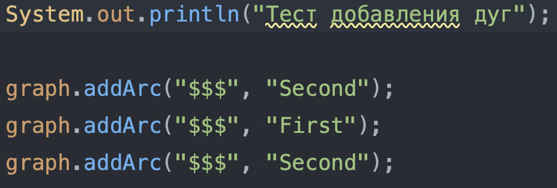
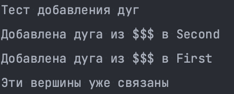
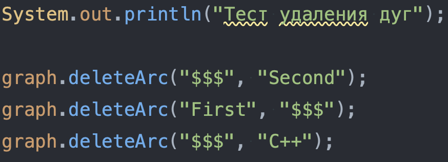
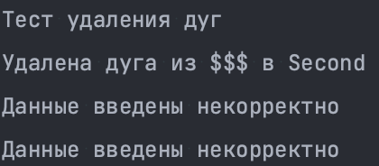
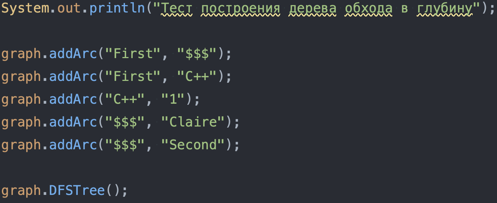
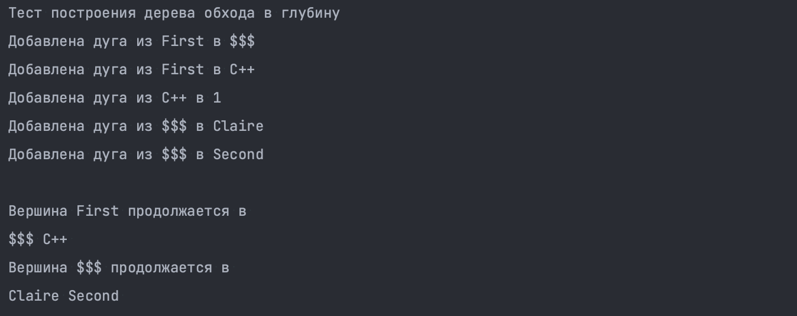

# Лабаратоная работа №1
---
### Тема: Структуры данных
### Цель: Исследовать свойства структур данных и разработать библиотеку алгоритмов обработки конкретной структуры данных

### Условие: неориентированный граф. Вставка вершины. Удаление вершины. Вставка дуги. Удаление дуги. Построение дерева обхода вглубину.
---
#### В решении лабараторной граф был представлен списком смежности, создоваемым в единственном конструкторе

#### Использовавшиеся библиотеки: util.Stack, util.Hashtable, util.ArrayList.

---

### Реализованные функции:

- void ***AddVertex(String name)***, создаёт вершину с названием name передаваемым в аргументе
- void ***AddEdge (String first, String second)***, создаёт ребро между вершинами first и second, названия которых передаются в аргументе
- void ***printAdjacencyList()***, выводит список смежности для каждой вершины
- void ***deleteVertex(String nameOfVertex)***, удаляет вершину с названием nameOfVertex передаваемым в аргументе
- void ***addArc(String fromVertexName, String toVertexName)***, создаёт дугу из fromVertexName в toVertexName, передаваемыми в аргументе
- void ***deleteArc(String fromVertexName, String toVertexName)***, удаляет дугуиз fromVertexName в toVertexName, передаваемыми в аргументе
- void ***DFSTree()***, строит дерево обхода в глубину
---
## Примеры тестов:
### 1.

#### Результат:

### 2.

#### Результат:

### 3.

#### Результат:

### 4.

#### Результат:

### 5.

#### Результат:

---
## Вывод: исследовал свойства структур данных и разработал библиотеку алгоритмов обработки конкретной структуры данных
