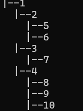
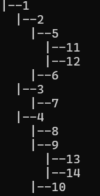
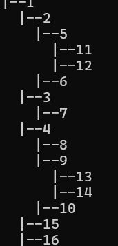
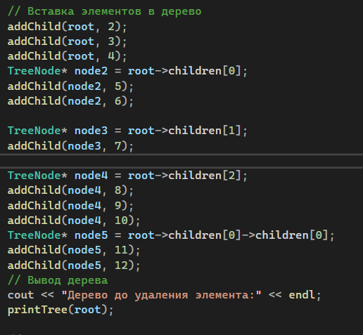
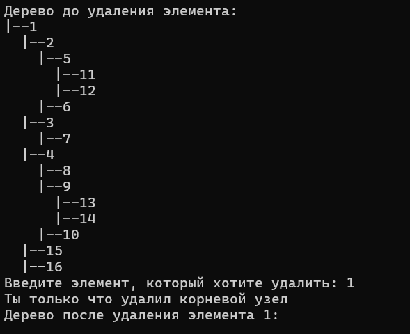
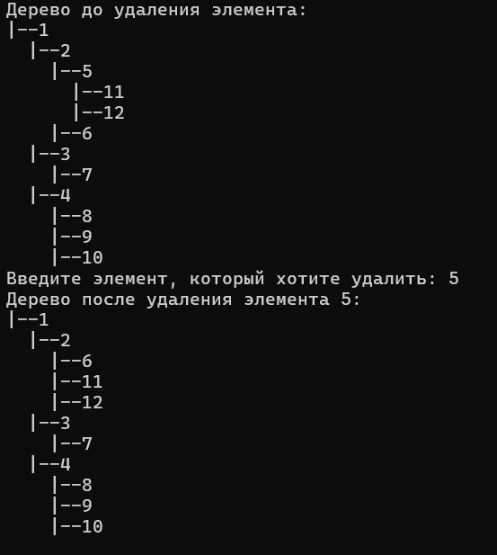
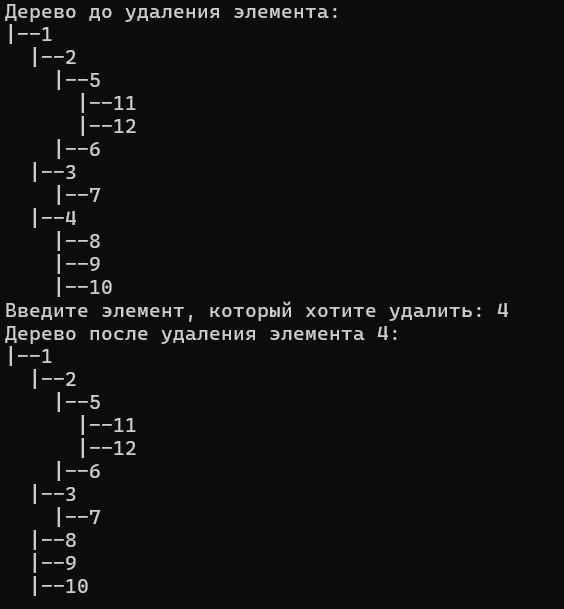
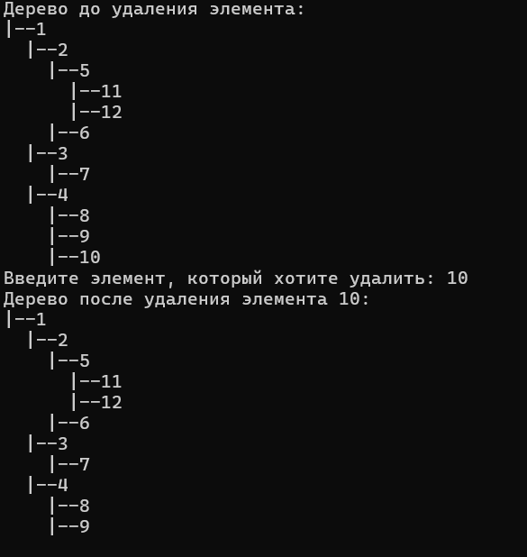

## <p align="center">Лабораторная работа №1</p>

Вариант 1. N-арное дерево. Вставка узла в дерево. Удаление узла из дерева..
## <p align="center">Задачи лабораторной работы:</p>
1. Изучить спецификацию задачи по работе с n-арным деревом
2. Выбрать язык программирования для реализации библиотеки (например, C++, Java, Python) в соответствии с индивидуальным заданием.
3. Разработать и реализовать библиотеку для работы с n-арным деревом, включая операции вставки и удаления узлов.
4. Написать тестовую программу, которая демонстрирует основные сценарии использования библиотеки.
5. Разработать систему тестов, включающую тест-кейсы для проверки различных аспектов работы библиотеки, включая корректность, производительность и обработку ошибок.
6. Провести тестирование разработанной библиотеки, убедившись в ее правильной работе на различных входных данных.
7. Составить подробный отчет, включая описание решения задачи, архитектуры библиотеки, результаты тестирования и выводы.
## <p align="center">Список используемых понятий </p>
N-арное дерево — это дерево, которое позволяет нам иметь nколичество дочерних элементов определенного узла, отсюда и название N-арное , что делает его немного сложнее, чем очень распространенные двоичные деревья , которые позволяют нам иметь не более двух дочерних элементов определенного узла. узел.
N-арные деревья определяются по аналогии с двоичным деревом. Для них также есть ориентированные и неориентированные случаи, а также соответствующие абстрактные структуры данных.

N-арное дерево (неориентированное) — это дерево (обычное, неориентированное), в котором степени вершин не превосходят N+1.


N-арное дерево (ориентированное) — это ориентированное дерево, в котором исходящие степени вершин (число исходящих рёбер) не превосходят N.
## <p align="center">Описание функций  </p>
1) структура `TreeNode` позволяет организовать иерархическую структуру дерева, где каждый узел содержит данные, указатели на своих дочерних узлов и указатель на своего родителя.
```cpp
struct TreeNode {
    int data;
    vector<TreeNode*> children;
    TreeNode* parent;
};
```
2) В данном фрагменте кода определена функция `getNewNode`, которая создает новый узел типа `TreeNode` и возвращает указатель на него.
Функция принимает один параметр `data`, который используется для установки значения `data` нового узла.
двух словах: Функция создает и возвращает новый узел с указанным значением данных.
```cpp
TreeNode* getNewNode(int data) {
    TreeNode* newNode = new TreeNode();
    newNode->data = data;
    return newNode;
   ```
   3) Функция создает новый узел с указанным значением данных, устанавливает его родителя в указанный узел `node` и добавляет его в качестве дочернего узла путем добавления указателя на новый узел в вектор `children` родительского узла.
```cpp
addChild(TreeNode* node, int data) {
    TreeNode* newNode = getNewNode(data);
    newNode->parent = node;
    node->children.push_back(newNode);
 ```
 4) Функция выводит структуру дерева, начиная с корневого узла `root`, используя рекурсию. Она отображает каждый узел с его значением данных и уровнем вложенности, чтобы показать иерархию дерева.
```cpp
void printTree(TreeNode* root, int depth = 0) {
    if (root == nullptr)
        return;

    for (int i = 0; i < depth; i++)
        cout << "  ";
    cout << "|--" << root->data << endl;

    for (TreeNode* child : root->children)
        printTree(child, depth + 1);
}  
 ```
5) Функция рекурсивно ищет узел с указанным значением `value` в дереве, начиная с указанного узла node. Она проверяет значение данных текущего узла, а затем рекурсивно вызывает себя для каждого дочернего узла, пока не найдет узел с соответствующим значением или не пройдет по всем узлам дерева.
```cpp
TreeNode* findNode(TreeNode* node, int value) {
    if (node == nullptr)
        return nullptr;

    if (node->data == value)
        return node;

    TreeNode* foundNode = nullptr;
    for (TreeNode* child : node->children) {
        foundNode = findNode(child, value);
        if (foundNode != nullptr)
            break;
    }

    return foundNode;
}
```
6)Функция рекурсивно удаляет все узлы дерева, начиная с корневого узла root, освобождая память, выделенную для каждого узла с помощью оператора  `delete`.
```cpp
void deleteTree(TreeNode* root) {
    if (root == nullptr)
        return;

    for (TreeNode* child : root->children) {
        deleteTree(child);
    }

    delete root;
}
```
7)Данный фрагмент кода определяет функцию `deleteNode`, которая удаляет узел с указанным значением из дерева и выполняет необходимые операции для поддержания структуры дерева.
```cpp
export TreeNode* deleteNode(TreeNode* root, int value) {
    TreeNode* searchedNode = findNode(root, value);
    if (searchedNode == nullptr) {
        cout << "Узел не найден " << value << endl;
        return root;
    }
    if (searchedNode == root) {
        cout << "Ты только что удалил корневой узел" << endl;
        deleteTree(root);
        return nullptr;
    }
    TreeNode* parent = searchedNode->parent;
    if (searchedNode->children.empty()) {
        auto it = remove(parent->children.begin(), parent->children.end(), searchedNode);
        parent->children.erase(it, parent->children.end());
        delete searchedNode;
    }
    else {
        auto it = remove(parent->children.begin(), parent->children.end(), searchedNode);
        parent->children.erase(it, parent->children.end());
        for (TreeNode* child : searchedNode->children) {
            child->parent = parent;
            parent->children.push_back(child);
        }
        delete searchedNode;
    }

    return root;
}
```
## <p align="center">Тесты   </p>

### Тестирование функции `addChild` и `PrintTree` 



### Пример реализации одного из деревьев кодом 


### Тестирование функции `DeleteNode` и `PrintTree` 








### На фото приведены варианты удаления различных узлов
## <p align="center"> Вывод </p>
#### В ходе лаюораторной работы мы:
1. Разработали библиотеку для работы с  N-арным деревом
2. Создали тестовую программу для демонстрации функциональности разработанной библиотеки.
3. Разработали систему тестов для проверки работоспособности и корректности библиотеки, учитывая требования полноты, адекватности и непротиворечивости.
4. Обеспечили обработку некорректных данных, предусмотрев корректное завершение программы при возникновении ошибок.
