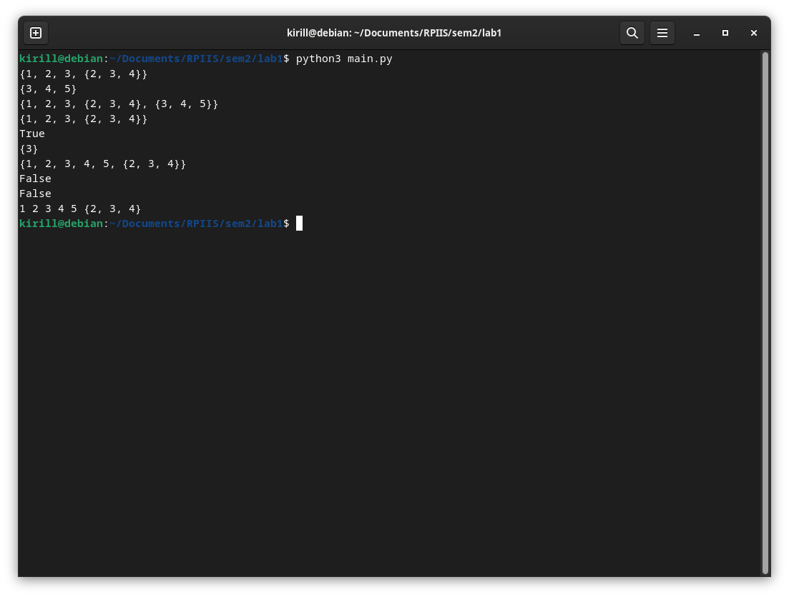

# лабораторная работа №1 (вариант 2)

## условие

**Цель работы:** Исследовать свойства структур данных и разработать библиотеку алгоритмов обработки структур данных.

**Постановка задачи:** Разработать библиотеку для работы со множеством. Реализовать добавление элемента во множество, удаление элемента из множества, поиск элемента во множестве, объединение двух множеств, пересечение двух множеств.

## список определений

`Множество` - это совокупность определенных и различных между собой объектов. 

Объекты, из которых состоит множество, называют `элементами множества`.

`Объединением множеств` называется множество, состоящее из элементов, принадлежащих хотя бы одному из множеств.

`Пересечением множеств` называется множество, состоящее из элементов, принадлежащих и первому и второму множеству одновременно.

## реализация

Файл реализации называется [mySet.py](mySet.py). Для использования данной библиотеки требуется подключить файл [mySet.py](mySet.py).

Для хранения элементов множества используется отсортированный массив. Сортировка происходит автоматически, во время добавление элемента во множество. Для проверки наличия элемента во множестве используется метод бинарного поиска.

Код библиотеки был написан на языке python.

### методы реализованные для данной реализации множества:

```
def add(self, value: Any) -> None
```
добавление элемента value во множество (если элемент присутствует ничего не делает) 
<br>

```
def delete(self, value: Any) -> None
```
удаление элемента value из множества (если элемент отсутствует ничего не делает)
<br>

```
def clear(self) -> None
```
удаление всех элементов множества
<br>

```
def copy(self) -> mySet
```
возвращает копию исходного множества
<br>

```
def contain(self, value: Any) -> bool
```
проверка наличия элемента value во множестве, возвращает true если элемент содержится и false если не содержится
<br>

### операторы реализованные для данной реализации множества:

при сравнении двух множеств сразу сравниваются их мощности, а потом попарно элементы каждого из множеств, на основе этих сравнений и делается вывод при сравнении множеств

ПРИМЕР:
- {1, 2, 3} (< or <= or !=) {1, 2, 3, 4}
- {1, 2, 4} (== or <= or >=) {1, 2, 4}
- {1, 2, 3} (< or <= or !=) {1, 2, 4}

доступные операции сравнения
- \<this\> == \<other\>
- \<this\> != \<other\>
- \<this\> < \<other\> 
- \<this\> > \<other\>
- \<this\> <= \<other\>
- \<this\> >= \<other\>

для всех вышеописанных операций на вывод подается результат сравнения множеств \<this\> и \<other\> по вышеописанным правилам

### функции реализованные для данной реализации множества:

```
def combining(first: mySet, second: mySet) -> mySet
```
операция объединение множеств, возвращает множество, которое является объединение двух множеств множеств first и second
<br>

```
def intersection(first: mySet, second: mySet) -> mySet
```
операция пересечение множеств, возвращает множество, которое является пересечением двух множеств множеств first и second
<br>

```
def boolean(this: mySet) -> mySet
```
возвращает множество множеств, которое является булеаном исходного множества this (множество всех нестрогих подмножеств)
<br>

### вывод на экран 

для выводи множества на экран можно использовать стандартную функцию `print()`

### инициализация

Для простой инициализации множества можно использовать конструкцию типа:
```
import mySet
mset = mySet.mySet()
```

Для создания множества из массива можно использовать конструкцию типа:
```
import mySet
mset = mySet.mySet([1,2,3])
```

### итератор
Для прохождения по всем (или нескольким) элементам множества можно использовать встроенный итератор:

```
import mySet

mset = mySet.mySet([1,2,3])
mset_iter = iter(mset)

print(next(mset_iter))
print(next(mset_iter))
print(next(mset_iter))

for i in mset:
    print(i)
```


### прочее

Для данной реализации иножества реализованы следующие встроенные методы:

- `__std__`
- `__len__`
- `__iter__`
- `__contains__`

### моменты которые стоит отметить

Бинарный поиск - это эффективный алгоритм поиска элемента в упорядоченном списке или массиве, он используется при проверке наличия элемента, а так же при поиске индекса откуда элемент удалить или куда его вставить.

Он работает следующим образом:

1. Предположим, что у вас есть отсортированный список элементов в возрастающем порядке.
    
2. Задайте начальное значение для левой и правой границ поиска. Левая граница будет указывать на первый элемент списка, а правая граница - на последний элемент списка.
    
3. Найдите средний элемент между левой и правой границей. Это можно сделать путем нахождения индекса середины списка: `mid = (left + right) / 2`.
    
4. Сравните средний элемент с целевым элементом, который вы ищете:
    - Если средний элемент равен целевому элементу, значит, вы нашли искомый элемент, и поиск завершается успешно.
    - Если средний элемент больше целевого элемента, то целевой элемент может находиться только в левой половине списка. Следовательно, обновите правую границу поиска на `mid - 1` и перейдите к шагу 3.
    - Если средний элемент меньше целевого элемента, то целевой элемент может находиться только в правой половине списка. Следовательно, обновите левую границу поиска на `mid + 1` и перейдите к шагу 3.
    
5. Повторяйте шаги 3-4, сужая диапазон поиска каждый раз вдвое, пока не найдете целевой элемент или пока левая граница не станет больше правой границы. Если левая граница станет больше правой границы, это означает, что целевой элемент отсутствует в списке.
<br>

Для нахождения множества всех подмножеств будем использовать следующий алгоритм:
- Создается пустой контейнер `result` для хранения всех подмножеств.

- Создается пустой контейнер `tmp` для формирования каждого подмножества.

- Внешний цикл выполняется `2 ** n` раз, чтобы обеспечить перебор всех возможных комбинаций элементов.

- Внутри внешнего цикла инициализируется переменная `t1` со значением текущей итерации внешнего цикла.

- Внутренний цикл выполняется `n` раз и используется для создания каждого подмножества. Переменная `j` представляет собой индекс элемента в исходном множестве или массиве.

- На каждой итерации внутреннего цикла, значение переменной `t2` устанавливается равным остатку от деления `t1` на 2. Затем значение переменной `t1` делится на 2.

- Если значение `t2` равно 1, то элемент с соответствующим индексом `j` добавляется во временное подмножество `tmp`.

- По завершении внутреннего цикла, временное подмножество `tmp`, содержащее элементы текущей комбинации, добавляется в контейнер `result`.

- После добавления временного подмножества `tmp` в `result`, временное подмножество `tmp` очищается, чтобы быть готовым для следующей комбинации.

- По завершении внешнего цикла, контейнер `result` содержит все подмножества исходного множества или массива.

- Контейнер `result` возвращается как результат выполнения функции.

Общая идея алгоритма заключается в использовании двоичного представления чисел от 0 до `2 ** n - 1` для определения комбинаций элементов из исходного множества или массива. Каждый бит числа соответствует наличию или отсутствию элемента в подмножестве.
<br>

В данном коде реализован итератор для класса mySet. Итератор - это объект, который позволяет последовательно перебирать элементы коллекции. Класс mySetIterator определен в коде и содержит методы __iter__ и __next__, которые являются основными методами итератора.

Метод __iter__ возвращает сам итератор, что позволяет использовать объект итератора в цикле for, например. В данной реализации метод __iter__ просто возвращает self, то есть сам объект итератора.

Метод __next__ используется для получения следующего элемента последовательности. В данной реализации он возвращает следующий элемент из списка set, который содержится в объекте mySet. Если все элементы уже были перебраны, выбрасывается исключение StopIteration, чтобы указать, что перебор завершен.
<br>


## тесты

В файле [main.py](main.py) импортируется библиотека для работы со множествами и тестируются ее основные возможности

```
import mySet

a = mySet.mySet([1,2,3, [4,3,2]])
print(a)

b = mySet.mySet([3,4,5])
print(b)

a.add(b)
a.add(b)
print(a)
a.delete(b)
a.delete(b)
print(a)

c = mySet.mySet([1,2])

print(a != b)

inter = mySet.intersection(a,b)
print(inter)

comb = mySet.combining(a,b)
print(comb)

print(comb.contain(b))
print(comb.contain(a))

for i in comb:
    print(i, end=" ")
    
print()
```



## Вывод

- Была изучена основа теории множеств
- Была разработана библиотека для работы с типом данных множество
- Были написаны основные функции для работы с типом данных множество

