# Лабораторная работа по ПиОИвИС №1(Структуры данных)
## Цель работы:
Исследовать свойства структур данных и разработать библиотеку алгоритмов обработки структур данных.
## Условие лабораторной работы(вариант 3):
1) Разработать библиотеку для работы с одномерным массивом на любом императивном языке программирования. Библиотека должна включать такие функции, как:  
-сортировка массива;  
-вставка элемента в отсортированный массив;  
-поиск элемента в отсортированном массиве;  
-объединение отсортированных массивов;  
-пересечение отсортированных массивов.  
2) Разработать тестовую программу, которая демонстрирует работоспособность реализованной библиотеки работы с одномерным массивом.
3) Разработать систему тестов, которые продемонстрировали бы работоспособность реализованной библиотеки. Система тестов должна отвечать требованиям полноты, адекватности и непротиворечивости. Система тестов должна учитывать не только корректную работу на правильных данных, но и предусматривать корректное завершение программы в случае некорректных данных.
## Решение:
Работа сделана на языке программирования С++. Была создана библиотека, реализующая функции над одномерными массивами, после чего была подключена к тестовой программе.  
Тестовая программа формирует два массива(количество элементов и сами элементы вводит пользователь).  
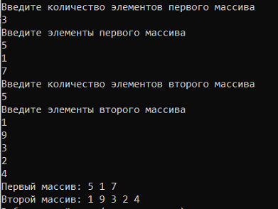  
Дальше программа просит пользователя выбрать действие над массивами.  
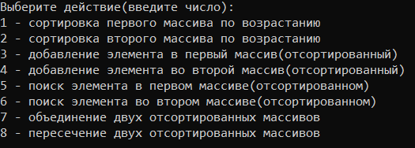  
Сортировка первого массива по возрастанию:  
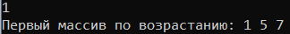  
Сортировка второго массива по возрастанию:  
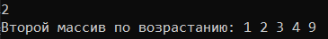  
Добавление элемента в первый массив:  
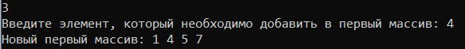  
Добавление элемента во второй массив:  
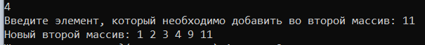  
Поиск элемента в первом массиве:  
  
Поиск элемента во втором массиве:  
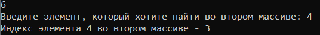  
Объединение двух массивов:  
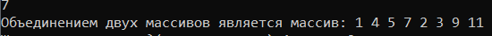  
Пересечение двух массивов:  
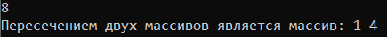  
После каждого действия программа спрашивает у пользователя, желает ли он продолжить. Если да, то программа вновь просит выбрать действие, в противном случае завершается.  
Если массив не является отсортированным, то добавление, поиск, пересечение, объединение не выполняются:  
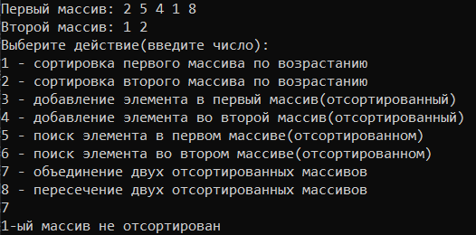  
Если пользователь вводит некорректные данные, программа завершается:  
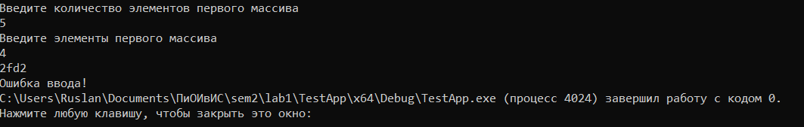  
## Вывод:
В результате работы были изучены свойства такой структуры данных, как одномерный массив. На языке С++ была разработана библиотека, реализующая такие функции, как сортировка массива, вставка элемента в массив, поиск элемента в массиве, объединение двух массивов и пересечение двух массивов. Данная библиотека была протестирована с помощью разработанной системы тестов.
В результате работы были изучены свойства такой структуры данных, как одномерный массив. На языке С++ была разработана библиотека, реализующая такие функции, как сортировка массива, вставка элемента в массив, поиск элемента в массиве, объединение двух массивов и пересечение двух массивов. Данная библиотека была протестирована с помощью разработанной системы тестов.
