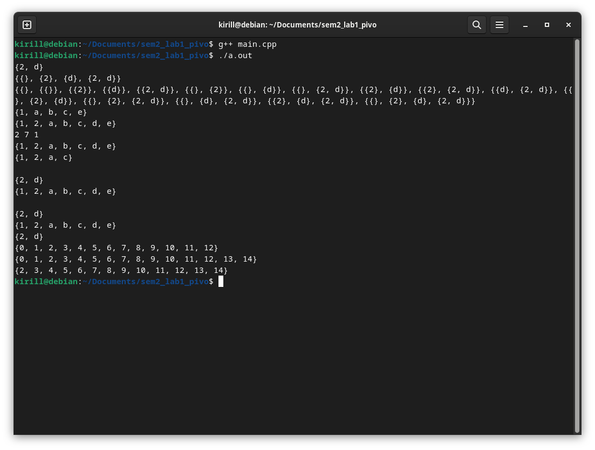

# лабораторная работа №1 (вариант 2)

## условие

**Цель работы:** Исследовать свойства структур данных и разработать
библиотеку алгоритмов обработки структур данных.

**Постановка задачи:** Разработать библиотеку для работы со множеством. Реализовать добавление элемента во множество, удаление элемента из множества, поиск элемента во множестве, объединение двух множеств, пересечение двух множеств.

## список определений

`Множество` - это совокупность определенных и различных между собой объектов. 

Объекты, из которых состоит множество, называют `элементами множества`.

`Объединением множеств` называется множество, состоящее из элементов, принадлежащих хотя бы одному из множеств.

`Пересечением множеств` называется множество, состоящее из элементов, принадлежащих и первому и второму множеству одновременно.

## реализация

Заголовочный файл библиотеки называется [mySet.h](mySet.h). Встроенный файл реализации называется [mySet.inl](mySet.inl). Для использования данной библиотеки требуется подключить заголовочный файл [mySet.h](mySet.h).

Для хранения элементов множества используется отсортированный массив. Сортировка происходит автоматически, во время добавление элемента во множество. Для проверки наличия элемента во множестве используется метод бинарного поиска.

### методы реализованные для данной реализации множества:

```
add(<value>)
```
добавление элемента *\<value\>* во множество (если элемент присутствует ничего не делает) 
<br>

```
del(<value>)
```
удаление элемента *\<value\>* из множества (если элемент отсутствует ничего не делает)
<br>

```
clear()
```
удаление всех элементов множества
<br>

```
getSize()
```
возвращает мощность / размер / кол-во элементов множества
<br>

```
contain(<value>)
```
проверка наличия элемента \<value\> во множестве, возвращает true если элемент содержится и false если не содержится
<br>

```
index(<value>)
```
проверяет наличие элемента \<value\> во множестве и возвращает его индекс, если элемент отсутствует возвращает -1
<br>

### операторы реализованные для данной реализации множества:

```
[<index>]
```
возвращает элемент с заданным индексом (доступ к элементу по индексу), допускается значение \<index\> в диапазоне от 0 до size - 1 включая, при попытке получить значение вне заданного диапазона кидает ошибку std::out_of_range и указывает размер массива, а так же индекс по которому пытались получить элемент

при сравнении двух множеств сразу сравниваются их мощности, а потом попарно элементы каждого из множеств, на основе этих сравнений и делается вывод при сравнении множеств

ПРИМЕР:  
- {1, 2, 3} (< or <= or !=) {1, 2, 3, 4}  
- {1, 2, 4} (== or <= or >=) {1, 2, 4}  
- {1, 2, 3} (< or <= or !=) {1, 2, 4}

доступные операции сравнения  
- \<this\> == \<other\>  
- \<this\> != \<other\>  
- \<this\> < \<other\>  
- \<this\> > \<other\>  
- \<this\> <= \<other\>  
- \<this\> >= \<other\>  

для всех вышеописанных операций на вывод подается результат сравнения множеств \<this\> и \<other\> по вышеописанным правилам

\<this\> + \<value\>  
\<this\> - \<value\>  
возвращает массив с добавленным / удаленным элементом \<value\>  
  
\<this\> + \<other\>  
возвращает объединение двух массивов \<this\> и \<other\>  
 
\<this\> += \<value\>  
\<this\> -= \<value\>  
добавляет / удаляет элемент \<value\> из массива \<this\>  
 
\<this\> += \<other\>  
в \<this\> записывает объединение двух массивов \<this\> и \<other\>

### функции реализованные для данной реализации множества:

```
combining(<set1>, <set2>)
```
операция объединение множеств, возвращает множество, которое является объединение двух множеств множеств \<set1\> и \<set2\>
<br>

```
intersection(<set1>, <set2>)
```
операция пересечение множеств, возвращает множество, которое является пересечением двух множеств множеств \<set1\> и \<set2\>
<br>

```
boolean(<set>)
```

возвращает множество множеств, которое является булеаном исходного множества \<set\> (множество всех нестрогих подмножеств)
<br>

### вывод на экран 

```
printSet(<set>, <end> = '\n')
```
выводит на экран множество set (в том числе если оно состоит из других множеств) в конце выводится символ записанный в переменную end (по умолчанию '\n')

```
std::cout << <set>
```
кроме функции printSet() для вывода множества на экран можно пользоваться стандартным потоком вывода (std::cout)

### моменты которые стоит отметить

Бинарный поиск - это эффективный алгоритм поиска элемента в упорядоченном списке или массиве, он используется при проверке наличия элемента, а так же при поиске индекса откуда элемент удалить или куда его вставить.

Он работает следующим образом:

1. Предположим, что у вас есть отсортированный список элементов в возрастающем порядке.
    
2. Задайте начальное значение для левой и правой границ поиска. Левая граница будет указывать на первый элемент списка, а правая граница - на последний элемент списка.
    
3. Найдите средний элемент между левой и правой границей. Это можно сделать путем нахождения индекса середины списка: `mid = (left + right) / 2`.
    
4. Сравните средний элемент с целевым элементом, который вы ищете:
    - Если средний элемент равен целевому элементу, значит, вы нашли искомый элемент, и поиск завершается успешно.
    - Если средний элемент больше целевого элемента, то целевой элемент может находиться только в левой половине списка. Следовательно, обновите правую границу поиска на `mid - 1` и перейдите к шагу 3.
    - Если средний элемент меньше целевого элемента, то целевой элемент может находиться только в правой половине списка. Следовательно, обновите левую границу поиска на `mid + 1` и перейдите к шагу 3.
    
5. Повторяйте шаги 3-4, сужая диапазон поиска каждый раз вдвое, пока не найдете целевой элемент или пока левая граница не станет больше правой границы. Если левая граница станет больше правой границы, это означает, что целевой элемент отсутствует в списке.
<br>

Для нахождения множества всех подмножеств будем использовать следующий алгоритм:
- Создается пустой контейнер `result` для хранения всех подмножеств.

- Создается пустой контейнер `tmp` для формирования каждого подмножества.

- Определяется размер исходного множества или массива и обозначается как `n`.

- Внешний цикл выполняется `pow(2, n)` раз, чтобы обеспечить перебор всех возможных комбинаций элементов.

- Внутри внешнего цикла инициализируется переменная `t1` со значением текущей итерации внешнего цикла.

- Внутренний цикл выполняется `n` раз и используется для создания каждого подмножества. Переменная `j` представляет собой индекс элемента в исходном множестве или массиве.

- На каждой итерации внутреннего цикла, значение переменной `t2` устанавливается равным остатку от деления `t1` на 2. Затем значение переменной `t1` делится на 2.

- Если значение `t2` равно 1, то элемент с соответствующим индексом `j` добавляется во временное подмножество `tmp`.

- По завершении внутреннего цикла, временное подмножество `tmp`, содержащее элементы текущей комбинации, добавляется в контейнер `result`.

- После добавления временного подмножества `tmp` в `result`, временное подмножество `tmp` очищается, чтобы быть готовым для следующей комбинации.

- По завершении внешнего цикла, контейнер `result` содержит все подмножества исходного множества или массива.

- Контейнер `result` возвращается как результат выполнения функции.

Общая идея алгоритма заключается в использовании двоичного представления чисел от 0 до `pow(2, n) - 1` для определения комбинаций элементов из исходного множества или массива. Каждый бит числа соответствует наличию или отсутствию элемента в подмножестве.
<br>

**Правило трёх** (также известное как «Закон Большой Тройки» или «Большая Тройка») — правило в C++ или структура определяет один из следующих методов, то они должны явным образом определить все три метода:

- Деструктор
- Конструктор копирования
- Оператор присваивания копированием

Эти три метода являются особыми членами-функциями, автоматически создаваемыми компилятором в случае отсутствия их явного объявления программистом. Если один из них должен быть определен программистом, то это означает, что версия, сгенерированная компилятором, не удовлетворяет потребностям класса в одном случае и, вероятно, не удовлетворит в остальных случаях.
<br>

Шаблонные классы в C++ позволяют создавать обобщенные классы, которые могут работать с различными типами данных. Они позволяют написать код, который можно переиспользовать для разных типов, без необходимости дублирования кода для каждого типа отдельно.

Для определения шаблонного класса в C++ используется ключевое слово `template`, за которым следует объявление класса с параметром типа или несколькими параметрами типа. Параметр типа обозначается ключевым словом `typename` или `class`, за которым следует имя параметра типа.

При использовании шаблонного класса, необходимо указать конкретный тип данных в угловых скобках (`<>`). Компилятор создаст экземпляр класса с указанным типом данных.

## тесты

В файле `main.cpp` импортируется библиотека для работы со множествами и тестируются ее основные возможности

```c++
#include <iostream>
#include "mySet.h"

int main() {
    mySet<char> a, b, c;

//    a.add('a'); a.add('b'); a.add('c');  
    a.add('d'); a.add('2');
    printSet(a);

    auto d = boolean(a);
    printSet(d);
    printSet(boolean(d));


    b.add('a'); b.add('b'); b.add('c'); b.add('e'); b.add('1');

    printSet(b);
    b += a;
    printSet(b);

    std::cout << a.getSize() << ' ' << b.getSize() << ' ' << (a < b) << '\n';

    c = a + b;
    printSet(c);

    c.del('d'); c.del('d'); c.del('b'); c.del('b'); c.del('g'); c.del('e');
    printSet(c);
    std::cout << '\n';

    c = intersection(a, b); printSet(c);

    printSet(combining(a, b));
    std::cout << '\n';

    c = a; printSet(c);

    c += b; printSet(c);

    printSet(intersection(a, b));

    mySet<int> s;
    s.add(0); s.add(1); s.add(2); s.add(3); s.add(4); s.add(5); s.add(6);
    s.add(7); s.add(8); s.add(9); s.add(10); s.add(12); s.add(11);
    printSet(s);

    s = s + 13; s += 14; printSet(s);

    s = s - 0; s -= 1;
    std::cout << s << '\n';

    return 0;
}
```



## Вывод

- Была изучена основа теории множеств
- Была разработана библиотека для работы с типом данных множество
- Были написаны основные функции для работы с типом данных множество
