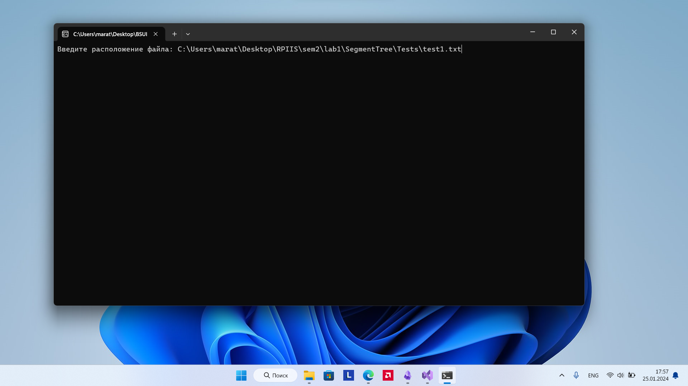
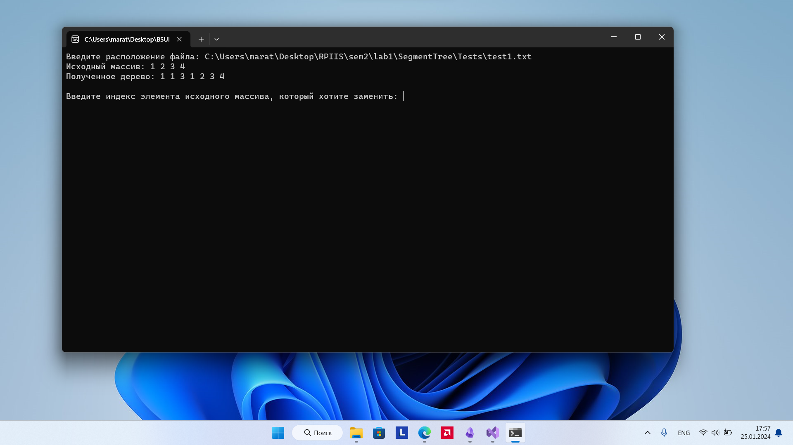
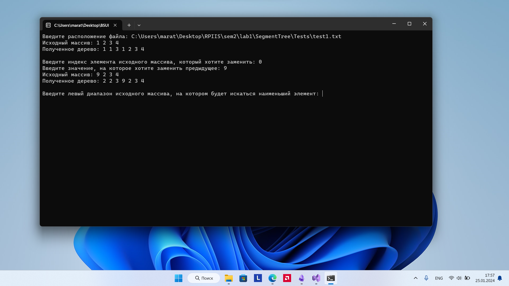
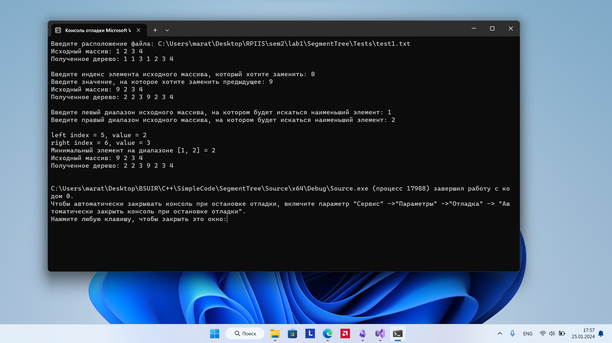

# Лабораторная работа №1
## Расчётная работа 🔢


<em>Схематичное представление $\textcolor{red}{\textit{дерева отрезков}}$</em>

- `Цель` - поиск наибольшего числа / обновление элементов массива при помощи $\textcolor{#e28679}{\textit{дерева максимумов}}$
- `Задача` - реализовать алгоритм дерева максимумов
- `Вариант` - $\textcolor{grey}{\textit{11}}$

## Список ключевых понятий (определения) ❓
- `Дерево отрезков` - структура данных, представимая в виде массива и позволяющая находить значение некоторой ассоциативной функции _f_ на произвольном отрезке массива за асимптотику _O(logN)_. Наиболее часто в качестве _f_ берутся функции <ins>суммы</ins>, <ins>произведения</ins>, <ins>максимум</ins> и <ins>минимум</ins>.

- `Дерево максимумов` - это дерево отрезков, где в качестве ассоциативной функции _f_ берётся функция <ins>минимум</ins>, т.е. функция нахождения минимального элемента
## Алгоритм
 Пусть у нас есть 2 задачи: замена конкретного элемента на другой и  поиск максимума на определённом диапазоне. Дерево максимумов решает эти задачи и позволяет обновить элемент, и дать ответ по диапазону. Все операции происходят за логарифмическое время O(logN), кроме построения самого дерева: структура данных строит дерево (представляется в виде массива) за линейное время O(N). Затраты по памяти - 4N.
 
 Дерево максимумов работает только с массивами, длина которых равна удвоенной длине нашего исходного массива. Дерево максимумов будем представлять просто в виде обычного массива, где ровно во второй половине располагаются элементы нашего исходного массива, до них располагаются элементы, которые равны сумме двух своих дочерних элементов и так до элемента с индексом 1 (он равен минимуму всех элементов исходного массива). 
 
 Допустим, наш исходный массив будет: [7, 3, 2, 4, 5, 6, 1, 0]
 Тогда получаем такую древовидную структуру:
 


Или же в виде обычного массива: 


Нулевой элемент мы не используем, а начинаем с 1 индекса, так как это удобно при индексировании и при обращении к элементам дерева максимумов. И так: чтобы перейти из родителя в левый дочерний элемент, нужно индекс умножать на 2, а чтобы перейти в правый дочерний элемент, нужно индекс умножать на 2 и добавлять 1, из этого также следует, что все левые элементы (не считая вершины дерева) имеют четный индекс, а все правые элементы (не считая вершины дерева) имеют нечетный индекс. И еще, чтобы перейти обратно из любого дочернего элемента в родителя, надо целочисленно делить текущий индекс на 2.

Я буду использовать нерекурсивный способ, т.к. он безопаснее рекурсивного и расходует меньше памяти

### Нерекурсивная реализация

#### Построение

Мы вначале заполняем правую часть дерева максимумов, а затем идем в обратную сторону и заполняем оставшиеся элементы, умножая или деля наши индексы на 2.

``` C++
void build() {
	int n = arr.size();

	for (int i = 0; i < n; i++) tree[i + n] = arr[i];
	for (int i = n - 1; i > 0; i--) tree[i] = min(tree[i * 2], tree[i * 2 + 1]);
}
```

#### Обновление элемента

Мы так же обновляем конкретный элемент, как и инициализировали дерево максимумов, а далее идем по элементам, которые зависят от него и пересчитываем их:

``` c++
void update(int index, int value) {
	int n = arr.size();
	tree[index + n] = value;
	
	for (index += n; index > 1; index /= 2)
		tree[index / 2] = min(tree[index], tree[index ^ 1]);
}
```
В этом случае очень хорошо подойдёт оператор `XOR ^ (исключающее или)`, т.к. в случае, если у нас элемент нечётный, то в бинарном представлении у него в начале будет стоять 1, а у нечётного - 0

Пример: 3(10) = 1<ins>1</ins>(2)

Оператор `XOR ^ исключающее или` работает по принципу оператора `|| или`, однако он исключает случает случай, когда у операндов в бинарной записи на одинаковых позициях одинаковое число


Следовательно у нечётного индекса справа стоит 1, и мы её `XORим` с 1 - результатом будет число, у которого справа стоит 0, а это наше предшествующий индекс. То же самое работает в обратную сторону: т.к. у чётного индекса справа стоит 0 и мы его `XORим` c 1, то результатом будет число, у которого справа стоит 1, а это наше последующий индекс.

#### Запрос максимума

Идея тут состоит в том, что если правая граница нашего диапазона относится к правому элементу, то мы поднимаемся вверх по дереву, не сравнивая на максимум наш текущий элемент, потому что родитель этого правого элемента точно содержит наш диапазон. То же можно сказать и про левую границу. Если наша левая граница принадлежит левому элементу, то можно переходить в родителя. Достаточно просто делить на два. Следующий случай: если наша правая граница принадлежит к левому элементу, то, логично, наш родитель содержит лишний элемент. Нам лишь остается сравнить текущий элемент с нашим максимальным числом и перейти ближе к левой границе путем вычитания 1 из текущего индекса (мы переходим на один элемент влево, чтобы поменять родительный элемент, ведь родитель левого элемента будет содержать, как раз, часть или весь диапазон, который мы ищем). Аналогично и с левой границей: если она принадлежит к правому элементу, то его родитель будет содержать лишний элемент, тогда мы сравниваем текущий элемент наибольшим и переходим на соседний правый элемент (путем прибавления 1 к индексу), так как родитель соседнего элемента точно содержит либо целый, либо часть оставшегося диапазона.

На вход функция принимает диапазон запроса и размер исходного массива. Так как мы работаем с деревом максимумов, а не с исходным массивом, то, чтобы перейти в листья дерева, мы должны прибавить к соответствующим индексам исходного массива n (right_input +=n и left_input += n). Все, что я описал абзацем выше, поместим в цикл while (left_input <= right_input) - это будет наше условие выхода. На каждой итерации будем либо прибавлять текущий элемент, либо нет, а в конце всегда переходим в родителя.


``` c++
int smallest_on_range(int left_input, int right_input){
	int n = arr.size();

	int left = left_input + n;
	int right = right_input + n;

	int res = tree[right];

	while (left <= right) {
		cout << "left index = " << left << ", value = " << tree[left] << '\n';
		cout << "right index = " << right << ", value = " << tree[right] << '\n';

		if (left % 2 == 1) res = min(res, tree[left++]);
		if (right % 2 == 0) res = min(res, tree[right--]);

		left /= 2; 
		right /= 2;
	}
	return res;
}
```

## Пример запуска
При запуске программы, первым делом программа просит нас написать абсолютный/относительный путь к файлу. Давайте введём тестовый пример



Затем программа показывает нам исходный массив и то дерево максимумов, которое сгенерировалось алгоритмом. Также предлагает нам указать индекс элемента, который надо поменять и значение, на которое надо поменять наше указанное предыдущее значение



Затем программа предлагает нам указать диапазон, где надо найти максимальный элемент


 
 Затем выводит максимальное число и завершает работу
 

## Вывод
 Реализовал структуру данных `дерево отрезков`, а в частности `дерево максимумов`
## Источники

 - [Владимир Балун | Дерево отрезков](https://youtu.be/LEkEPE_BKQY?si=3GBrjW2oWmSXc9qR)
	 