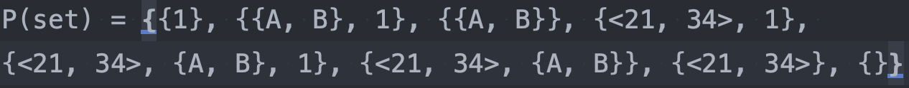
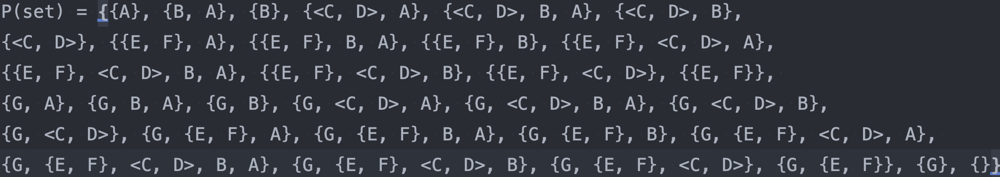

# Лабаратоная работа №2
---
### Тема: Операции над множествами
### Цель: Исследовать свойства структурных данных "множество" и разработать библиотеку для выполнения операций над множеством.

### Условие: Реализовать программу, формирующую множество равное булеану исходного множества.
---
#### В решении лабараторной работы использовались файловый ввод в текстовый файл и файловый вывод в текстовый файл (в случае некорректных данных консольный вывод).

#### Использовавшиеся библиотеки: io.*, util.Objects, util.ArrayList.

---
### Конструкторы:
 - ***BooleanFounder(String inputFileName, String outputFileName)***, принимает название файла ввода в переменной **inputFileName** и файла вывода в переменной **outputFileName**.

### Реализованные функции:

- void ***getOriginalSet()***, принимает данные записанные в файл ввода
- void ***findBoolean()***, находит булеан на оснавании множетво заданного функцией **getOriginalSet()** и записывает его в текстовый файл вывода.
- boolean ***protectInputData(String fileSet)***, проверяет входное множество на отсутсвие ошибок в случае нахождении ошибки возвращает ***false***, в случае корректности возвращает ***true***, в аргументе принимает переменную **String fileSet**, содержащую в себе содержимое файла ввода.
---
## Примеры тестов:
### 1.
#### Входные данные

#### Результат

### 2.
#### Входные данные

#### Результат

### 3.
#### Входные данные

#### Результат

---
## Вывод: Исследовал свойства структурных данных "множество" и разработал библиотеку для выполнения операций над множеством.