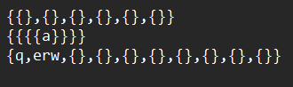
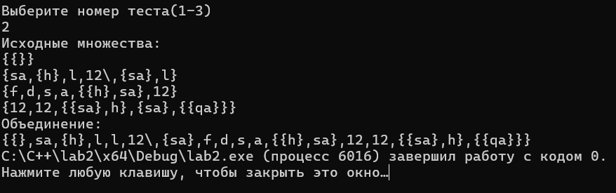

# Лабораторная работа №2

## Цель работы:

Разработатать библиотеку алгоритмов для работы со множествами

## Условие лабораторной работы вариант 10:

Реализовать программу, формирующую множество равное объединению произвольного 
количества исходных множеств (с учётом кратных вхождений элементов).

## Используемые понятия:

`Множество` - совокупность каких-либо объектов — элементов этого множества.

`Объединение множеств с учетом кратных вхождений` - множество S тогда и только тогда, когда для любого x
истинно S|x| = max{A|x|, B|x|}.

`Множество с кратными вхождениями` - т множество S тогда и только 
тогда, когда существует x такой, что истинно S|x| > 1

## Начальные значения тестов:

## Результаты:

## Вывод:

Исследовал операциии над множествами и способы работы с множествами с учетом кратных вхождений

